# Module 00 - Lab Environment Setup

**[Home](../README.md)** - [Next Module >](../modules/module01.md)

## :loudspeaker: Introduction

In order to follow along with the lab exercises, you need to provision a set of common resources and then provision an Azure Data Factory for each resource. Finally, sample data needs to be staged. 

| #  | Jump To |
| --- | --- |
| 1 | [Prerequisites](#thinking-prerequisites) |
| 2 | [Lab Environment Setup](#gear-lab-environment-setup-one-time) |
| 3 | [Data Factory Setup (Per Participant)](#gear-data-factory-setup-per-participant) |
| 4 | [Optional SAP Test Environment Setup](#gear-optional-sap-test-environment-setup) |
| 5 | [Stage Sample Data](#gear-stage-sample-data) |

## :thinking: Prerequisites

1. An [Azure account](https://azure.microsoft.com/free/) with an active subscription.
    > The subscription must have the following resource providers registered.
    > * Microsoft.Authorization
    > * Microsoft.DataFactory
    > * Microsoft.EventHub
    > * Microsoft.KeyVault
    > * Microsoft.Storage
    > * Microsoft.Sql
    > * Microsoft.Synapse
    > * Microsoft.Insights
    > * **Warning**  If you are using an **Azure Pass promo code**, the following resource providers - `Microsoft.Storage`, `Microsoft.EventHub`, and `Microsoft.Synapse` are not registered by default. Follow the instructions on [how to register a resource provider](./providers.md) before proceeding with the lab environment deployment below.

1. A resource group for the lab environment, which is recommended to be in a non-production subscription.

1. A Data Factory will be created for each project particpant. To enable user-specific security assigments, capture the **Azure Active Directory** user **Object ID** for all training participants.

    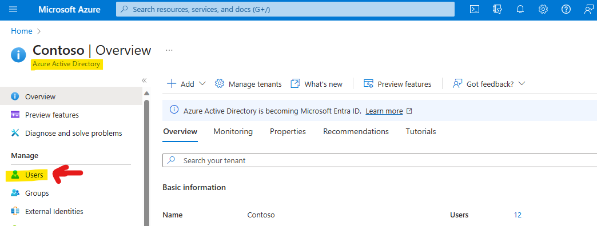
    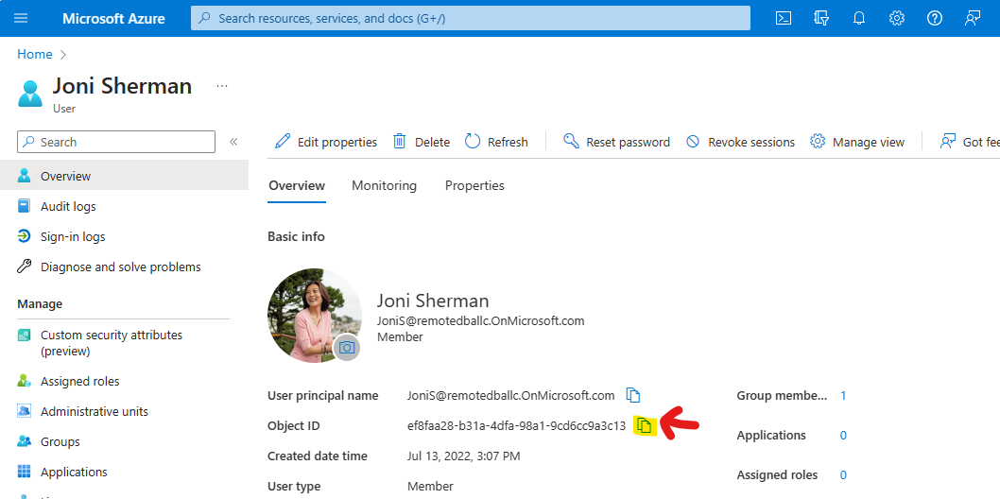

<a href="#module-00---lab-environment-setup">↥ back to top</a>

## :gear: Lab Environment Setup

The below instructions require resource group owner role and will take 10 minutes to complete with the appropriate access.

  > **Warning**  Deployed assets will include allow Azure and allow all firewall rules for training purposes only. Use a testing environment for training. Consult appropriate networking and security teams before production implementation.

1. Right-click or `Ctrl + click` the button below to open the Azure Portal in a new window.

    

    The below Azure resources will be included in the deployment:
    - Azure SQL Server and Database
    - Azure Synapse workspace and Synapse Dedicated Pool
    - 2 Azure Storage accounts (1 for the Synapse workspace and 1 for data files)
    - Azure Key Vault
    - Role assignment granting the Synapse workspace permission to the Storage Account for data files

2. Beneath the **Resource group** field, click **Create new** and provide a unique name (e.g. `adfmdflab-rg`), select a [valid location](https://azure.microsoft.com/global-infrastructure/services/?products=purview&regions=all) (e.g. `West US 3`), and then click **Review + create**.

    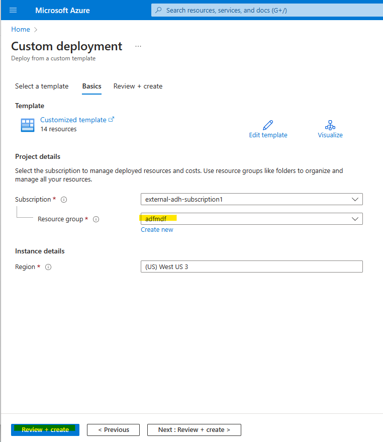

3. Once the validation has passed, click **Create**.

    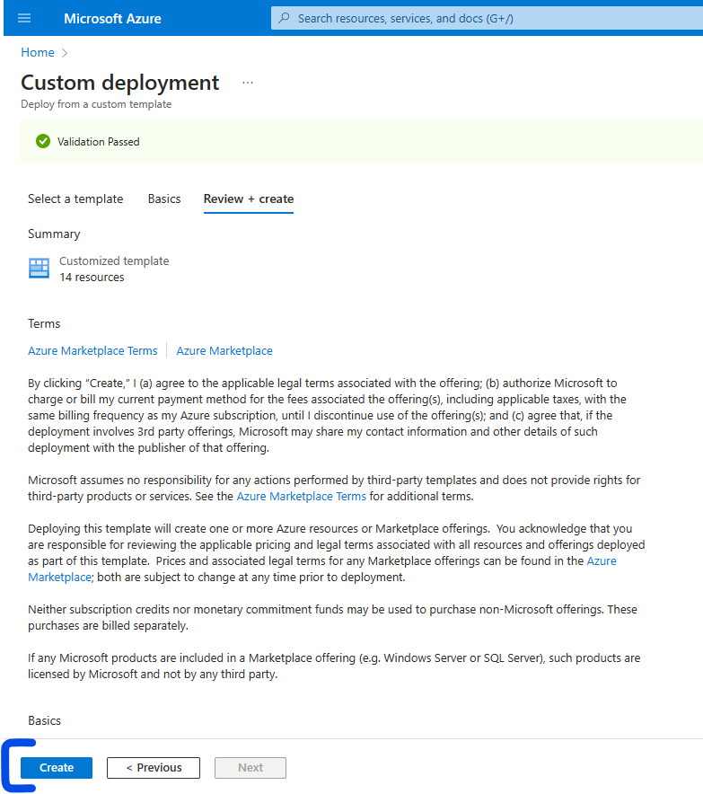

4. The deployment may take up to 10 minutes to complete. Once you see the message **Your deployment is complete**, click **Go to resource group**.

    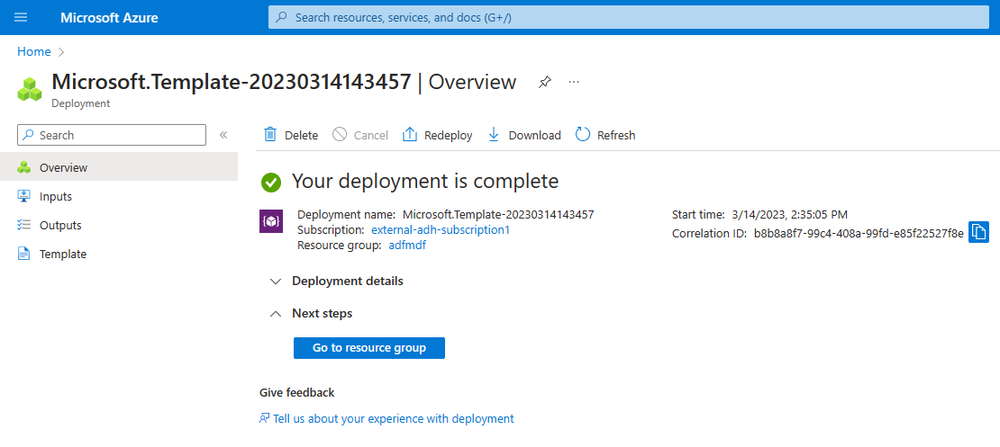

5. If successful, you should see the resource group resources, similar to the screenshot below.

    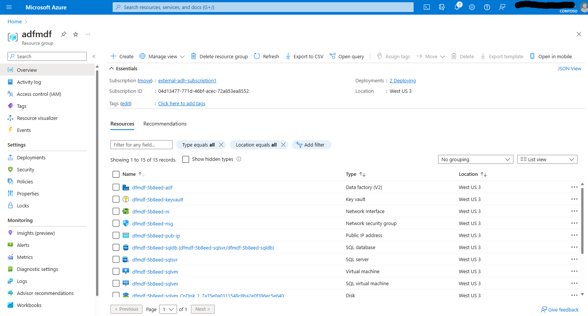

<a href="#module-00---lab-environment-setup">↥ back to top</a>

## :gear: Data Factory Setup (Per Participant)

The below instructions require resource group owner role and will take approximately 5 minutes to complete with the appropriate access. These steps should be repeated for each lab participant.

1. Right-click or `Ctrl + click` the button below to open the Azure Portal in a new window.

    

    The below Azure resources will be included in the deployment:
    - Azure Data Factory
    - Role assignment granting the participant resource group contributor access and Storage Blob Data Contributor access
    - Role assignment granting the Azure Data Factory resource group contributor and Storage Blob Data Contributor access

1. Complete the below parameters and click **Review + create**.

    | Parameter  | Description |
    | --- | --- |
    | Subscription | The subscription name where the lab environment should be created. |
    | Resource Group | The resource group name where the lab environment should be created. |
    | Region | The region used for the lab environment resources. |
    | Principal Id | The AAD user Object Id, as shown in the [Prerequisites](#thinking-prerequisites) |
    | Customer User Designation | A six character or less designation that is used to differentiate one Data Factory from another. It is recommended to use the project participants initials. |
    | Dfmdf_data_adls_name | The name of the Storage Account within the lab environment for data files (starts with dfmdf and ends with adls). |
    |  |  |

    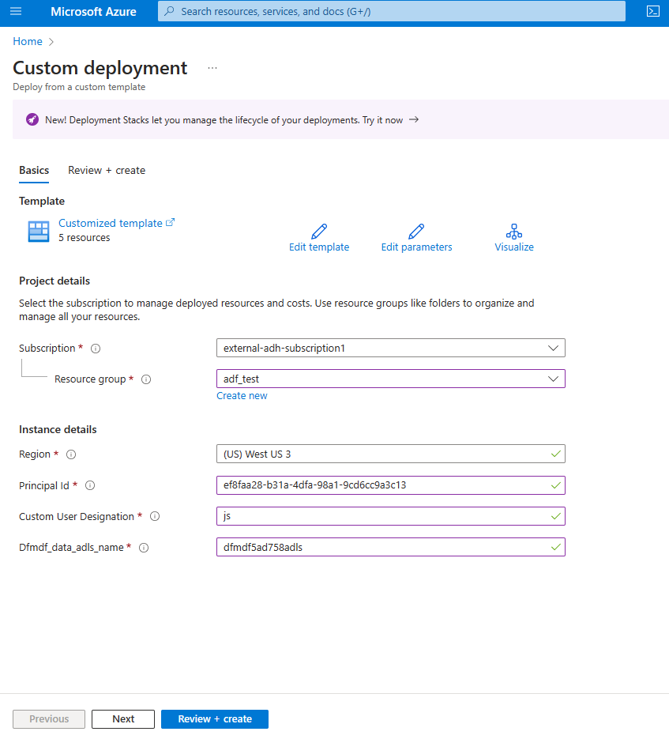

1. Once the validation has passed, click **Create**.

1. The deployment may take up to 10 minutes to complete. Once you see the message **Your deployment is complete**, click **Go to resource group**.

1. If successful, you should see the resource group resources, similar to the screenshot below.

<a href="#module-00---lab-environment-setup">↥ back to top</a>

## :gear: Optional SAP Test Environment Setup

The below instructions require subscription-level owner role and will take 3-4 hours to complete with the appropriate access. Only complete this section if module 13 is part of the Lab. This is a one time setup.

1. Get an SAP user number (SUSER) and password to be used to access the instances in SAP CAL. SAP CAL is a 30-day trial SAP system after which a valid license needs to be deployed. Generally, SUSERs are managed by a local SAP Basis Team. 

2. Go to the GitHub repository "MCW-SAP-plus-extend-and-innovate-with-Data-and-AI" or click the link in the next step :smile:.

3. Navigate to [./Hands-on lab/Before the HOL – SAP plus extend and innovate with Data and AI.md](https://github.com/microsoft/MCW-SAP-plus-extend-and-innovate-with-Data-and-AI/blob/main/Hands-on%20lab/Before%20the%20HOL%20-%20SAP%20plus%20extend%20and%20innovate%20with%20Data%20and%20AI.md#task-2-create-an-sap-cloud-appliance) file and complete only the below sections to ensure you have an SAP test environment ready for the event.
    - Task 3: Deploy the Azure Resources (Skip step 3 as a dedicated pool and storage account are already part of the lab environment.)
    - Task 4: Prepare sales data in SAP

<a href="#module-00---lab-environment-setup">↥ back to top</a>

## :gear: Stage Sample Data

<a href="#module-00---lab-environment-setup">↥ back to top</a>

Sample data is used throughout the modules. Sample data is listed by module below. Follow the instructions to stage it before the event.

### Stage Module 3 [Two Ways to do a Basic Copy](./modules/module03.md) Sample Data 

The pipelines in this module use a 5 MB file named *NYCTripSmall.parquet*. This file needs to be in the Azure Storage Account created for this lab.

1. Download this file from [../data_to_be_staged/adls/inbound/nyx_taxi_sample/NYCTripSmall.parquet](../data_to_be_staged/adls/inbound/nyx_taxi_sample/NYCTripSmall.parquet).

2. From the Azure Resource Group overview page, find and click the Azure Storage Account lab resource named `dfmdf< Random string for your lab environment resources >adls` to open the storage account.

    <kbd> 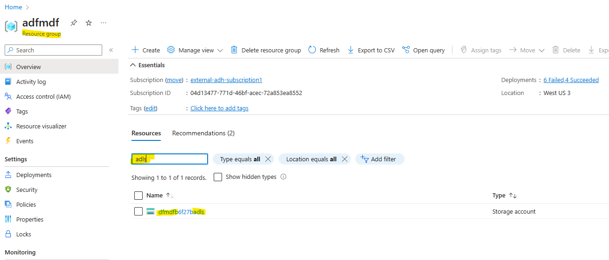 </kbd>

3. Within the Azure Storage Account, open the **Containers** page from within the **Data storage** section of the left pane. Then, click the **+ Container** button and add an `inbound` container if it does not already exist.

    <kbd> 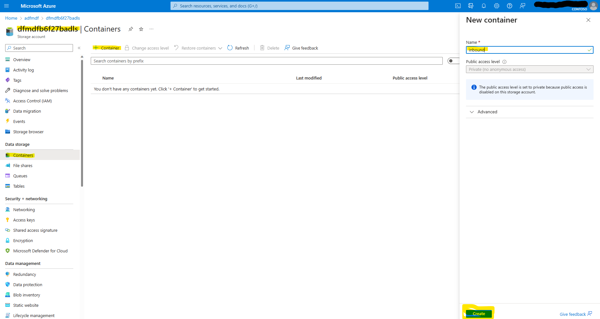 </kbd>

4. Click the container name to open the container. Then, click **+ Add Directory**. Add a directory **Name** `nyx_taxi_sample` and click **Save** to create the directory.

    <kbd> 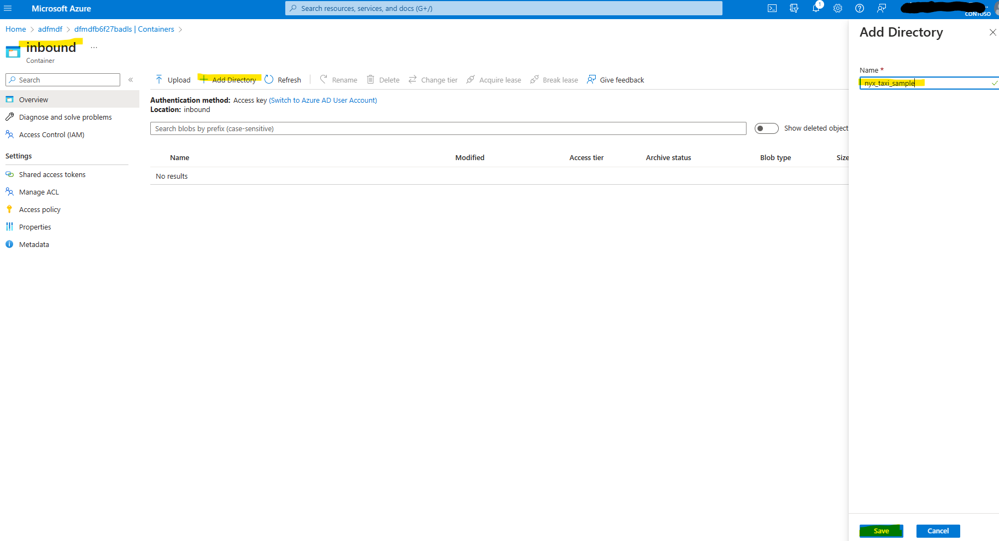 </kbd>

5. Click the directory name to open the directoy. Then, click the **Upload** button and drag and drop the `NYCTripSmall.parquet` file you downloaded in step 1 into the **Upload blob** drag and drop area. Finally, click **Upload**.

    <kbd> 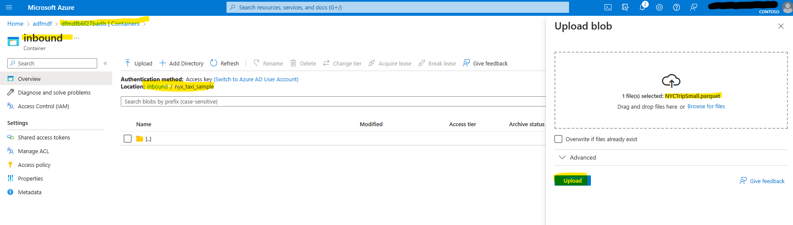 </kbd>

6. Within the Azure Storage Account, open the **Containers** page from within the **Data storage** section of the left pane. Then, click the **+ Container** button and add an `publish` container.

    <kbd> 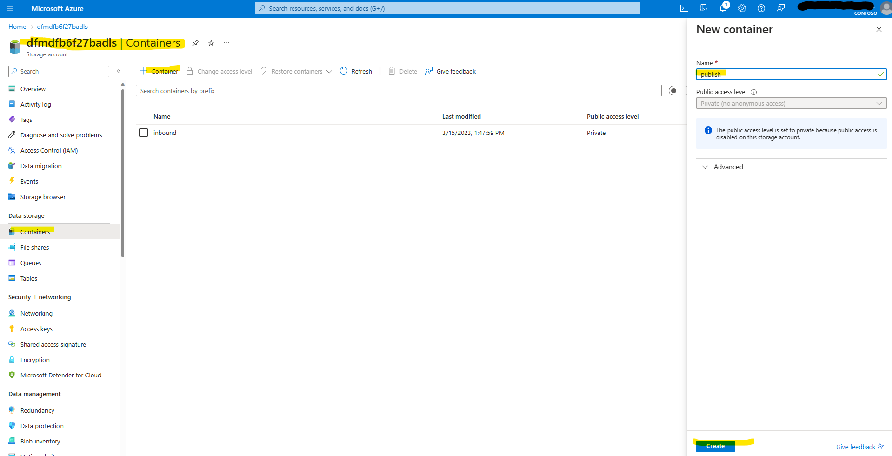 </kbd>

7. Click the `publish` container name to open the container. Then, click **+ Add Directory**. Add a directory named `nyx_taxi_sample_pipeline` and click **Save** and add a second directory named `nyx_taxi_sample_dataflow` and click **Save**.

   <kbd> 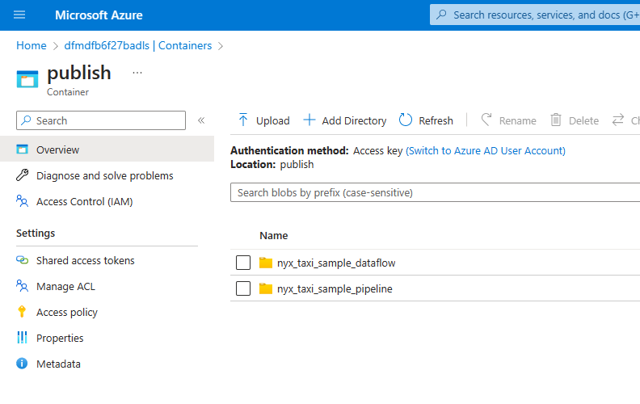 </kbd>

### Stage Module 4 [Join Placeholder](./modules/module04.md) Sample Data 

Instructions here

### Stage Module 5 [Slowly Changing Dimensions](./modules/module05.md) Sample Data 

Instructions here

### Stage Module 7 [Medallion Architecture: Bronze Layer](./modules/module07.md) Sample Data

The pipelines in this module use 2 Excel files under 50 KB file named *Employees.xlsx* and *Regions.xlsx*. This files needs to be in the Azure Storage Account created for this lab.

1. Download the below files from this GitHub repository.
  - [../data_to_be_staged/adls/source/employees/Employees.xlsx](../data_to_be_staged/adls/source/employees/Employees.xlsx)
- [../data_to_be_staged/adls/source/employees/Regions.xlsx](../data_to_be_staged/adls/source/employees/Regions.xlsx)

1. From the Azure Resource Group overview page, find and click the Azure Storage Account lab resource named `dfmdf< Random string for your lab environment resources >adls` to open the storage account.

    <kbd>  </kbd>

1. Within the Azure Storage Account, open the **Containers** page from within the **Data storage** section of the left pane. Then, click the **+ Container** button and add the 3 containers below if they does not already exist.
    - inbound
    - publish
    - source 
    
    <kbd> 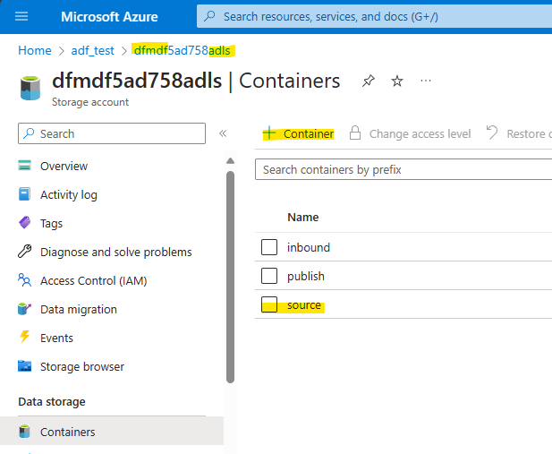 </kbd>

1. Click the container name to open the container. Then, click **+ Add Directory**. Add a directory **Name** `employees` and click **Save** to create the directory.

1. To add a directory, click the container name, then, click **+ Add Directory** and **Save**. Ensure the following directories exist: 
    - `source/employees`
    - `inbound/employees_bronze`
    - `inbound/employees_silver`
    - `inbound/employees_silver_errors`
    - `publish/employees_gold_general`
    - `publish/employees_gold_confidential`
    - `publish/employees_gold_errors`
    - `publish/employees_project_a`

1. Navigate to the `source/employees` directory. Then, click the **Upload** button and drag and drop the `Employees.xlsx` and `Regions.xlsx` files you downloaded in step 1 into the **Upload blob** drag and drop area. Finally, click **Upload**.

    <kbd> 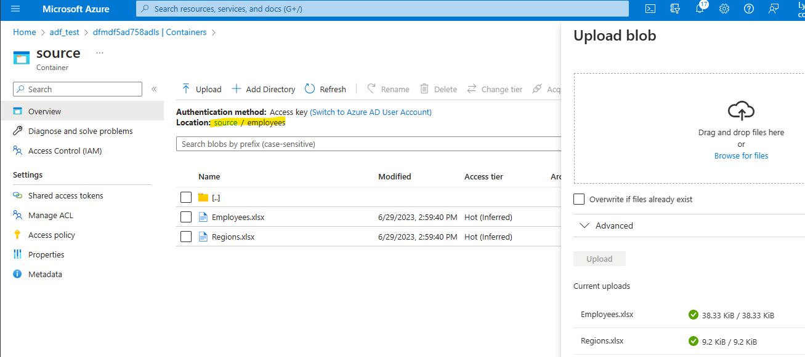 </kbd>

<a href="#module-00---lab-environment-setup">↥ back to top</a>

## :tada: Summary

By successfully deploying the lab template, you have the Azure resources and data needed to follow along with the learning exercises.

[Continue >](../modules/module01.md)

<a href="#module-00---lab-environment-setup">↥ back to top</a>
