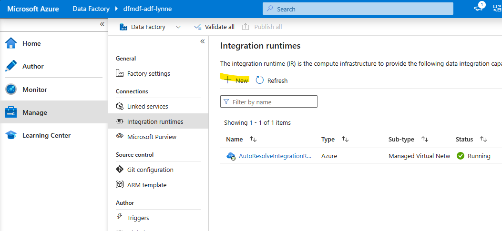
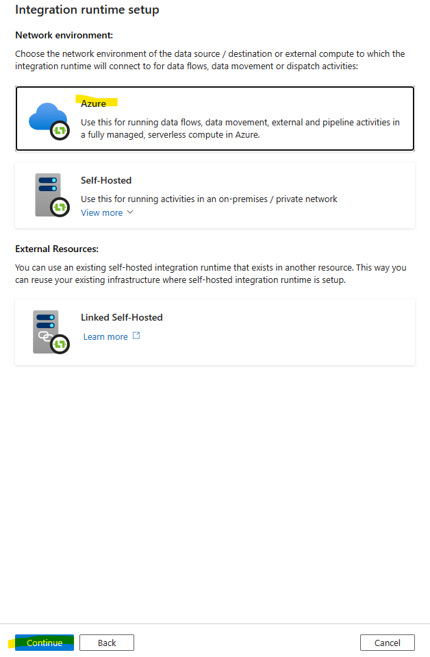

# Module 01 - Create Integration Runtimes and Linked Services

[< Previous Module](../modules/module00.md) - **[Home](../README.md)** - [Next Module >](../modules/module03.md)

## :loudspeaker: Introduction
The Integration Runtime (IR) is the compute infrastructure used by Azure Data Factory and Azure Synapse pipelines. For more information about integration runtimes, see [Integration runtime in Azure Data Factory](https://learn.microsoft.com/en-us/azure/data-factory/concepts-integration-runtime).

In this workshop, the default Azure Integration Runtime is used, along with Managed Virtual Network. Azure integration runtime provides a fully managed, serverless compute in Azure. You don't have to worry about infrastructure provision, software installation, patching, or capacity scaling. In addition, you only pay for the duration of the actual utilization. The enablement of Managed Virtual Network allows you to use the power of spark within mapping data flows.

Once integration runtimes exist, the next step is to create linked services to the resources the data factory connects to. Linked services are referenced by datasets and activities.

## :bookmark_tabs: Table of Contents

| #  | Section | Role |
| --- | --- | --- |
| 1 | [Create an Azure IR with Managed Virtual Network enabled](#1-create-an-azure-ir-with-managed-virtual-network-enabled) | Data Factory Contributor |
| 2 | [Create Azure Storage Linked Service](#2-create-azure-storage-linked-service) | Data Factory Contributor |

<a href="#module-01---create-integration-runtimes-and-linked-services">↥ back to top</a>

## 1. Create an Azure IR with Managed Virtual Network enabled

1. From the resources list in the resource group, find and click the Data factory (V2) resource to open Azure Data Factory.

2. Click the **Launch studio** button.

3. Within the Data Factory Studio, select the **Manage** tab from the leftmost pane. Select **Integration runtimes** on the left pane, and click the **+ New** button.

4. Click the **Azure, Self-Hosted** option and then click **Continue**.

5. Click the **Azure** option and then click **Continue**.

6. On the **Settings** tab, enter the following values.

    | Attribute  | Example Value |
    | --- | --- |
    | Name | `ir-vnetwork-medium-60min` |
    | Description | `An integration runtime with managed virtual network enabled and a 60 minute cluster time to live. Cluster size is set to medium.` |
    | Region | `Auto Resolve` |

||
-
6. On the **Virtual network** tab, select **Enable** for **Virtual network configuration** and ensure the **Interactive authoring** box is checked with a **Time to live** of `60 minutes`.

||
-
6. On the **Data flow runtime** tab, select a **Compute size** of `Medium` and click **Create**.

||
-
The IR will be provisioned by Azure. Note that this can take up to 15 minutes.

||
-

Once the IR is provisioned, the **Status** will be `Running` and you can proceed to the next section.

## 2. Create Azure Storage Linked Service

1. Within the Data Factory Studio, select the **Manage** tab from the leftmost pane. Select **Linked services** on the left pane, and click the **+ New** button.

> >

