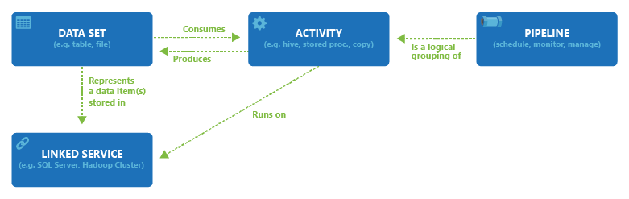
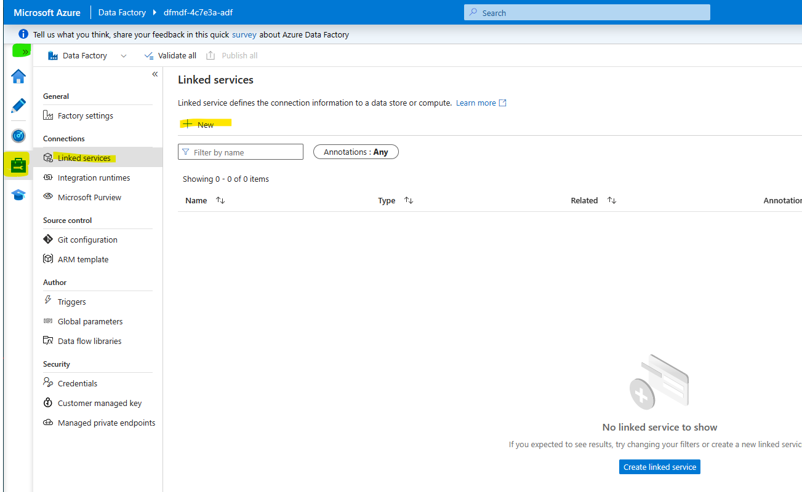
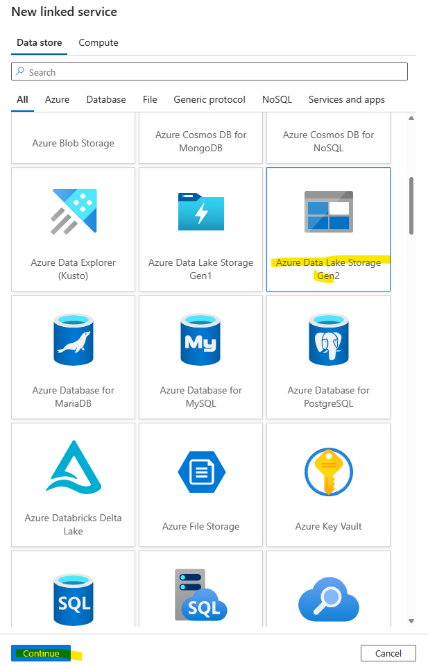
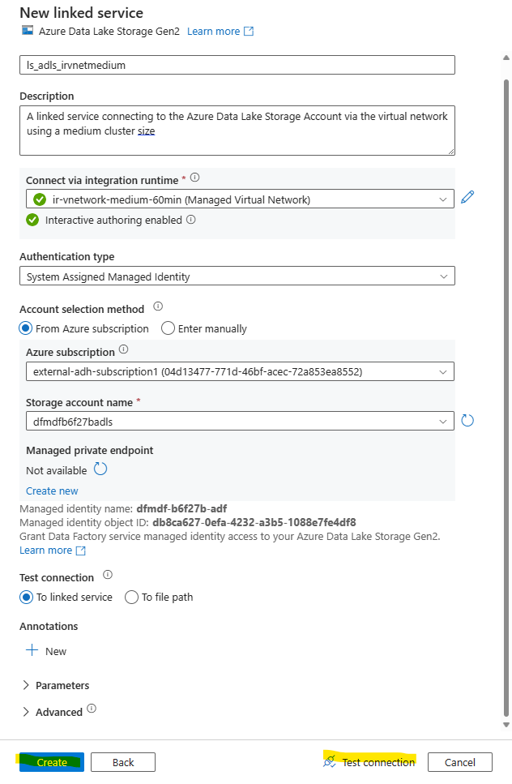
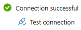
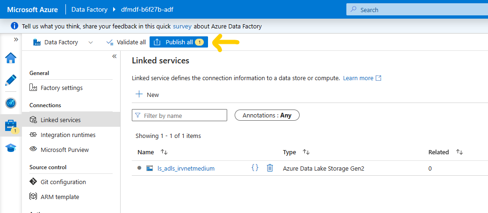
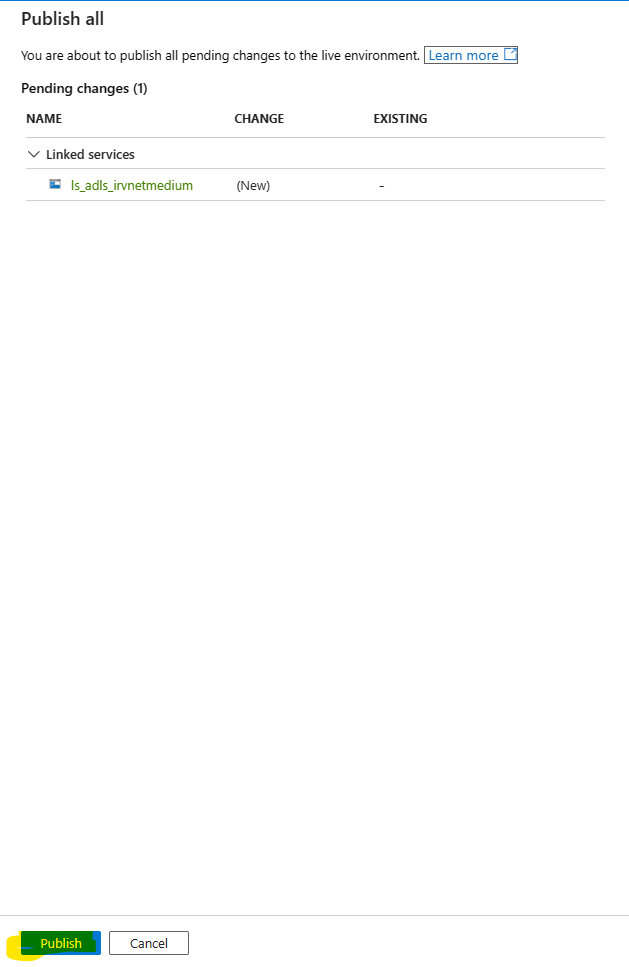
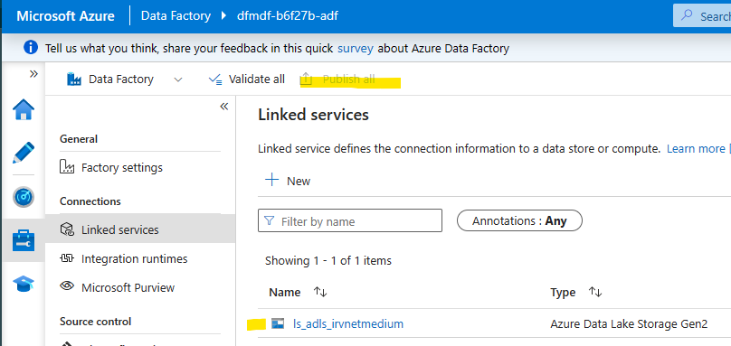
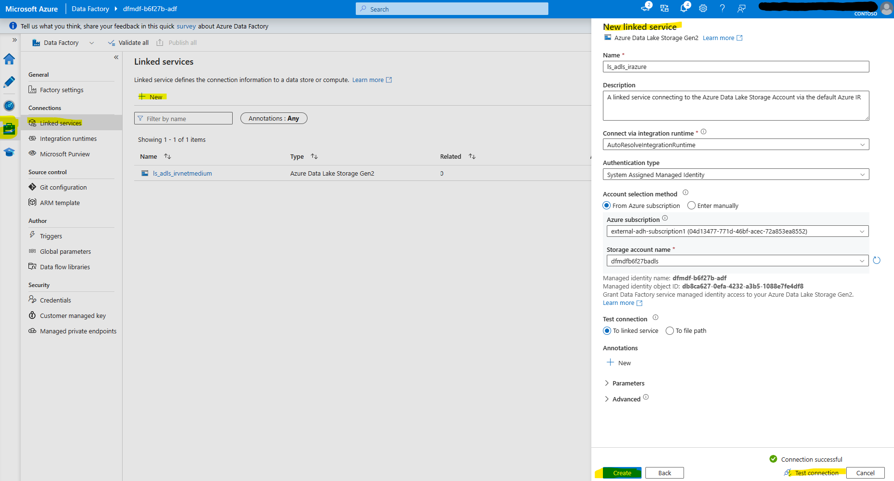
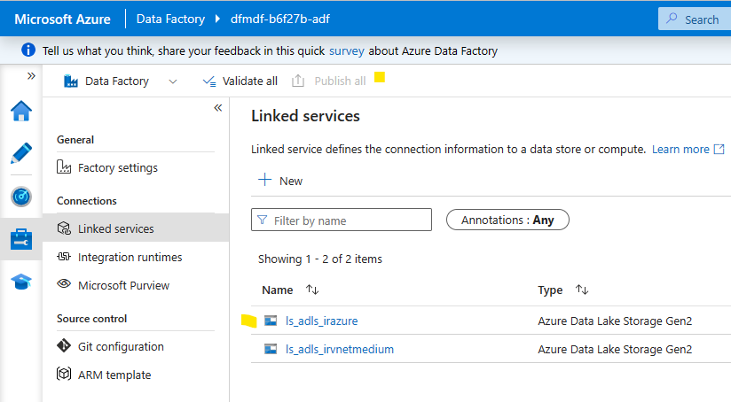

# Module 02 - Create Linked Services

[< Previous Module](../modules/module00.md) - **[Home](../README.md)** - [Next Module >](../modules/module03.md)

## :loudspeaker: Introduction
Once integration runtimes exist, the next step is to create linked services. Linked services are much like connection strings, which define the connection information needed for the service to connect to external resources. Linked services are referenced by datasets and activities.

   <kbd>  </kbd>

For more information about linked services, see [Linked services in Azure Data Factory and Azure Synapse Analytics](https://learn.microsoft.com/en-us/azure/data-factory/concepts-linked-services?tabs=data-factory#overview).

## :bookmark_tabs: Table of Contents

| #  | Section |
| --- | --- |
| 1 | [Create ADLS Linked Service with Managed VNet IR](#1-create-adls-linked-service-with-managed-vnet-ir) |
| 2 | [Create ADLS Linked Service with default Azure IR](#2-create-adls-linked-service-with-default-azure-ir) |

<a href="#module-02---create-linked-services">↥ back to top</a>

## 1. Create ADLS Linked Service with Managed VNet IR

This linked service should be used to connect to the Azure Data Lake Storage Account (ADLS) when the Apache spark clusters powered by the managed VNet are desired to be used.

1. Within the Data Factory Studio, select the **Manage** tab from the leftmost pane. Select **Linked services** on the left pane, and click the **+ New** button.

   <kbd>  </kbd>

2. Select **Azure Data Lake Storage Gen 2** and click **Continue**.

   <kbd>  </kbd>

3. Enter the following values. Then, click **Test connection**. You should see a Connection successful message. Click **Create**.

    | Attribute  | Example Value |
    | --- | --- |
    | Name | `ls_adls_irvnetmedium` |
    | Description | `A linked service connecting to the Azure Data Lake Storage Account via the virtual network using a medium cluster size` |
    | Connect via | `< Your virtual network integration runtime >` |
    | Authentication type | `System Assigned Managed Identity` |
    | Account selection method| `From Azure subscription` |
    | Azure subscritpion | `< Your subscription >` |
    | Storage account name | `dfmdf< Random string for your lab environment resources >adls` |
    | Test connection | `To linked service` |

   <kbd>  </kbd>

   <kbd>  </kbd>

4. The linked service is now created but not published. Unpublished changes are indicated by the number on the **Publish all** button. Click **Publish all** to proceed. When the Publish all pane appears, click the **Publish** button at the bottom.

   <kbd>  </kbd>
   <kbd>  </kbd>

   Once the linked service is published, the Publish all button on the top banner will be grey and the ls_adls_irvnetmedium linked service will no longer have a dot next to it. 
   <kbd>  </kbd>

<a href="#module-02---create-linked-services">↥ back to top</a>

## 2. Create ADLS Linked Service with default Azure IR

This linked service should be used to connect to the Azure Data Lake Storage Account (ADLS) when the normal (non-spark) integration runtime is desired to be used.

1. Within the Data Factory Studio, select the **Manage** tab from the leftmost pane. Select **Linked services** on the left pane, and click the **+ New** button.

2. Select **Azure Data Lake Storage Gen 2** and click **Continue**.

3. Enter the following values. Then, click **Test connection**. You should see a Connection successful message. Click **Create**.

    | Attribute  | Example Value |
    | --- | --- |
    | Name | `ls_adls_irazure` |
    | Description | `A linked service connecting to the Azure Data Lake Storage Account via the default Azure IR` |
    | Connect via | `AutoResolveIntegrationRuntime` |
    | Authentication type | `System Assigned Managed Identity` |
    | Account selection method| `From Azure subscription` |
    | Azure subscritpion | `< Your subscription >` |
    | Storage account name | `dfmdf< Random string for your lab environment resources >adls` |
    | Test connection | `To linked service` |

   <kbd>  </kbd>

4. The linked service is now created but not published. Unpublished changes are indicated by the number on the **Publish all** button. Click **Publish all** to proceed. When the Publish all pane appears, click the **Publish** button at the bottom.

   Once the linked service is published, the Publish all button on the top banner will be grey and the ls_adls_irvnetmedium linked service will no longer have a dot next to it. 
   <kbd>  </kbd>

<a href="#module-02---create-linked-services">↥ back to top</a>
