# Module 02 - Create Linked Services

[< Previous Module](../modules/module01.md) - **[Home](../README.md)** - [Next Module >](../modules/module03.md)

## :loudspeaker: Introduction
Once integration runtimes exist, the next step is to create linked services. Linked services are much like connection strings, which define the connection information needed for the service to connect to external resources. Linked services are referenced by datasets and activities.

   <kbd>  </kbd>

For more information about linked services, see [Linked services in Azure Data Factory and Azure Synapse Analytics](https://learn.microsoft.com/en-us/azure/data-factory/concepts-linked-services?tabs=data-factory#overview).

## :bookmark_tabs: Table of Contents

| #  | Section |
| --- | --- |
| 1 | [Create ADLS Linked Service with Managed VNet IR](#1-create-adls-linked-service-with-managed-vnet-ir) |
| 2 | [Create ADLS Linked Service with default Azure IR](#2-create-adls-linked-service-with-default-azure-ir) |
| 3 | [Create Azure SQL DB Linked Service](#3-create-azuresqldb-linked-service) |

<div align="right"><a href="#module-02---create-linked-services">↥ back to top</a></div>

## 1. Create ADLS Linked Service with Managed VNet IR

This linked service should be used to connect to the Azure Data Lake Storage Account (ADLS) when the Apache spark clusters powered by the managed VNet are desired to be used.

1. Within the Data Factory Studio, select the **Manage** tab from the leftmost pane. Select **Linked services** on the left pane, and click the **+ New** button.

   <kbd> 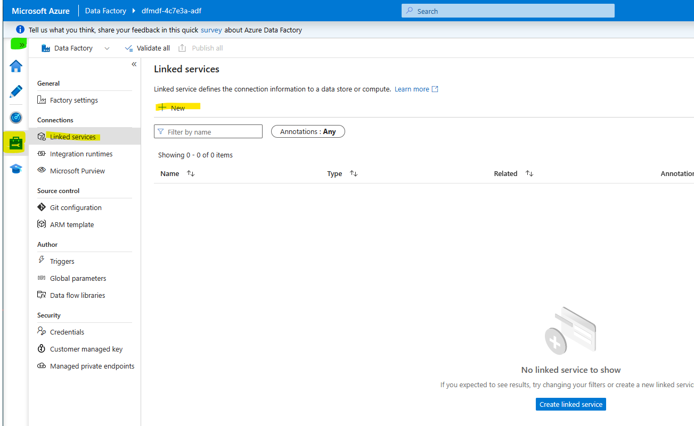 </kbd>

2. Select **Azure Data Lake Storage Gen 2** and click **Continue**.

   <kbd> 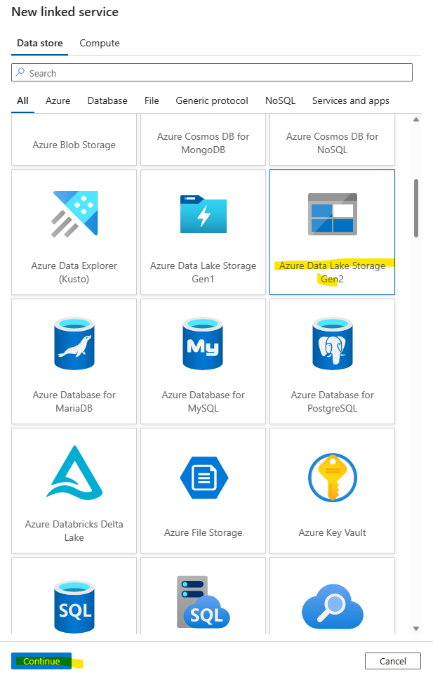 </kbd>

3. Enter the following values. Then, click **Test connection**. You should see a Connection successful message. Click **Create**.

    | Attribute  | Example Value |
    | --- | --- |
    | Name | `ls_adls_irvnetmedium` |
    | Description | `A linked service connecting to the Azure Data Lake Storage Account via the virtual network using a medium cluster size` |
    | Connect via | `< Your virtual network integration runtime >` |
    | Authentication type | `System Assigned Managed Identity` |
    | Account selection method| `From Azure subscription` |
    | Azure subscritpion | `< Your subscription >` |
    | Storage account name | `dfmdf< Random string for your lab environment resources >adls` |
    | Test connection | `To linked service` |

   <kbd> 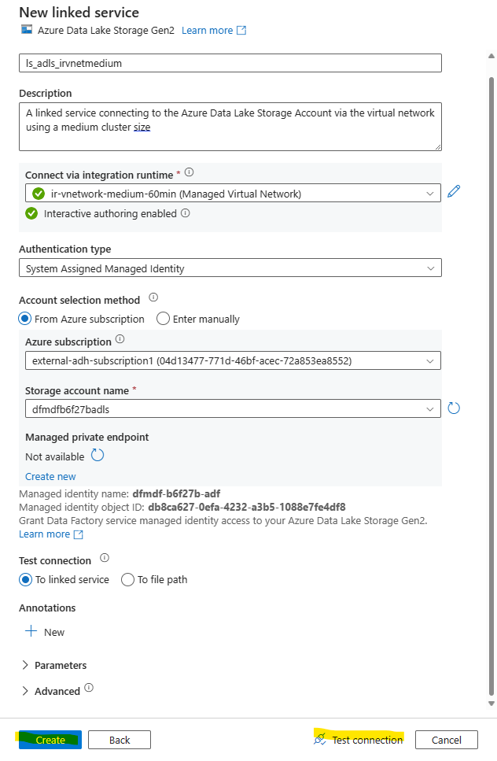 </kbd>

   <kbd> 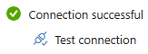 </kbd>

4. The linked service is now created but not published. Unpublished changes are indicated by the number on the **Publish all** button. Click **Publish all** to proceed. When the Publish all pane appears, click the **Publish** button at the bottom.

   <kbd> 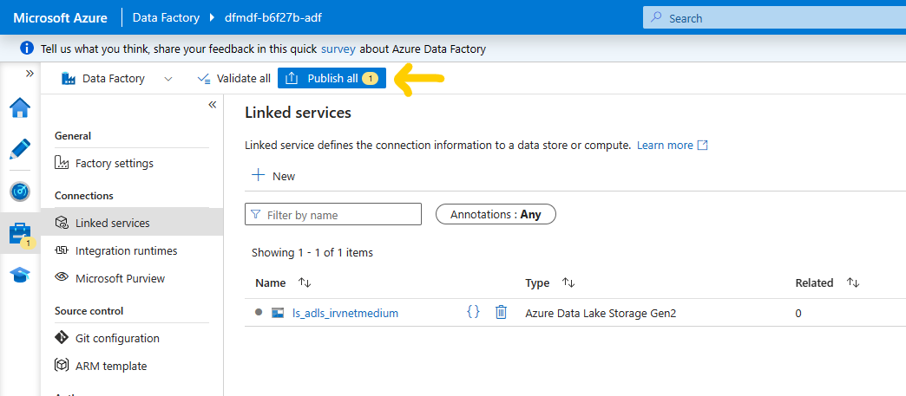 </kbd>
   <kbd> 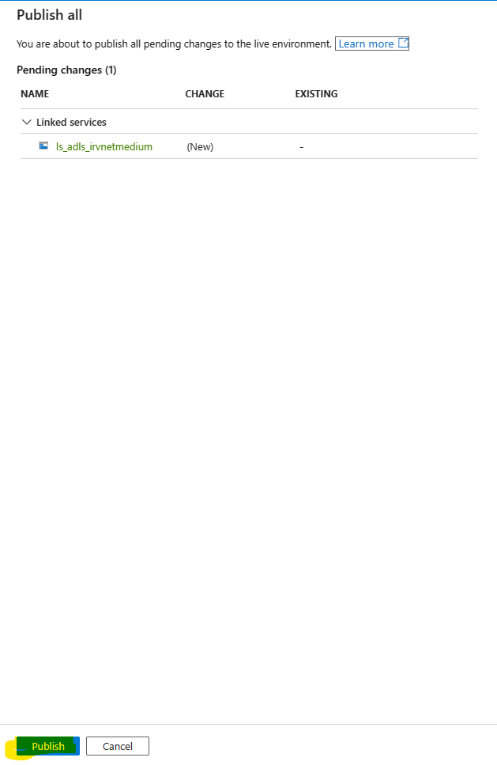 </kbd>

   Once the linked service is published, the Publish all button on the top banner will be grey and the ls_adls_irvnetmedium linked service will no longer have a dot next to it. 
   <kbd> 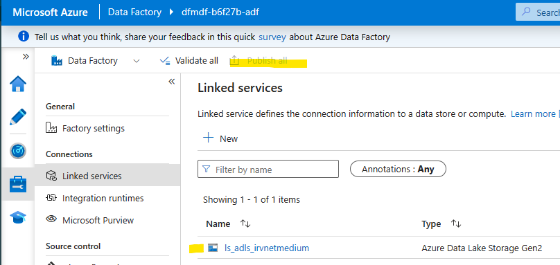 </kbd>

<div align="right"><a href="#module-02---create-linked-services">↥ back to top</a></div>

## 2. Create ADLS Linked Service with default Azure IR

This linked service should be used to connect to the Azure Data Lake Storage Account (ADLS) when the normal (non-spark) integration runtime is desired to be used.

1. Within the Data Factory Studio, select the **Manage** tab from the leftmost pane. Select **Linked services** on the left pane, and click the **+ New** button.

2. Select **Azure Data Lake Storage Gen 2** and click **Continue**.

3. With `AutoResolveIntegrationRuntime` selected in **Connect via integration runtime**, if the error *Interactive authoring disabled* appears, click the edit icon. When the **Integration runtime** sidebar appears, go to the **Virtual network** tab and select the **Enable** option for **Interactive authoring**. Then, click **Apply**.

   <kbd> 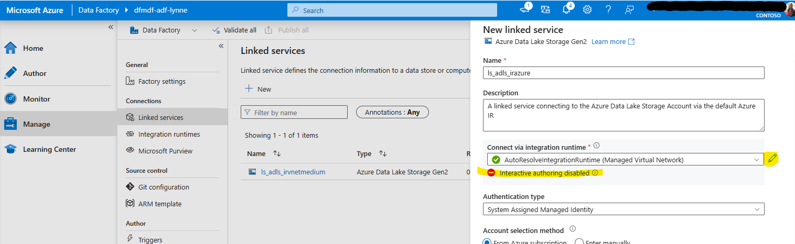 </kbd>
   <kbd> 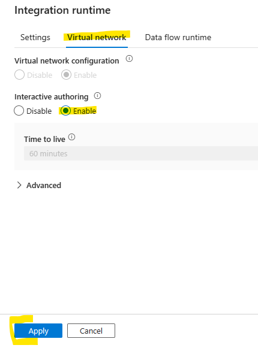 </kbd>

3. Enter the following values. If the **Test connection** button is not available (grey), confirm interactive authoring on the selected integration runtime is enabled. Then, click **Test connection**. You should see a *Connection successful* message. Click **Create**.

    | Attribute  | Example Value |
    | --- | --- |
    | Name | `ls_adls_irazure` |
    | Description | `A linked service connecting to the Azure Data Lake Storage Account via the default Azure IR` |
    | Connect via | `AutoResolveIntegrationRuntime` |
    | Authentication type | `System Assigned Managed Identity` |
    | Account selection method| `From Azure subscription` |
    | Azure subscritpion | `< Your subscription >` |
    | Storage account name | `dfmdf< Random string for your lab environment resources >adls` |
    | Test connection | `To linked service` |

   <kbd> 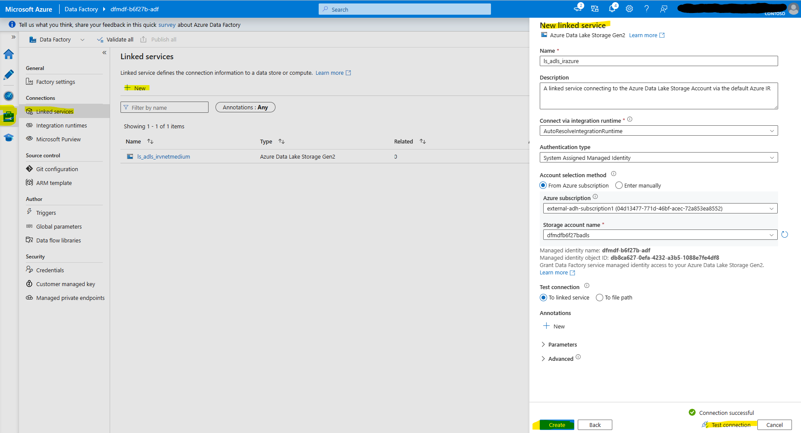 </kbd>

4. The linked service is now created but not published. Unpublished changes are indicated by the number on the **Publish all** button. Click **Publish all** to proceed. When the Publish all pane appears, click the **Publish** button at the bottom.

   Once the linked service is published, the Publish all button on the top banner will be grey and the ls_adls_irvnetmedium linked service will no longer have a dot next to it. 

<kbd> 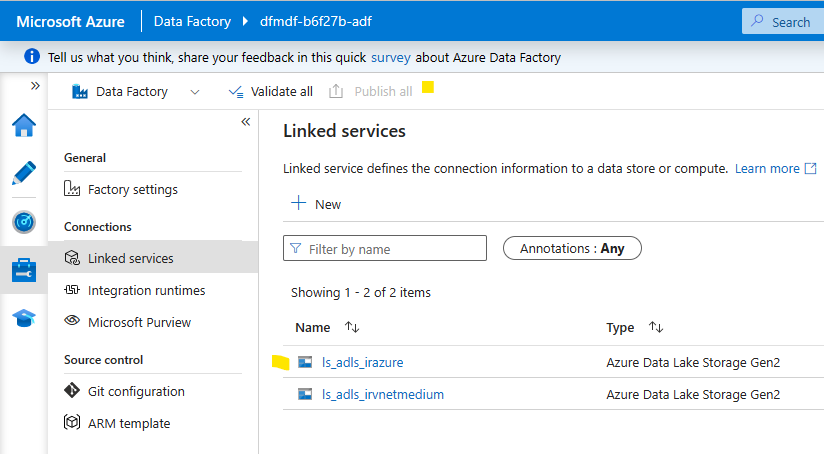 </kbd>

<div align="right"><a href="#module-02---create-linked-services">↥ back to top</a></div>

## :tada: Summary

<kbd> 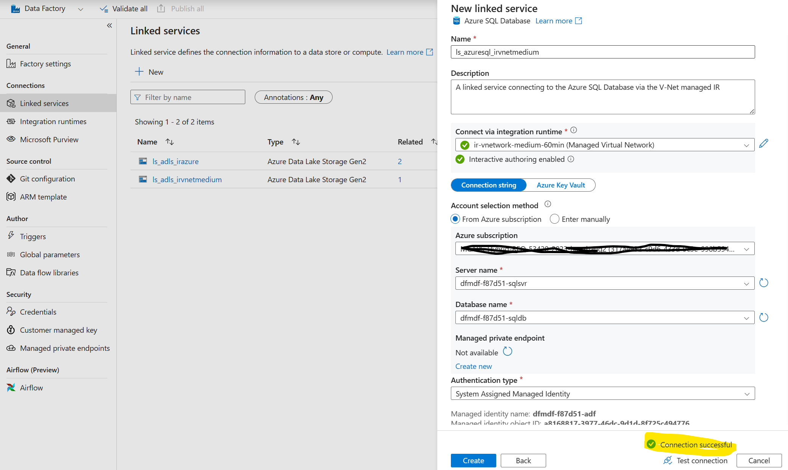 </kbd>

[Continue >](../modules/module03.md)

## 3. Create Azure SQL DB Linked Service

This linked service should be used to connect to the Azure SQL Database. The following steps uses the Managed VNet IR in the screenshots, but feel free to use the default Azure IR if V-Net isolation is not required by your company policy.

1. Within the Data Factory Studio, select the **Manage** tab from the leftmost pane. Select **Linked services** on the left pane, and click the **+ New** button. In the pop-up window, select **Azure SQL Database** (for a quicker find: type in "Azure SQL" in the search bar above) and click **Continue**.

<kbd> 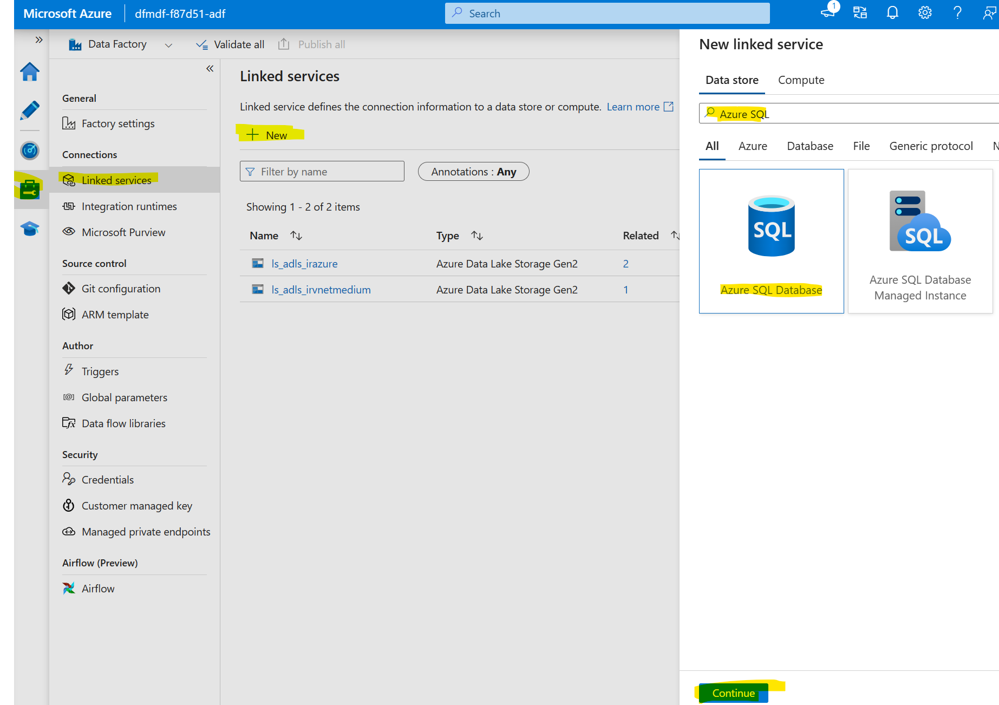 </kbd>

2. Enter the following values. Then, click **Test connection**. 

    | Attribute  | Example Value |
    | --- | --- |
    | Name | `ls_azuresql_irvnetmedium` |
    | Description | `A linked service connecting to the Azure SQL Database via the V-Net managed IR using a medium cluster size` |
    | Connect via | `< Your virtual network integration runtime >` |
    | Account selection method| `From Azure subscription` |
    | Azure subscritpion | `< Your subscription >` |
    | Server name | `< dfmdf-< Random string for your lab environment resources >-sqlsvr >` |
    | Database name | `< dfmdf-< Random string for your lab environment resources >-sqldb >` |
    | Authentication type | `System Assigned Managed Identity` |
    | Test connection | `To linked service` |

<kbd> 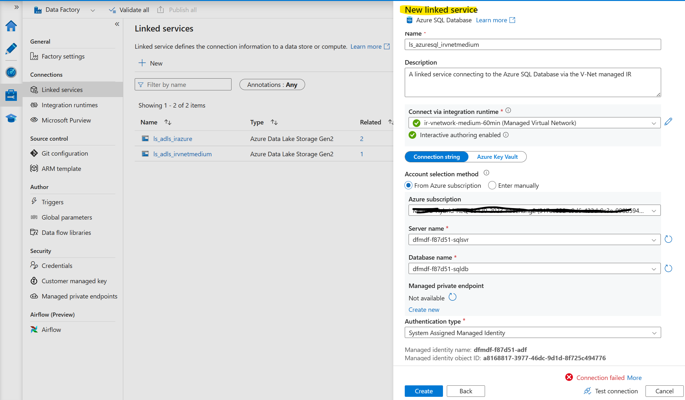 </kbd>

initially you will see a red error message, but this is expected as we haven't granted ADF's Managed Identity the access to Azure SQL Database, which needs to be done using 2 lines of T-SQL code.

3. Go to Azure Portal, and navigate to the Azure SQL server resource. Click **Azure Active Directory** under the settings pane anc click **Set admin**. In the pop-up window on the right side, type in your name in the search field, click on your own user and click **Select**. This step ensures that you (your Azure AD user) are the admin of the Azure SQL Database and can grant other users (in this case the ADF's Managed Identity) access to the database.

<kbd> 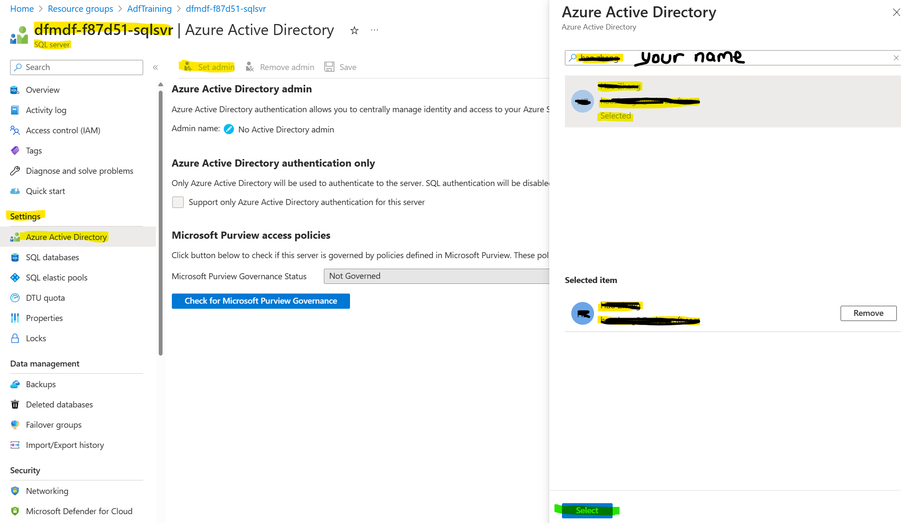 </kbd>

4. Navigate to the Azure SQL Database resource, and click **Query editor (preview)**. In the pop-up window, click **Continue as 'your user as Server admin'** and you will find yourself in the query editor. 

<kbd> 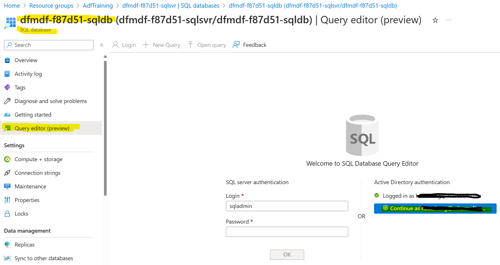 </kbd>

5. Copy and paste the following 2 lines of T-SQL code into the query editor, replace the `name_of_the_adf` with your own ADF name `< dfmdf-< Random string for your lab environment resources >-adf >` and click **Run**. This will grant the ADF's Managed Identity access to the Azure SQL Database.

```sql	
--Add Azure Data Factory managed identity as an account to Azure SQL database.
CREATE USER [name_of_the_adf] FROM EXTERNAL PROVIDER;
--Grant appropriate role to Azure Data Factory based on your needs. 
ALTER ROLE [db_owner] ADD MEMBER [name_of_the_adf];
```
<kbd> 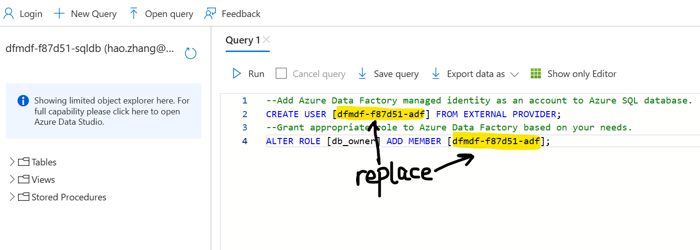 </kbd>

6. Go back to the Data Factory Studio, and click **Test connection** again. You should see a Connection successful message. Click **Create**.

<kbd>  </kbd>

7. Publish the change to make it effective. Click **Publish all** to proceed. When the Publish all pane appears, click the **Publish** button at the bottom.

<kbd> 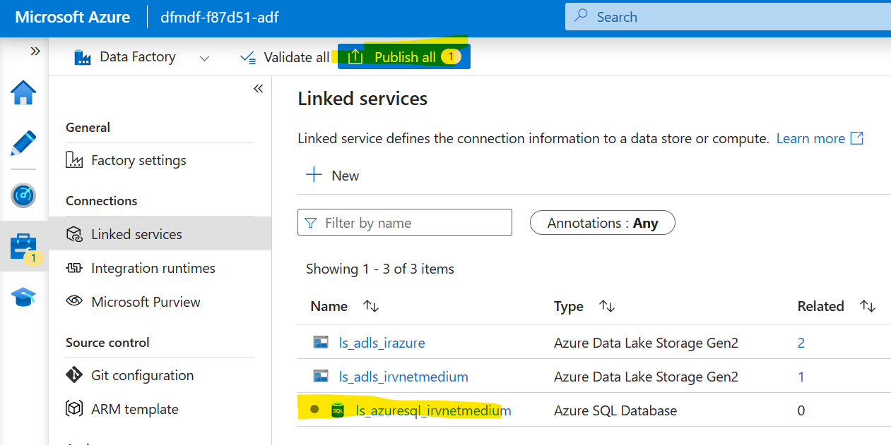 </kbd>