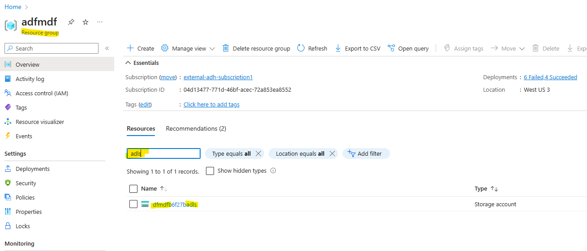
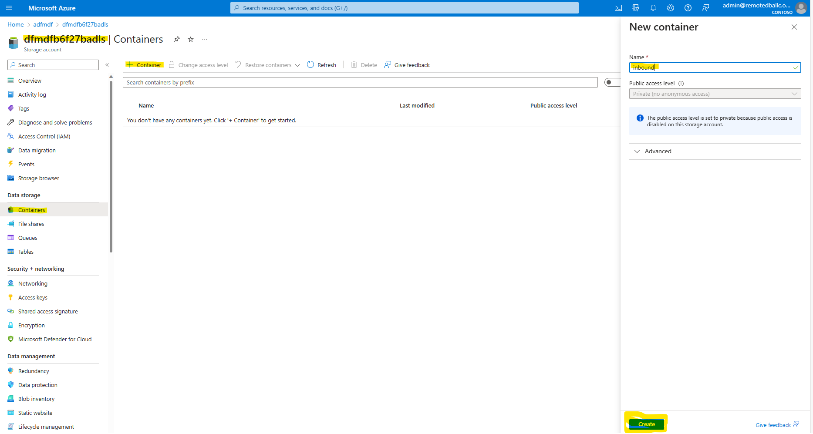
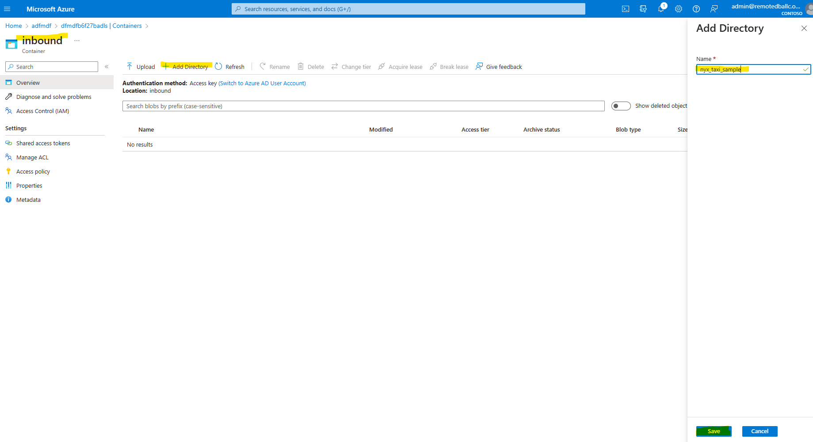
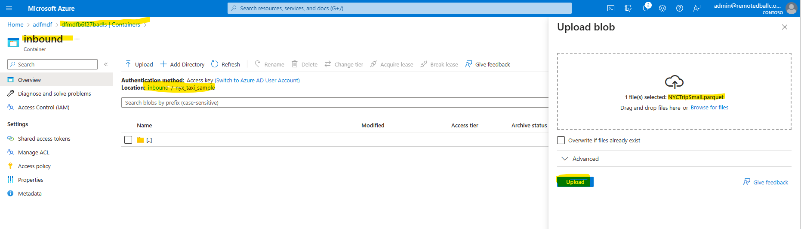
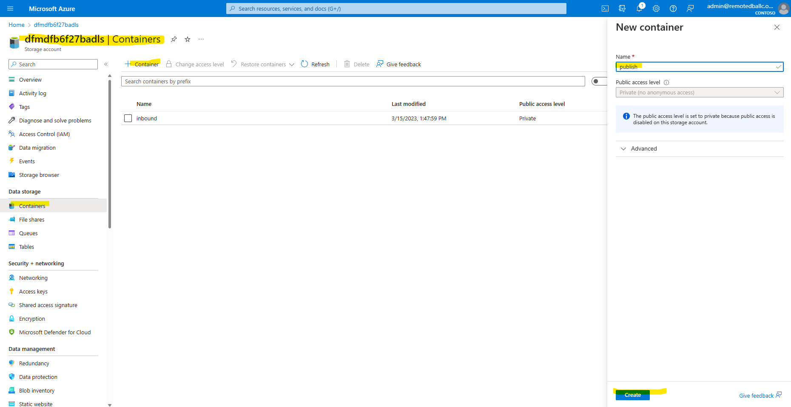
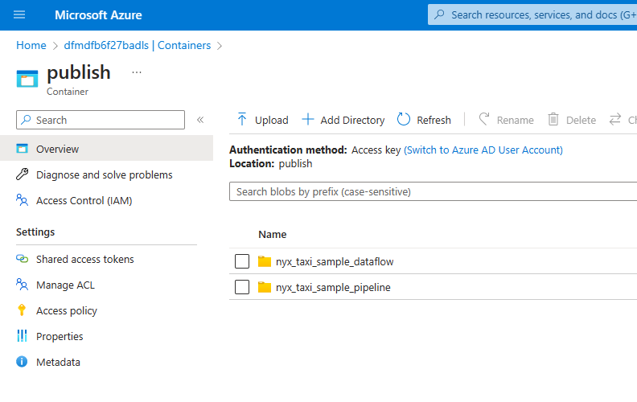

# Module 03 - Two Ways to do a Basic Copy

[< Previous Module](../modules/module02.md) - **[Home](../README.md)** - [Next Module >](../modules/module04.md)

## :loudspeaker: Introduction

A basic data movement can be accomplished two ways in Azure Data Factory. This module will demonstrate both:

* Pipeline copy
* Mapping data flows copy

## :bookmark_tabs: Table of Contents

| #  | Section |
| --- | --- |
| 1 | [Stage data in the data lake](#1stage-data-in-the-data-lake) |
| 2 | [Pipeline copy](#2pipeline-copy) |
| 3 | [Mapping data flows copy](#3mapping-data-flows-copy) |

<a href="#module-03---two-ways-to-do-a-basic-copy">↥ back to top</a>

## 1. Stage data in the data lake

The pipelines in this module use a 5 MB file named *NYCTripSmall.parquet*. This file needs to be in the Azure Storage Account created for this lab.

1. Download this file from [../data_to_be_staged/adls/inbound/nyx_taxi_sample/NYCTripSmall.parquet](../data_to_be_staged/adls/inbound/nyx_taxi_sample/NYCTripSmall.parquet).

2. From the Azure Resource Group overview page, find and click the Azure Storage Account lab resource named `dfmdf< Random string for your lab environment resources >adls` to open the storage account.

   <kbd>  </kbd>

3. Within the Azure Storage Account, open the **Containers** page from within the **Data storage** section of the left pane. Then, click the **+ Container** button and add an `inbound` container.

   <kbd>  </kbd>

4. Click the container name to open the container. Then, click **+ Add Directory**. Add a directory Name `nyx_taxi_sample' and click **Save** to create the directory.

   <kbd>  </kbd>

5. Click the directory name to open the directoy. Then, click the **Upload** button and drag and drop the `NYCTripSmall.parquet` file you downloaded in step 1 into the **Upload blob** drag and drop area. Finally, click **Upload**.

   <kbd>  </kbd>

6. Within the Azure Storage Account, open the **Containers** page from within the **Data storage** section of the left pane. Then, click the **+ Container** button and add an `publish` container.

   <kbd>  </kbd>

7. Click the `publish` container name to open the container. Then, click **+ Add Directory**. Add a directory named `nyx_taxi_sample_pipeline` and click **Save** and add a second directory named `nyx_taxi_sample_dataflow` and click **Save**.

   <kbd>  </kbd>

<a href="#module-03---two-ways-to-do-a-basic-copy">↥ back to top</a>

## 2. Pipeline Copy
pipeline copy

<a href="#module-03---two-ways-to-do-a-basic-copy">↥ back to top</a>

## 3. Mapping Data Flows Copy

mapping data flow copy

## :tada: Summary

You have now completed this module. 

[Continue >](../modules/module04.md)

