# Module 05 - Slowly Changing Dimensions

[< Previous Module](../modules/module04.md) - **[Home](../README.md)** - [Next Module >](../modules/module05.md)

## :loudspeaker: Introduction

according to [Wikipedia](https://en.wikipedia.org/wiki/Slowly_changing_dimension): a slowly changing dimension (SCD) in data management and data warehousing is a dimension which contains relatively static data which can change slowly but unpredictably, rather than according to a regular schedule. Typical examples are the family name change of an employee after marrige and address change of a customer, which all happens unpredictably.

Based on how to deal with a slowly dimensional data change in different scenarios, there are several SCD Types. The most frequently used are SCD Type 1 and SCD Type 2, which will be introduced in this module together with the implementation pattern in Azure Data Factory Mapping Data Flow. 


* Slowly Changing Dimensions Type 1 (overwrite without tracking history)
* Slowly Changing Dimensions Type 2 (track history by adding new row)

## :bookmark_tabs: Table of Contents

| #  | Section |
| --- | --- |
| 1 | [Introduction SCD Type 1 and SCD Type 2](#1-introduction-scd-type-1-and-scd-type-2) |
| 2 | [Set up the linked service and dataset](#2-set-up-the-linked-service-and-dataset) |
| 3 | [Implement SCD Type 1 transformation with MDF](#3-implement-sdc-type-1-transformation-with-MDF) |
| 4 | [Implement SCD Type 2 transformation with MDF](#4-implement-sdc-type-2-transformation-with-MDF) |

<div align="right"><a href="#module-05---slowly-changing-dimensions">↥ back to top</a></div>

## 1. Introduction SCD Type 1 and SCD Type 2

### SCD Type 1
A **SCD Type 1** always reflects the latest values, and when changes in source data are detected, the dimension table data is overwritten. This design approach is common for columns that store supplementary values, like the email address or phone number of a customer. When a customer email address or phone number changes, the dimension table updates the customer row with the new values. It's as if the customer always had this contact information. The key field, such as CustomerID, would stay the same so the records in the fact table automatically link to the updated customer record.

<kbd>  </kbd>

### SCD Type 2
A **SCD Type 2** supports versioning of dimension members. Often the source system doesn't store versions, so the data warehouse load process detects and manages changes in a dimension table. In this case, the dimension table must use a surrogate key to provide a unique reference to a version of the dimension member. It also includes columns that define the date range validity of the version (for example, StartDate and EndDate) and possibly a flag column (for example, IsCurrent) to easily filter by current dimension members.

For example, Adventure Works assigns salespeople to a sales region. When a salesperson relocates region, a new version of the salesperson must be created to ensure that historical facts remain associated with the former region. To support accurate historic analysis of sales by salesperson, the dimension table must store versions of salespeople and their associated region(s). The table should also include start and end date values to define the time validity. Current versions may define an empty end date (or 12/31/9999), which indicates that the row is the current version. The table must also define a surrogate key because the business key (in this instance, employee ID) won't be unique.

<kbd>  </kbd>

## 2. Prepare the dataset
if you have successfully completed the [module 2](../modules/module02.md), you should already have the Azure Data Factory with the read and write access granted to the Azure SQL DB.

In the Azure SQL DB you will already find an "Adventure Works" database pre-deployed and filled with data ready to be queried (a test query on the [SalesLT].[Customer] table executed in the **Query Editor** showed below).

<kbd> 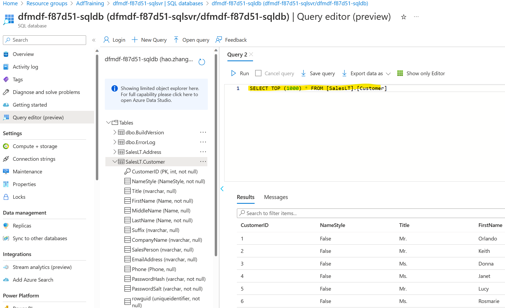 </kbd>

This database represents a typical OLTP (Online Transactional Processing) database, which is optimized for fast data insertion and retrieval. For analytical and reporting purposes it is always recommended to have a OLAP (Online Analytical Processing) database (which usually forms into a Datawarehouse) in place, that offloads the analytical workloads on the same data sources (by syncing and persisting required data from the OLTP databases) and optimizes the query performance for **read** queries on large amount of rows. 

Usually in a datawarehouse scenario you want to build a "star schema" where a fact table is surrounded by several dimension tables, linked by a ID column in a many-to-one relationship.

<kbd>  </kbd>

Each dimension table represents an **entity** e.g. Product, Date, Customer and Employee where all related information about that entity are **denormalized** and put together to benefit **read** queries from analytical perspective, comparing to in OLTP databases usually all tables are normalized to maximize performance for **write** activites.

<kbd>  </kbd>

In this module we will use the [SalesLT].[Customer], [SalesLT].[CustomerAddress] and [SalesLT].[Address] tables denormalized together as source data for the SCD Type 1 and SCD Type 2 transformation.

To prepare this data source, go to the **query editor (preview)** tab within Azure Portal of the Azure SQL Database, login to the query editor pane using either SQL server authentication or Active Direnctory authentication. 
<kbd>  </kbd>
To create a simple source, let's create a view about customers with the last name **Adams** and some relevant attributes from the **Customer** and **CustomerAddress** table (copy and paste following code block in **Query 1** and hit **Run**):
```SQL
SELECT 
 C.CustomerID
,Title
,FirstName
,Lastname
,CompanyName
,A.City
,A.CountryRegion
,EmailAddress
,Phone
FROM SalesLT.Customer C
JOIN SalesLT.CustomerAddress CA
ON C.CustomerID = CA.CustomerID
JOIN SalesLT.Address A
ON CA.AddressID = A.AddressID
WHERE LastName = 'Adams'");
```
<kbd> 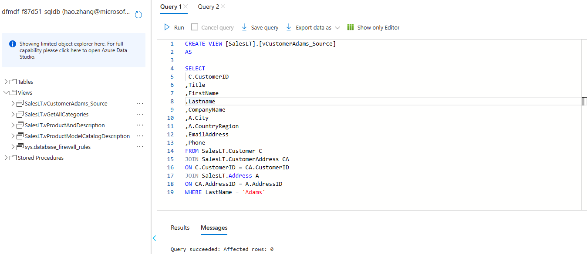 </kbd>

Now, right click on the newly created view (if not yet visible, click the refresh botton) to **Select Top 1000 Rows**. You will see only 2 users with the last name **Adams** in your results. 

<kbd> 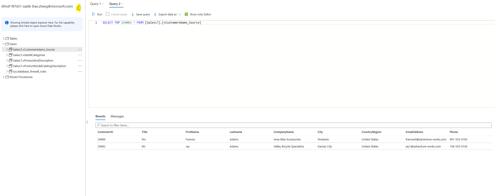 </kbd>

For target tables, we will create 2 different ones, one for SCD Type 1 scenario and the other one for SCD Type 2 scenario. 

Copy and past the following 2 code blocks in the query editor and run them individually:
```SQL
CREATE TABLE [SalesLT].[DimCustomerAdams_SCD1](
	[SID_CustomerAdams] [int] IDENTITY(1,1) NOT NULL,
	[CustomerID] [int] NULL,
	[Title] [nvarchar](8) NULL,
	[FirstName] [nvarchar](50) NULL,
	[Lastname] [nvarchar](50) NULL,
	[CompanyName] [nvarchar](128) NULL,
	[City] [nvarchar](30) NULL,
	[CountryRegion] [nvarchar](50) NULL,
	[EmailAddress] [nvarchar](50) NULL,
	[Phone] [nvarchar](25) NULL,
	[LastUpdated] [datetime] NULL
);
```
<kbd> 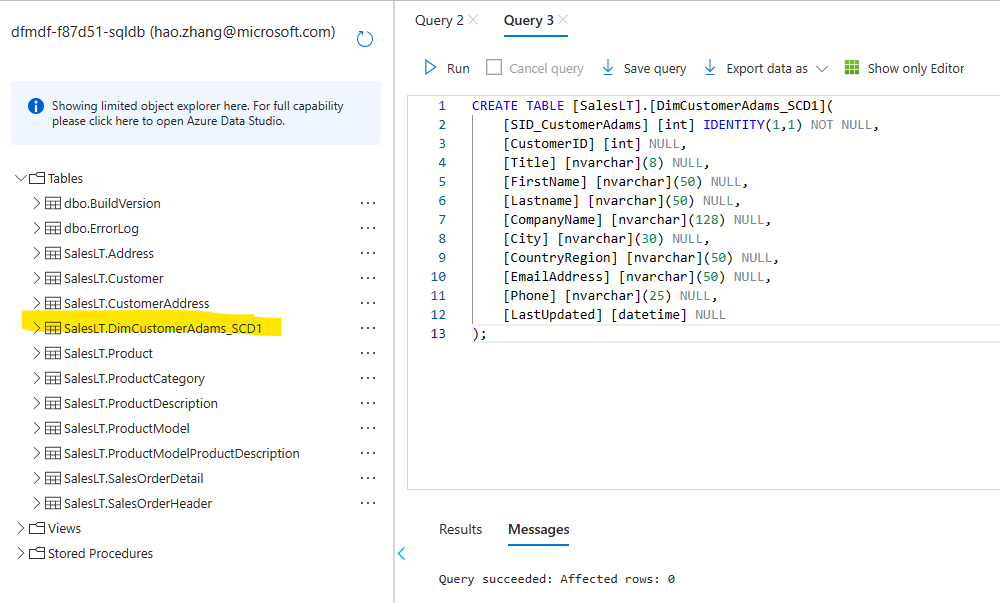 </kbd>
Notice here we added 2 new columns comparing to the view created above: **SID_CustomerAdams** and **LastUpdated**. The former SID is short for Serrogate ID, which is a common practice in datawarehouse dimenstion tables working as the final identity column to map with fact tables. The latter is for logging/lineage purposes to document with a timestamp of change. 
```SQL
CREATE TABLE [SalesLT].[DimCustomerAdams_SCD2](
	[SID_CustomerAdams] [int] IDENTITY(1,1) NOT NULL,
	[CustomerID] [int] NULL,
	[Title] [nvarchar](8) NULL,
	[FirstName] [nvarchar](50) NULL,
	[Lastname] [nvarchar](50) NULL,
	[CompanyName] [nvarchar](128) NULL,
	[City] [nvarchar](30) NULL,
	[CountryRegion] [nvarchar](50) NULL,
	[EmailAddress] [nvarchar](50) NULL,
	[Phone] [nvarchar](25) NULL,
    [IsActive] [bit] NULL,
    [ValidFrom] [datetime] NULL,
    [ValidTo] [datetime] NULL,
	[LastUpdated] [datetime] NULL
);
```
<kbd> 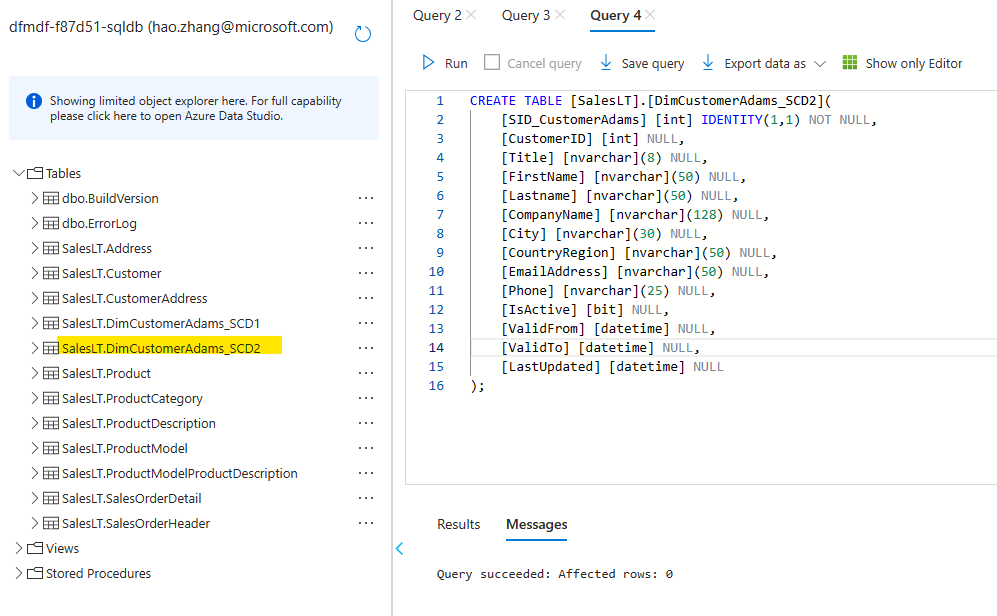 </kbd>
Comparing to the SCD1 table we again added 3 additional columns here:

**IsActive** is a flag column for identifying whether a record is representing the up-to-date information or only for historization purposes. **ValidFrom** and **ValidTo** further elaborates the case when a record is not update, when (from which timestamp to which timestamp) exactily it **was** representing the truth. With this 3 additional columns, the reporting should be able to reflect the truth without losing the historical changes.

As the final step, let's create 3 datasets in Azure Data Factory to represent the source and target tables in Azure SQL DB. 

Go to Azure Data Factory studio, click on elipsis of **Dataset** and select New dataset. In the pop-up window on the right, type in **Azure SQL Database** to filter and select Azure SQL Database as the data store. 
<kbd> 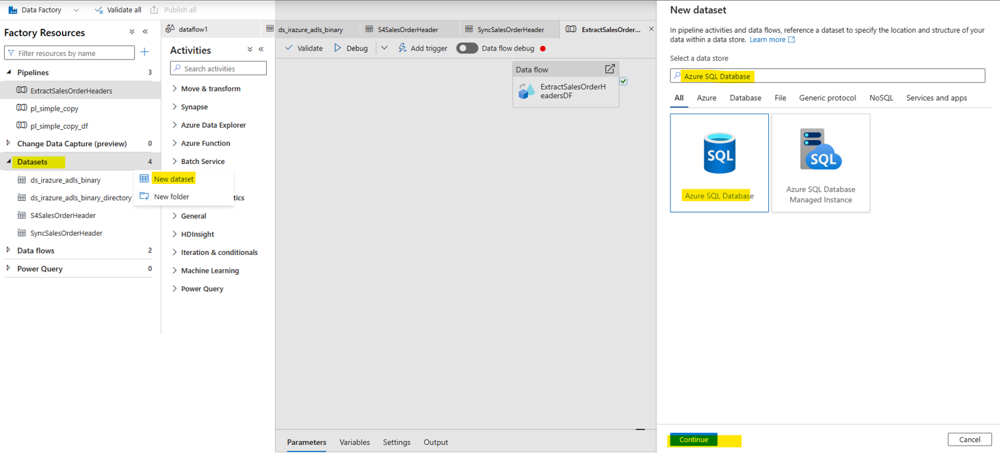 </kbd>
Set the **Name**, **Linked service** and select the table from the dropdown list as shown below and click **OK**.
<kbd> 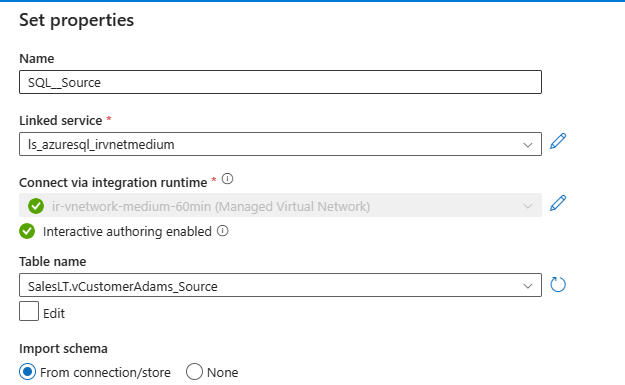 </kbd>
repeat the process 2 more times for the 2 target tables.
<kbd> 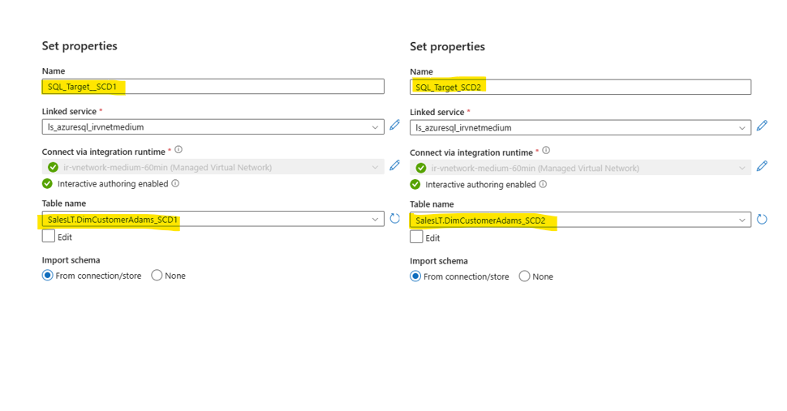 </kbd>

Now you should have 3 new datasets as shown below:
<kbd> 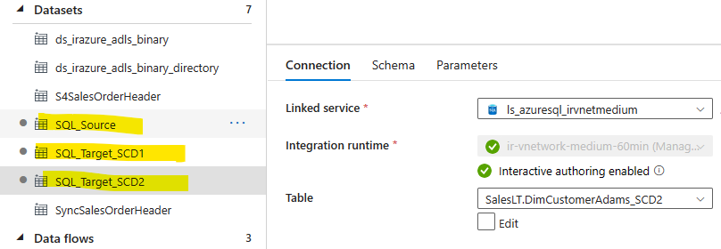 </kbd>

Click **Publish all** to save the changes. 

Now, we have prepared our source and target as well as a dataset representing Azure SQL objects, we are ready to build some data flows to load data from source to target based on different business scenarios.

## 3. Slowly-Changing-Dimension 1

As mentioned before, SCD type 1 comes into play when the change of the attribute doesn't need to be tracked e.g. phone number of a customer, because we always want to have the up-to-date phone number to contact the customer with. Let's simulate this case.

Click on the elipsis of **Data flows** and then click on **New data flow**. In the pop-up window on the right, change the **Name** of the data flow to **SCD1**. 
<kbd> 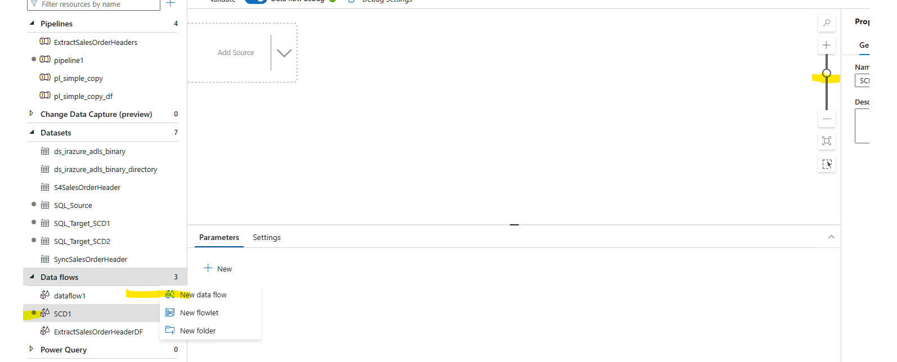 </kbd>
Click on **Add Source** on the canvas to add the source. Change the **Output stream name** to **vCustomerAdamSource**. Click on the toggle **Data flow debug** to activate the debug computer cluster during data flow development time. Optionally, after clicking **Save** button, click on the **Test connection** beside **Dataset** to test if the connection to our view in the Azure SQL DB is successful. 
<kbd> 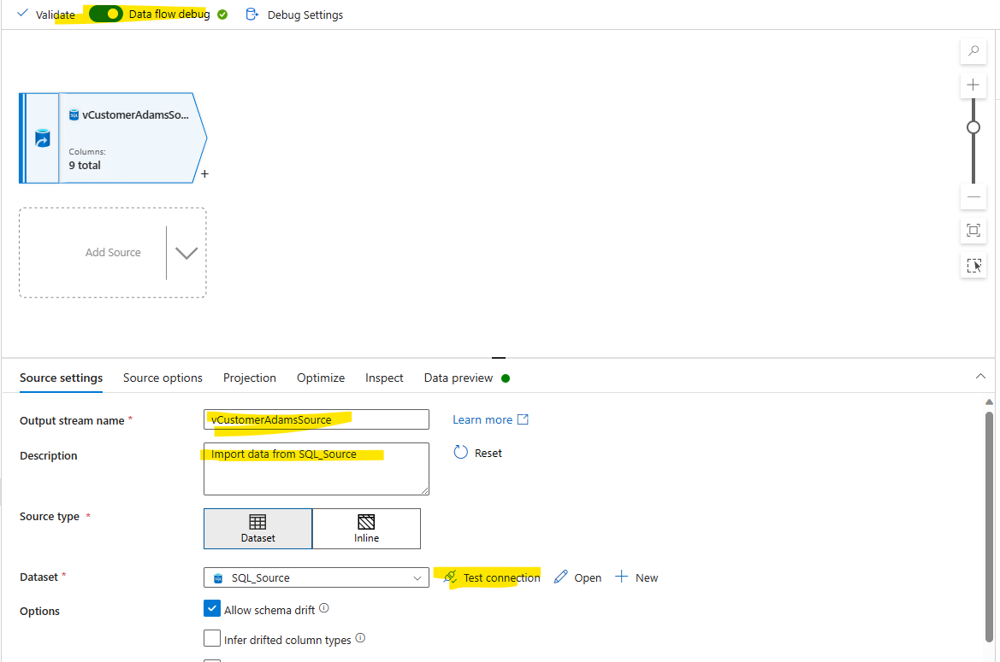 </kbd>
Then switch to the **Data preview** tab and click on **Refresh**, in a few seconds you should see the 2 records. 
<kbd> 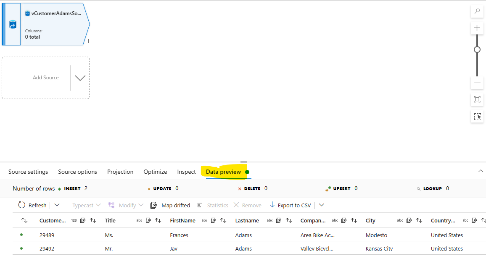 </kbd>

Next step, we will add a **Alter Row** transformation under the **Row modifier** section by click on the **+** button at the lower right corner of the source block. 
<kbd> 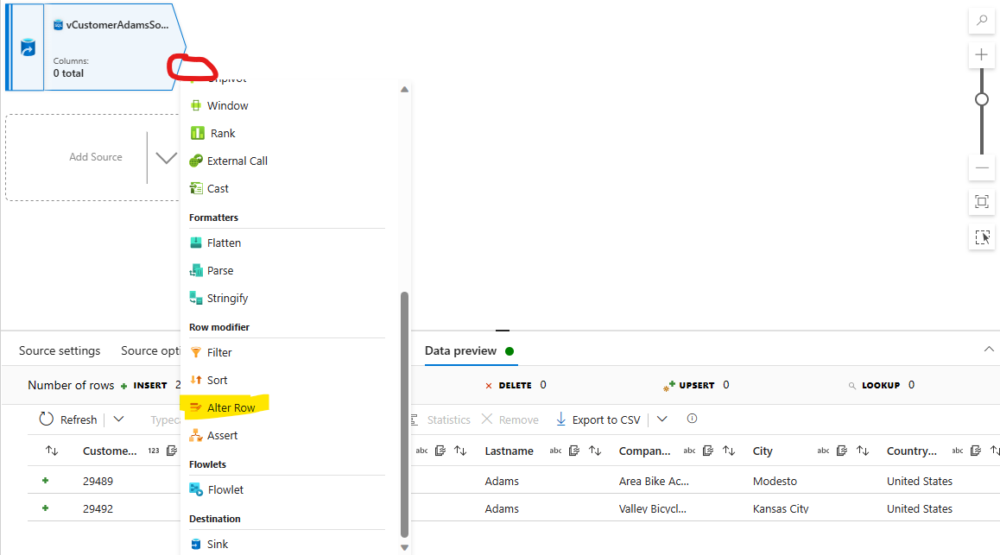 </kbd>
Unter **Alter row settings**, change the name and give a description as shown below. Unter **Alter row conditions** setting, select **Upsert if** and set the condition to **true()**. This **Alter Row** transformation is needed before the **Sink** block as long as there is any modification (insert, update, delete) forseen on the target table. 
<kbd> 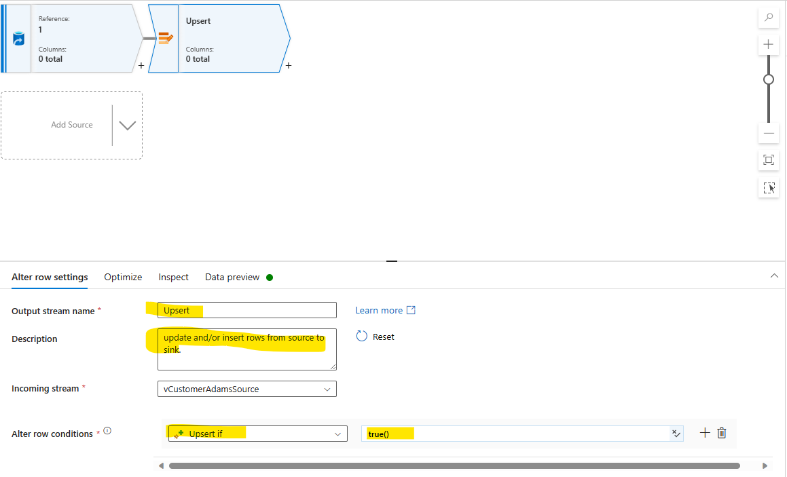 </kbd>

As last step, we add the **Sink** block to the data flow
<kbd> 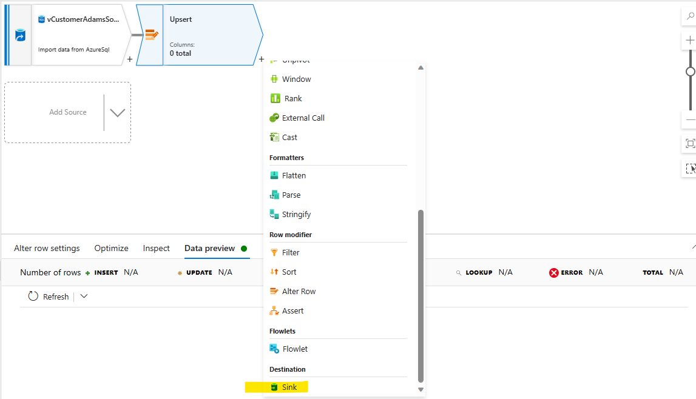 </kbd>
as before, change the name, description and select **AzureSql** as the dataset. Go to **Debug Settings** and asign the values as shown below to point the generic/dynamic dataset object to our target table [SalesLT].[DimCustomerAdams_SCD1] as target. 
<kbd> 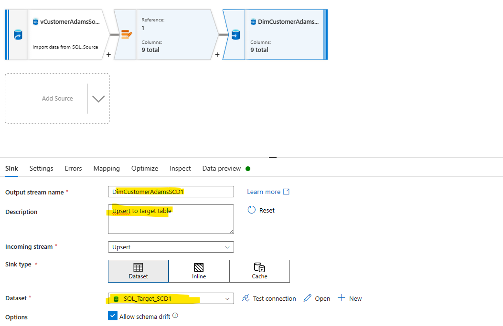 </kbd>
Switch to **Setting** tab, set the **Update method** to **Allow upsert**, select the **Key columns** to **CustomerID**. 
<kbd>  </kbd>
This setting is important as it tells the data flow to decide whether to update or insert based on **CustomerID** column. If any row from the source has unmatched value in **CustomerID** column compare to the target, it will be inserted. If any row from the source has matched value in **CustomerID** column compare to the target, the same row in target will be updated with the row from source for all other columns. 
Now, switch to **Mapping** tab und uncheck the **Auto mapping** box. In the manual mapping below, delete the **SID_CustomerAdams** row because it is an **identity column**, will increment by 1 automatically for every inserted row. For the last column **LastUpdated** we don´t have any column from source to map with. Since this column should be filled with the timestamp as the row modification happens, we need to add a new column before **Upsert** transformation. 
<kbd> 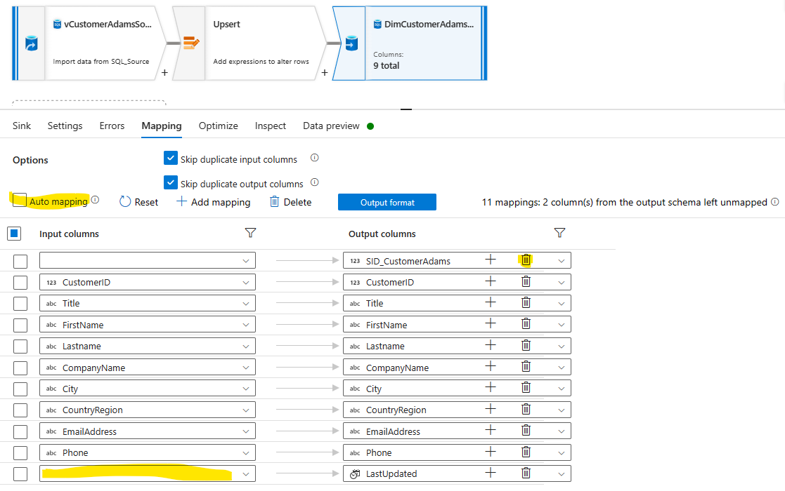 </kbd>
Click on the **+** of the source block to add a **Derived Column** transformation block. 
<kbd> 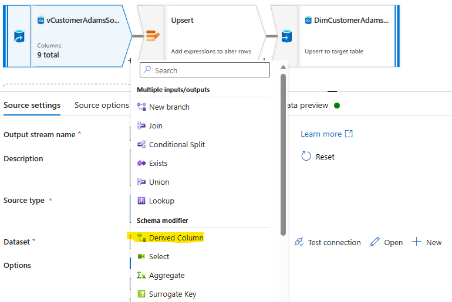 </kbd>
Change the name and description as shown below. Give the name **CurrentTimeStamp** to the new column, for the expression, use the function **currentTimestamp()**
<kbd>  </kbd>
Click on the **Data preview** and **Refresh** to confirm a new column is added. 
<kbd> 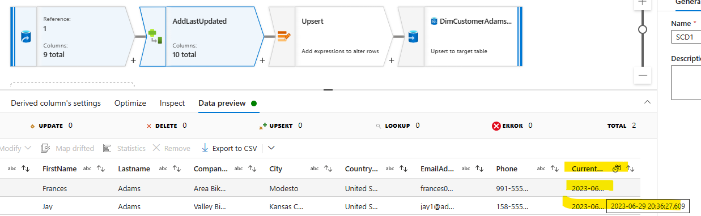 </kbd>
Go back to the Sink Settings under **Mapping**, we can now map the **CurrentTimeStamp** to **LastUpdated** column. 
<kbd> 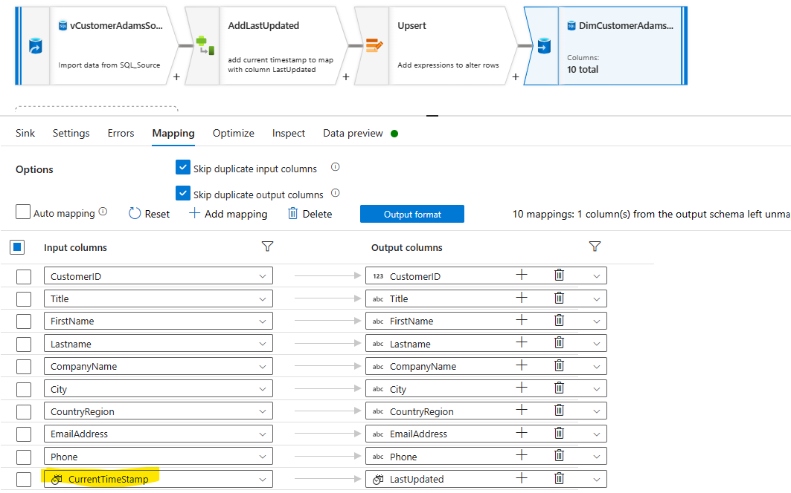 </kbd>

Now, it is time to run the data flow. First, let´s confirm the target table is currently empty (go by to **Query editor** in Azure SQL DB and do a quick query): 
<kbd> 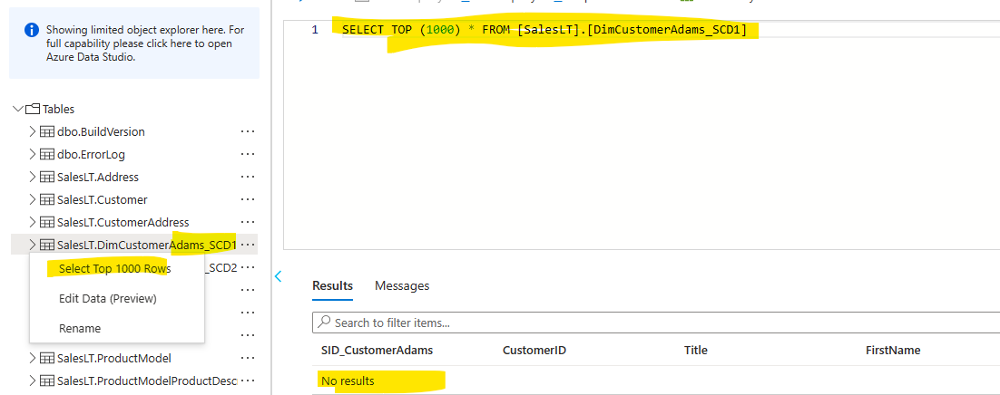 </kbd>
then, let's run the data flow for the first time. To do that, we create a pipeline and drag the data flow activity to the canvas. Then choose the **SCD1** data flow from the dropdown list, finally click **Debug**:
<kbd> 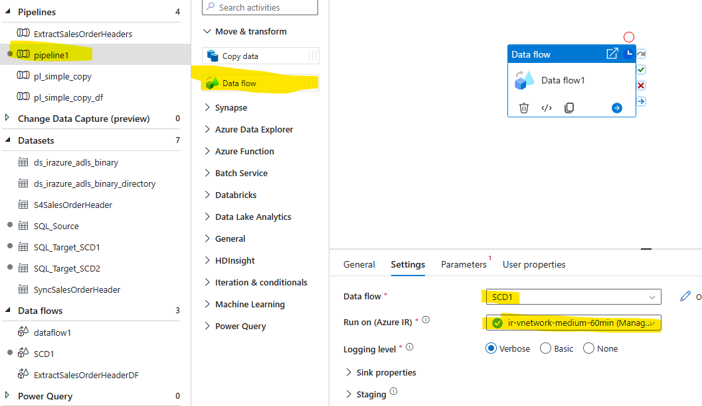 </kbd>
after a few seconds you should see the result:
<kbd> 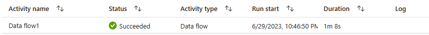 </kbd>
Now we can go back and check the target table again with a simple query, and we can see the 2 rows are inserted into the target table. :
<kbd> 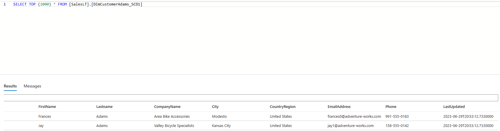 </kbd>

Let´s now do some changes to the source so that we can see the **upsert** taking effect. Copy the following code and execute it in a new query:
```SQL
UPDATE [SalesLT].[CustomerAddress] SET AddressID = 1068 WHERE CustomerID = '29489' -- manually move Ms. Frances Adams from Modesto to Phoenix

INSERT INTO [SalesLT].[Customer] (Title,FirstName,LastName,CompanyName,EmailAddress,Phone,PasswordHash,PasswordSalt,rowguid,ModifiedDate) --manually add two people with last name "Adams"
VALUES
	('Mr.', 'Michael', 'Adams', 'Contoso', 'madams@contoso.com', '111-111-1111',HASHBYTES('SHA2_256','111-111-1111'),'PassW0rd',NEWID(),GETDATE ()),
	('Ms.', 'Anna', 'Adams', 'Contoso', 'aadams@contoso.com', '222-222-2222',HASHBYTES('SHA2_256','222-222-2222'),'PassW0rd1',NEWID(),GETDATE ());
	-- max. 30118
INSERT INTO [SalesLT].[CustomerAddress] (CustomerID,AddressID,AddressType,rowguid,ModifiedDate) -- manually add 2 Customer-Address mapping to include the newly created fake customer, due to foreign key constrain of the table. 
VALUES 
	((SELECT CustomerID FROM [SalesLT].[Customer] WHERE EmailAddress = 'madams@contoso.com'),11,'Main Office',NEWID(),GETDATE ()),
	((SELECT CustomerID FROM [SalesLT].[Customer] WHERE EmailAddress = 'aadams@contoso.com'),25,'Main Office',NEWID(),GETDATE ());
```
The code above will make one row updated and 2 rows newly added from the source. 
<kbd> 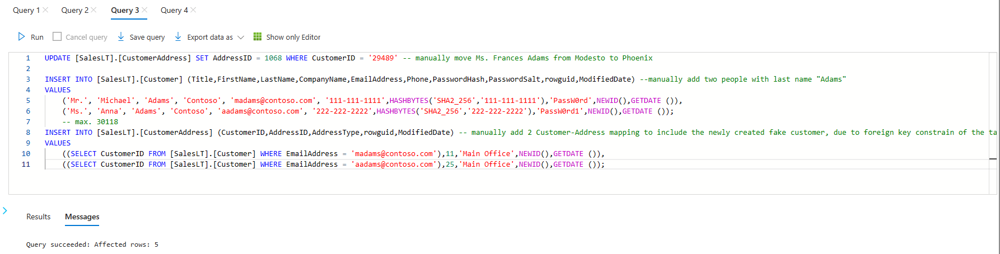 </kbd>
now if you rerun the query of our source:
<kbd> 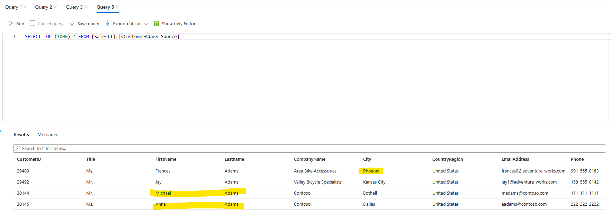 </kbd>
you will find one updated records and 2 new records.

Now if you rerun the data flow:
<kbd> 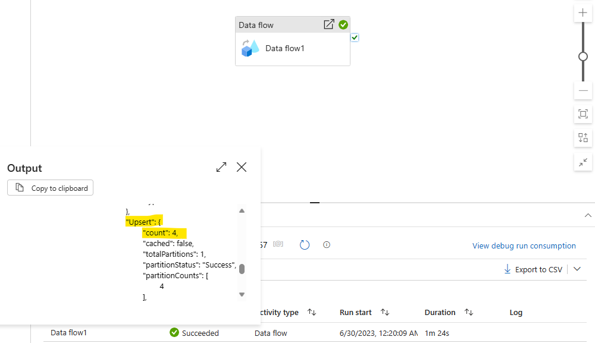 </kbd>
and check the target table again you will see that all changes from the source are reflected in the target (sink):
<kbd> 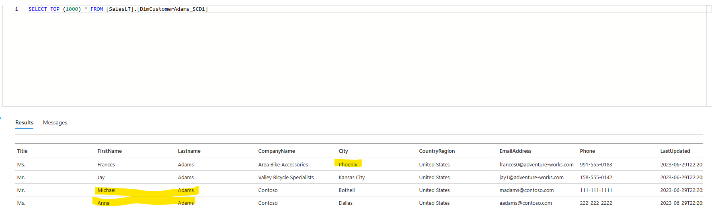 </kbd>

With that, our Slowly-Changing-Dimension Type 1 transformation is demenstrated. 
## 4. Slowly-Changing-Dimension 2

asdfasdfasdf