# Module 05 - Slowly Changing Dimensions

[< Previous Module](../modules/module04.md) - **[Home](../README.md)** - [Next Module >](../modules/module06.md)

## :loudspeaker: Introduction

according to [Wikipedia](https://en.wikipedia.org/wiki/Slowly_changing_dimension): a slowly changing dimension (SCD) in data management and data warehousing is a dimension which contains relatively static data which can change slowly but unpredictably, rather than according to a regular schedule. Typical examples are the family name change of an employee after marrige and address change of a customer, which all happens unpredictably.

Based on how to deal with a slowly dimensional data change in different scenarios, there are several SCD Types. The most frequently used are SCD Type 1 and SCD Type 2, which will be introduced in this module together with the implementation pattern in Azure Data Factory Mapping Data Flow. 


* Slowly Changing Dimensions Type 1 (overwrite without tracking history)
* Slowly Changing Dimensions Type 2 (track history by adding new row)

## :bookmark_tabs: Table of Contents

| #  | Section |
| --- | --- |
| 1 | [Introduction SCD Type 1 and SCD Type 2](#1-introduction-scd-type-1-and-scd-type-2) |
| 2 | [Set up the linked service and dataset](#2-set-up-the-linked-service-and-dataset) |
| 3 | [Implement SCD Type 1 transformation with MDF](#3-implement-sdc-type-1-transformation-with-MDF) |
| 4 | [Implement SCD Type 2 transformation with MDF](#4-implement-sdc-type-2-transformation-with-MDF) |

<div align="right"><a href="#module-05---slowly-changing-dimensions">↥ back to top</a></div>

## 1. Introduction SCD Type 1 and SCD Type 2

### SCD Type 1
A **SCD Type 1** always reflects the latest values, and when changes in source data are detected, the dimension table data is overwritten. This design approach is common for columns that store supplementary values, like the email address or phone number of a customer. When a customer email address or phone number changes, the dimension table updates the customer row with the new values. It's as if the customer always had this contact information. The key field, such as CustomerID, would stay the same so the records in the fact table automatically link to the updated customer record.

<kbd> 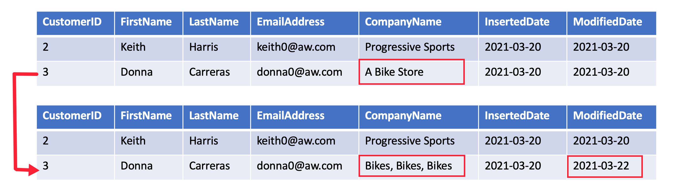 </kbd>

### SCD Type 2
A **SCD Type 2** supports versioning of dimension members. Often the source system doesn't store versions, so the data warehouse load process detects and manages changes in a dimension table. In this case, the dimension table must use a surrogate key to provide a unique reference to a version of the dimension member. It also includes columns that define the date range validity of the version (for example, StartDate and EndDate) and possibly a flag column (for example, IsCurrent) to easily filter by current dimension members.

For example, Adventure Works assigns salespeople to a sales region. When a salesperson relocates region, a new version of the salesperson must be created to ensure that historical facts remain associated with the former region. To support accurate historic analysis of sales by salesperson, the dimension table must store versions of salespeople and their associated region(s). The table should also include start and end date values to define the time validity. Current versions may define an empty end date (or 12/31/9999), which indicates that the row is the current version. The table must also define a surrogate key because the business key (in this instance, employee ID) won't be unique.

<kbd> 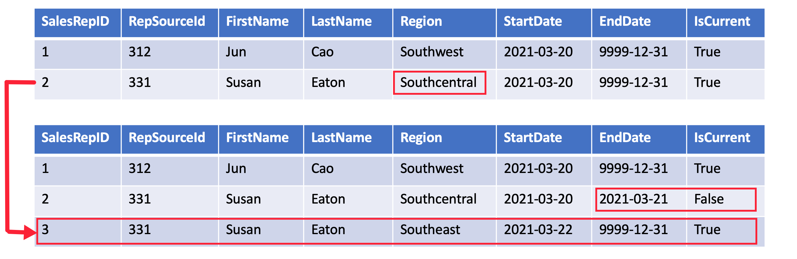 </kbd>

## 2. Prepare the dataset
if you have successfully completed the [module 2](../modules/module02.md), you should already have the Azure Data Factory with the read and write access granted to the Azure SQL DB.

In the Azure SQL DB you will already find an "Adventure Works" database pre-deployed and filled with data ready to be queried (a test query on the [SalesLT].[Customer] table executed in the **Query Editor** showed below).

<kbd>  </kbd>

This database represents a typical OLTP (Online Transactional Processing) database, which is optimized for fast data insertion and retrieval. For analytical and reporting purposes it is always recommended to have a OLAP (Online Analytical Processing) database (which usually forms into a Datawarehouse) in place, that offloads the analytical workloads on the same data sources (by syncing and persisting required data from the OLTP databases) and optimizes the query performance for **read** queries on large amount of rows. 

Usually in a datawarehouse scenario you want to build a "star schema" where a fact table is surrounded by several dimension tables, linked by a ID column in a many-to-one relationship.

<kbd>  </kbd>

Each dimension table represents an **entity** e.g. Product, Date, Customer and Employee where all related information about that entity are **denormalized** and put together to benefit **read** queries from analytical perspective, comparing to in OLTP databases usually all tables are normalized to maximize performance for **write** activites.

<kbd>  </kbd>

In this module we will use the [SalesLT].[Customer], [SalesLT].[CustomerAddress] and [SalesLT].[Address] tables denormalized together as source data for the SCD Type 1 and SCD Type 2 transformation.

1. To prepare this data source, go to the **query editor (preview)** tab within Azure Portal of the Azure SQL Database, login to the query editor pane using either SQL server authentication or Active Direnctory authentication. 
<kbd> 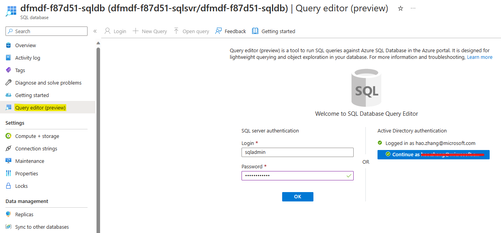 </kbd>
To create a simple source, let's create a view about customers with the last name **Adams** and some relevant attributes from the **Customer** and **CustomerAddress** table (copy and paste following code block in **Query 1** and hit **Run**):
```SQL
SELECT 
 C.CustomerID
,Title
,FirstName
,Lastname
,CompanyName
,A.City
,A.CountryRegion
,EmailAddress
,Phone
FROM SalesLT.Customer C
JOIN SalesLT.CustomerAddress CA
ON C.CustomerID = CA.CustomerID
JOIN SalesLT.Address A
ON CA.AddressID = A.AddressID
WHERE LastName = 'Adams'");
```
<kbd>  </kbd>

2. Now, right click on the newly created view (if not yet visible, click the refresh botton) to **Select Top 1000 Rows**. You will see only 2 users with the last name **Adams** in your results. 

<kbd>  </kbd>

3. For target tables, we will create 2 different ones, one for SCD Type 1 scenario and the other one for SCD Type 2 scenario. 

	Copy and past the following 2 code blocks in the query editor and run them individually:
```SQL
CREATE TABLE [SalesLT].[DimCustomerAdams_SCD1](
	[SID_CustomerAdams] [int] IDENTITY(1,1) NOT NULL,
	[CustomerID] [int] NULL,
	[Title] [nvarchar](8) NULL,
	[FirstName] [nvarchar](50) NULL,
	[Lastname] [nvarchar](50) NULL,
	[CompanyName] [nvarchar](128) NULL,
	[City] [nvarchar](30) NULL,
	[CountryRegion] [nvarchar](50) NULL,
	[EmailAddress] [nvarchar](50) NULL,
	[Phone] [nvarchar](25) NULL,
	[LastUpdated] [datetime] NULL
);
```
<kbd>  </kbd>
Notice here we added 2 new columns comparing to the view created above: **SID_CustomerAdams** and **LastUpdated**. The former SID is short for Serrogate ID, which is a common practice in datawarehouse dimenstion tables working as the final identity column to map with fact tables. The latter is for logging/lineage purposes to document with a timestamp of change. 
```SQL
CREATE TABLE [SalesLT].[DimCustomerAdams_SCD2](
	[SID_CustomerAdams] [int] IDENTITY(1,1) NOT NULL,
	[CustomerID] [int] NULL,
	[Title] [nvarchar](8) NULL,
	[FirstName] [nvarchar](50) NULL,
	[Lastname] [nvarchar](50) NULL,
	[CompanyName] [nvarchar](128) NULL,
	[City] [nvarchar](30) NULL,
	[CountryRegion] [nvarchar](50) NULL,
	[EmailAddress] [nvarchar](50) NULL,
	[Phone] [nvarchar](25) NULL,
    [IsActive] [bit] NULL,
    [ValidFrom] [datetime] NULL,
    [ValidTo] [datetime] NULL,
	[LastUpdated] [datetime] NULL
);
```
<kbd>  </kbd>
Comparing to the SCD1 table we again added 3 additional columns here:

**IsActive** is a flag column for identifying whether a record is representing the up-to-date information or only for historization purposes. **ValidFrom** and **ValidTo** further elaborates the case when a record is not update, when (from which timestamp to which timestamp) exactily it **was** representing the truth. With this 3 additional columns, the reporting should be able to reflect the truth without losing the historical changes.

4. As the final step, let's create 3 datasets in Azure Data Factory to represent the source and target tables in Azure SQL DB. 

	Go to Azure Data Factory studio, click on elipsis of **Dataset** and select New dataset. In the pop-up window on the right, type in **Azure SQL Database** to filter and select Azure SQL Database as the data store. 
<kbd>  </kbd>
Set the **Name**, **Linked service** and select the table from the dropdown list as shown below and click **OK**.
<kbd>  </kbd>
repeat the process 2 more times for the 2 target tables.
<kbd>  </kbd>

Now you should have 3 new datasets as shown below:
<kbd>  </kbd>

Click **Publish all** to save the changes. 

5. Now, we have prepared our source and target as well as a dataset representing Azure SQL objects, we are ready to build some data flows to load data from source to target based on different business scenarios.

## 3. Slowly-Changing-Dimension 1

As mentioned before, SCD type 1 comes into play when the change of the attribute doesn't need to be tracked e.g. phone number of a customer, because we always want to have the up-to-date phone number to contact the customer with. Let's simulate this case.

1. Click on the elipsis of **Data flows** and then click on **New data flow**. In the pop-up window on the right, change the **Name** of the data flow to **SCD1**. 
<kbd> 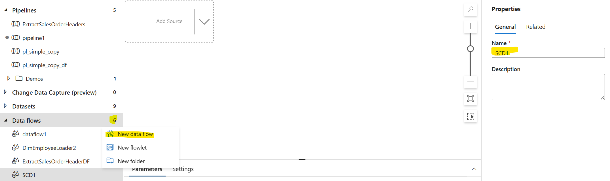 </kbd>
2. Click on **Add Source** on the canvas to add the source. Change the **Output stream name** to **vCustomerAdamSource**. Click on the toggle **Data flow debug** to activate the debug computer cluster during data flow development time. Optionally, after clicking **Save** button, click on the **Test connection** beside **Dataset** to test if the connection to our view in the Azure SQL DB is successful. 
<kbd>  </kbd>
Then switch to the **Data preview** tab and click on **Refresh**, in a few seconds you should see the 2 records. 
<kbd>  </kbd>

3. Next step, we will add a **Alter Row** transformation under the **Row modifier** section by click on the **+** button at the lower right corner of the source block. 
<kbd>  </kbd>
Unter **Alter row settings**, change the name and give a description as shown below. Unter **Alter row conditions** setting, select **Upsert if** and set the condition to **true()**. This **Alter Row** transformation is needed before the **Sink** block as long as there is any modification (insert, update, delete) forseen on the target table. 
<kbd>  </kbd>

4. As last step, we add the **Sink** block to the data flow
<kbd>  </kbd>
as before, change the name, description and select **AzureSql** as the dataset. Go to **Debug Settings** and asign the values as shown below to point the generic/dynamic dataset object to our target table [SalesLT].[DimCustomerAdams_SCD1] as target. 
<kbd>  </kbd>
Switch to **Setting** tab, set the **Update method** to **Allow upsert**, select the **Key columns** to **CustomerID**. 
<kbd> 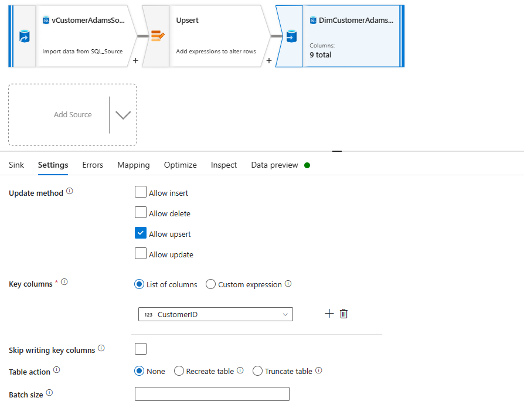 </kbd>
This setting is important as it tells the data flow to decide whether to update or insert based on **CustomerID** column. If any row from the source has unmatched value in **CustomerID** column compare to the target, it will be inserted. If any row from the source has matched value in **CustomerID** column compare to the target, the same row in target will be updated with the row from source for all other columns. 
Now, switch to **Mapping** tab und uncheck the **Auto mapping** box. In the manual mapping below, delete the **SID_CustomerAdams** row because it is an **identity column**, will increment by 1 automatically for every inserted row. For the last column **LastUpdated** we don´t have any column from source to map with. Since this column should be filled with the timestamp as the row modification happens, we need to add a new column before **Upsert** transformation. 
<kbd>  </kbd>
Click on the **+** of the source block to add a **Derived Column** transformation block. 
<kbd>  </kbd>
Change the name and description as shown below. Give the name **CurrentTimeStamp** to the new column, for the expression, use the function **currentTimestamp()**
<kbd> 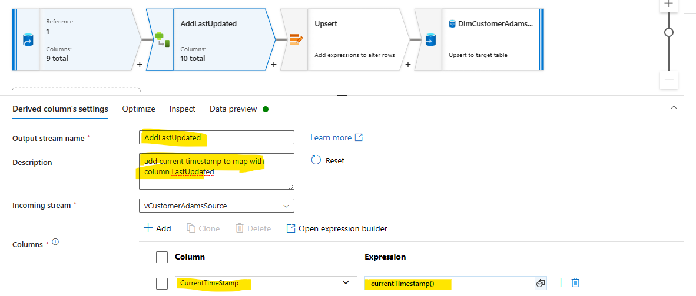 </kbd>
Click on the **Data preview** and **Refresh** to confirm a new column is added. 
<kbd>  </kbd>
Go back to the Sink Settings under **Mapping**, we can now map the **CurrentTimeStamp** to **LastUpdated** column. 
<kbd>  </kbd>

5. Now, it is time to run the data flow. First, let´s confirm the target table is currently empty (go by to **Query editor** in Azure SQL DB and do a quick query): 
<kbd>  </kbd>
then, let's run the data flow for the first time. To do that, we create a pipeline and drag the data flow activity to the canvas. Then choose the **SCD1** data flow from the dropdown list, finally click **Debug**:
<kbd>  </kbd>
after a few seconds you should see the result:
<kbd>  </kbd>
Now we can go back and check the target table again with a simple query, and we can see the 2 rows are inserted into the target table. :
<kbd>  </kbd>

6. Let´s now do some changes to the source so that we can see the **upsert** taking effect. Copy the following code and execute it in a new query:
```SQL
UPDATE [SalesLT].[CustomerAddress] SET AddressID = 1068 WHERE CustomerID = '29489' -- manually move Ms. Frances Adams from Modesto to Phoenix

INSERT INTO [SalesLT].[Customer] (Title,FirstName,LastName,CompanyName,EmailAddress,Phone,PasswordHash,PasswordSalt,rowguid,ModifiedDate) --manually add two people with last name "Adams"
VALUES
	('Mr.', 'Michael', 'Adams', 'Contoso', 'madams@contoso.com', '111-111-1111',HASHBYTES('SHA2_256','111-111-1111'),'PassW0rd',NEWID(),GETDATE ()),
	('Ms.', 'Anna', 'Adams', 'Contoso', 'aadams@contoso.com', '222-222-2222',HASHBYTES('SHA2_256','222-222-2222'),'PassW0rd1',NEWID(),GETDATE ());
	-- max. 30118
INSERT INTO [SalesLT].[CustomerAddress] (CustomerID,AddressID,AddressType,rowguid,ModifiedDate) -- manually add 2 Customer-Address mapping to include the newly created fake customer, due to foreign key constrain of the table. 
VALUES 
	((SELECT CustomerID FROM [SalesLT].[Customer] WHERE EmailAddress = 'madams@contoso.com'),11,'Main Office',NEWID(),GETDATE ()),
	((SELECT CustomerID FROM [SalesLT].[Customer] WHERE EmailAddress = 'aadams@contoso.com'),25,'Main Office',NEWID(),GETDATE ());
```
The code above will make one row updated and 2 rows newly added from the source. 
<kbd>  </kbd>
now if you rerun the query of our source:
<kbd>  </kbd>
you will find one updated records and 2 new records.

Now if you rerun the data flow:
<kbd>  </kbd>
and check the target table again you will see that all changes from the source are reflected in the target (sink):
<kbd>  </kbd>

With that, our Slowly-Changing-Dimension Type 1 transformation is demonstrated. 
## 4. Slowly-Changing-Dimension 2

As mentioned before, the handling of attribute changes in a dimension table is more complex in SCD Type 2 scenarios than it was the case for SCD Type 1. 
From the workflow's perspective, we have to do the following steps:

First, check if the incoming data from source contains any new instances of the entity (in our example here: check if there are any new customers based on CustomerID as business key).

Second, from the existing instances of the entity (in our example: existing customers), check if any attributes of each instances has changed compare to the target. 
- If there is a case, deactivate the row of the target (update the flag column **IsActive** of the target rows to **0** and set the **ValidTo** timestamp to the current moment) and activate the respective row from the source to target window (insert the row to target, set the flag column **IsActive** to **1** and set the **ValidFrom** timestamp to the current moment as well as the **ValidTo** timestamp to a default **infinitive** value.)
- If there is no such case, do nothing and ignore the rows from source. 

With that recap, let's build the data flow for SCD2.

1. Go to Azure Data Factory studio and create a new **Data Flow** with the name **SCD2**, activate the **Data flow debug** if it is not already the case.
<kbd> 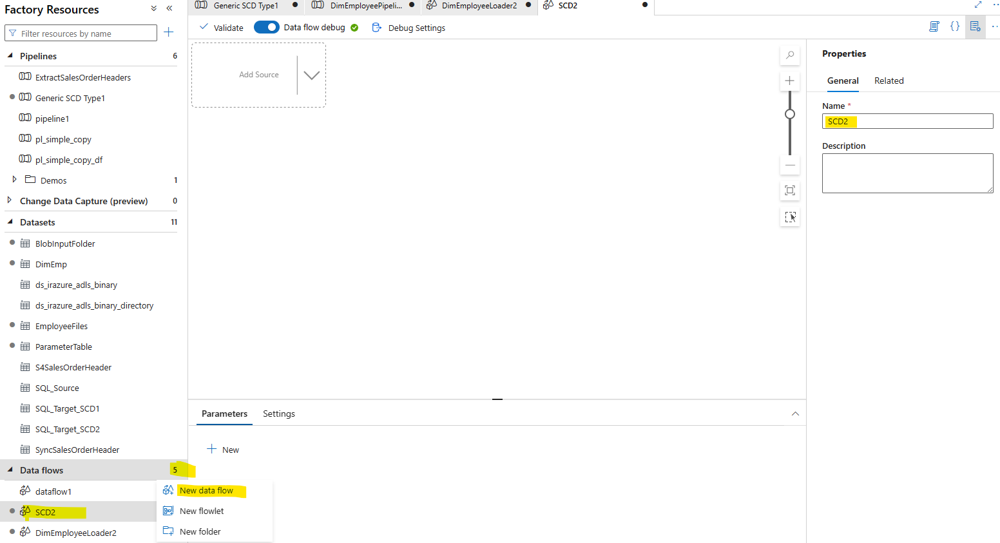 </kbd>

Add 2 sources: one for our incoming new data from the source table and one for our existing data from the target table in Azure SQL DB. 
<kbd> 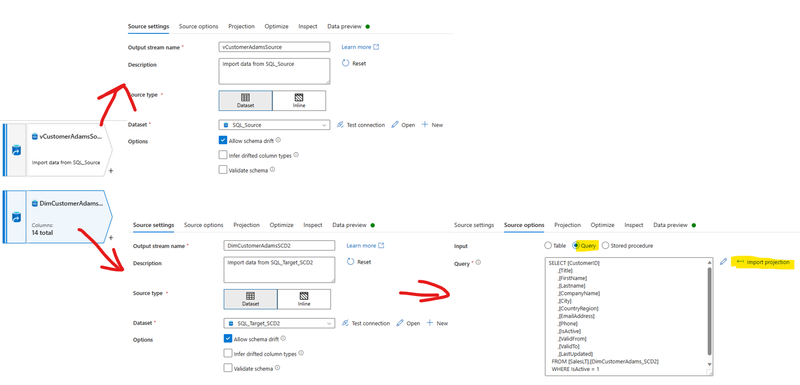 </kbd>
notice for the existing data as source we used a **Query** input type instead of the default **Table**. Reason is that we want to make sure to only take **active** records into consideration during a lookup. As we have set the column **[SID_CustomerAdams]** as identity column, we don´t have to include it into the query definition. Remember to click the **Import projection** button after type in the following statement into the query field to make it effective (otherwise it uses by default the complete table as in **SELECT * FROM [SalesLT].[DimCustomerAdams_SCD2]**)

```SQL
SELECT [CustomerID]
      ,[Title]
      ,[FirstName]
      ,[Lastname]
      ,[CompanyName]
      ,[City]
      ,[CountryRegion]
      ,[EmailAddress]
      ,[Phone]
      ,[IsActive]
      ,[ValidFrom]
      ,[ValidTo]
      ,[LastUpdated]
  FROM [SalesLT].[DimCustomerAdams_SCD2]
  WHERE IsActive = 1
```
2. Up next let´s finish preparing the existing data for further lookup. First, let´s use **Derived column** to create a **Hash** column of the attributes column that could change. The purpose of using a hash column here is to easily detect if any of the attributes column has changed when comparing the rows of incoming data and existing data (as long as at least one attributes changed when the business key matches, the hash column will have a different value). 
<kbd> 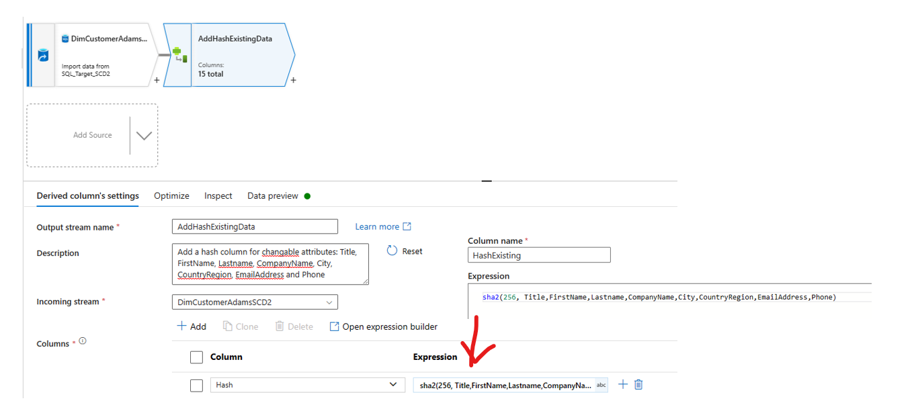 </kbd>
For easy distinction of incoming rows and existing rows with the same column names, we could add a **Exist** suffix to the column names of the existing data (on business key column and the hash column). To do that, we can use a **select** transformation. Because we used a hash column to represent the changable attributes columns, we don´t need them for further lookups anymore and can delete them in the **select** transformation.
<kbd> 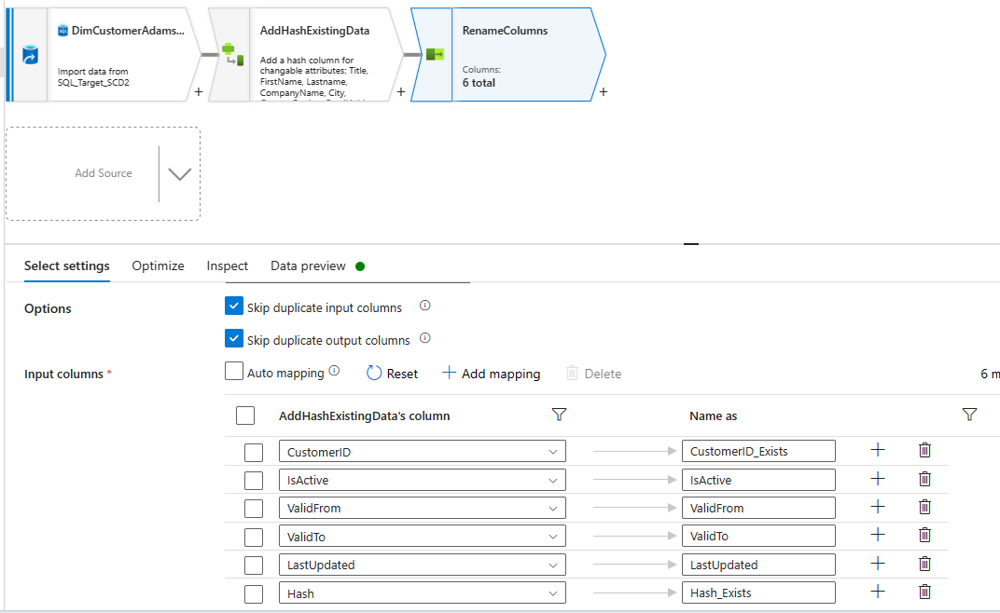 </kbd>

Up to this point, the existing data for reference (lookup purpose) is prepared. Let´s now build the **incoming new data** route. First, let´s create a **Hash** column here as well (be careful to use the same hash function as before so that these 2 are comparable), in order to compare with the **Hash_Exists** later. 
<kbd> 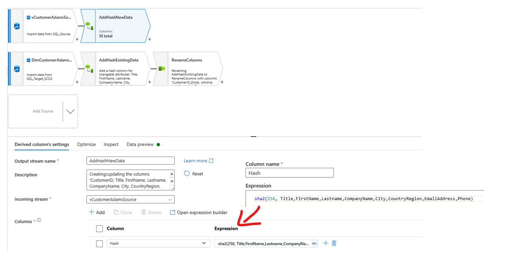 </kbd>
3. next, we need to do a lookup based on the business key column to find which rows are new instances of the entity (in our example, new customers) and which rows are existing ones. A **Lookup** transformation will serve the purpose. 
<kbd> 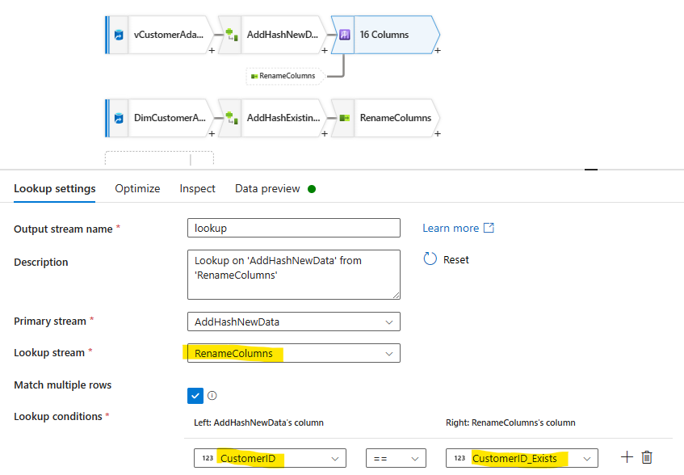 </kbd>
notice the setting on **Match multiple rows**: this indicates that if based on the lookup condition there are multiple rows matched, all of them would be returned. In our case this should never happen because for every CustomerID, there should be only one row that has the attribute **IsActive = 1 (true)**. Although this setting could be useful in the debugging phase where that scenario could come up, so you can identify the problem by searching for duplicated rows based on business key. 

4. Now after the lookup we should be able to divide the incoming rows to 2 streams: new customers and existing customers. By adding a **Conditional split** as next step we can achieve this:
<kbd> 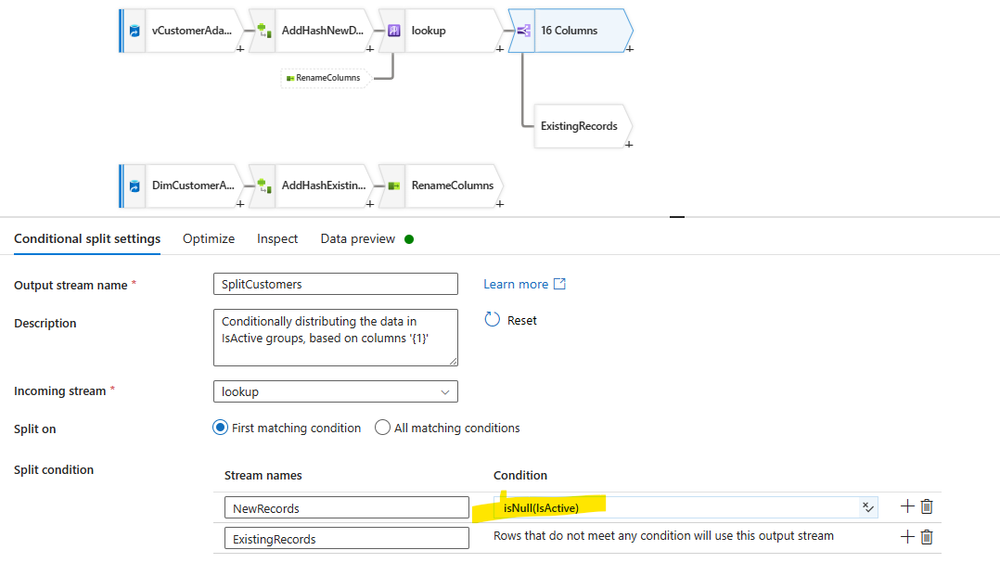 </kbd>
notice here we used the condition **isNull(IsActive)**, alternatively you could also use other **helping columns** like **ValidFrom**,**ValidTo** and **LastUpdated** as well, because **new customers** won´t have whose values with them. 

5. Now these 2 streams need different treatment: new customers should be inserted into the target directly, existing customers needs another **Conditional split** to distinguish between **attributes changed** and **attributes unchanged**.
Let´s build the stream for **existing customer and attributes changed** first. Adding a new **Conditional split** after the **ExistingRecords** transformation:
<kbd> 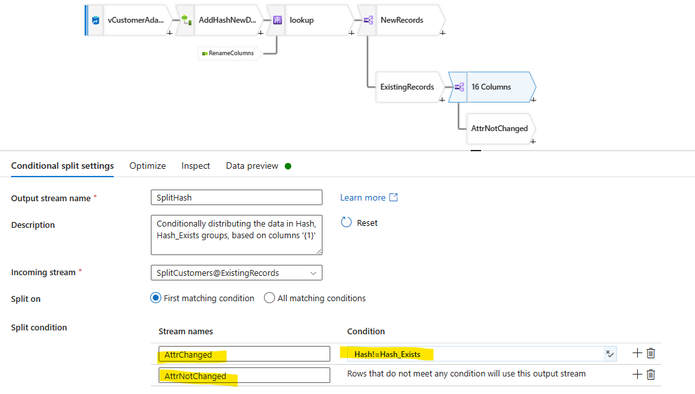 </kbd>
notice here we are spliting the rows based on the hash columns. If we haven´t use the **hashing approach**, we would have put all 8 columns into the condition and concatnate them together, which is hard to maintain. 
Now, for the rows whose attributes haven´t changed, we do nothing to them and keep the matching rows in existing table untouched. For the rows whose attributes have changed, we insert the them to the target as if they were new customers and update the matching existing rows on the column **IsActive** and **ValidTo** to **deactivate** them. This requires a second branch (like the multicast in SSIS). 
First, add a **Select** step after the **AttrChanged** like shown below:
<kbd> 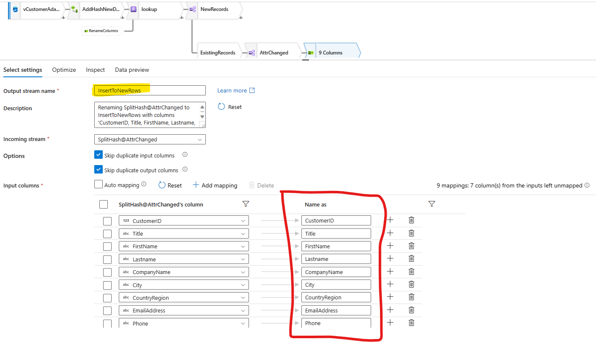 </kbd>
here we only leave the columns coming from the new data and delete all lookuped columns from existing data. These rows are to be **unioned** with the rows that don´t have a matching **CustomerID** with the existing data. 
Now we need the second branch for that for the **updating** purpose. 
<kbd> 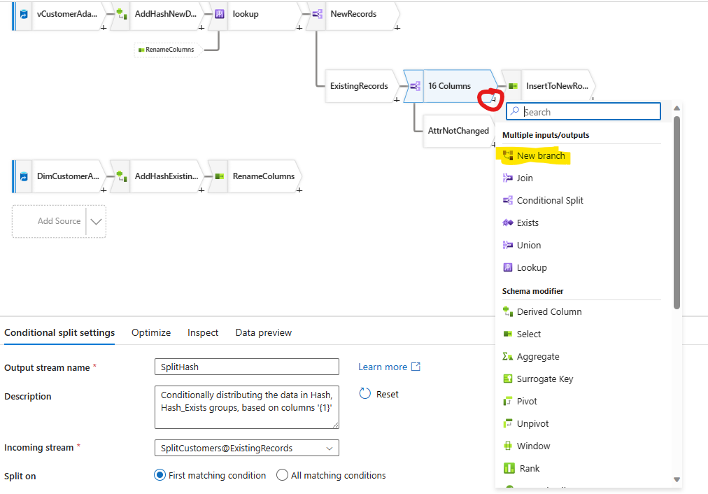 </kbd>
note that this **New branch** option will not be visible if we haven´t created the **select** transformation for the original branch (it is a feature, not a bug).
6. Then create a **select** transformation as well and leave only the **CustomerID** columns(**CustomerID** is the key column for update, **IsActive**, **ValidTo** and **LastUpdated** will be created using **Derived Column** in the next step).
<kbd> 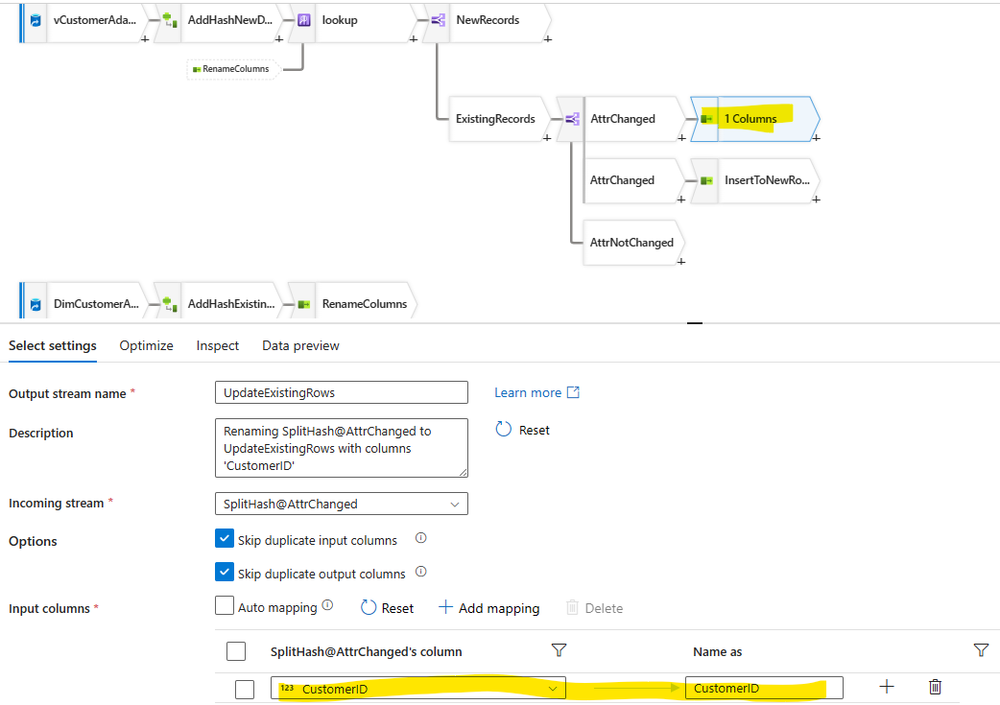 </kbd>
now, before we can finally update, we will need to create the values for the 3 **helper columns** mentioned above, a **Derived column** will do the job for us:
<kbd> 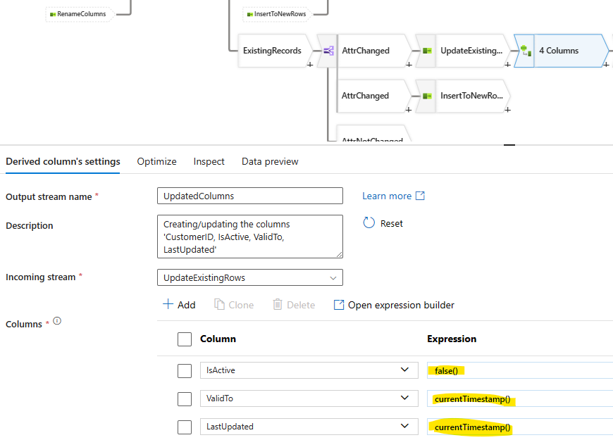 </kbd>
notice the expression for **IsActive** is **false()** because the column definition is **bit(boolean)**.
After that, we are allowed to update the sink (with the **Alter Row** inserted upfront):
<kbd> 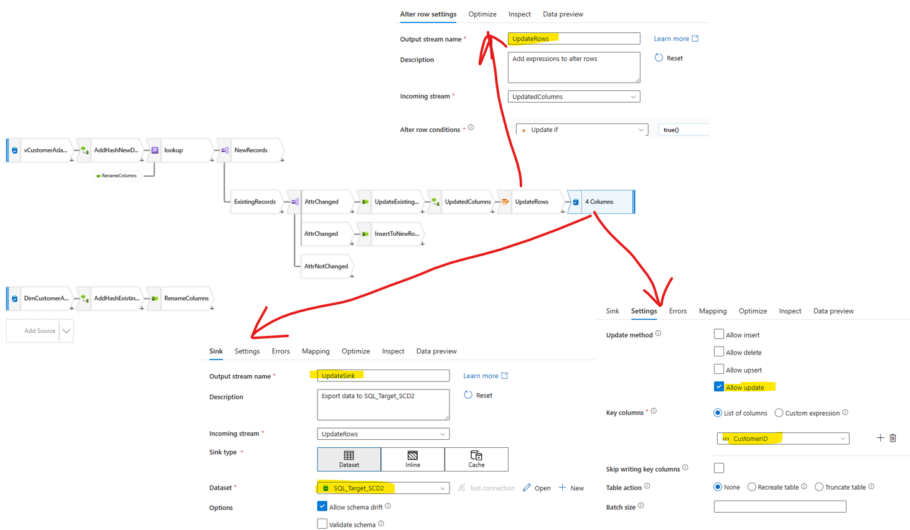 </kbd>

7. Finally, we have completely finished the stream about **ExistingRecords** and we can focus on **NewRecords** now. First step would be to **union** all **new customers** with **existing customers with attribute change**:
<kbd>  </kbd>
since we still have the **lookuped** columns from the previous step left and won´t need them for inserting into the target table, let´s use **Select** transformation to remove them:
<kbd>  </kbd>
Then we need to create the **helper columns** for **New Records** for the target table, again **Derived Column** is our friend here:
<kbd>  </kbd>
notice we set the **ValidTo** column with the date **9999-12-31**, which is a common practise in datawarehouse design to ensure a **infinite validity**.
Finally, we are to add a **Alter Row** for insert into **Sink**:
<kbd>  </kbd>
8. **Important:** because we are doing inserting and updating to the same table on the same key column **CustomerID**, the order of the sink operation matters: if one existing customer with attribute change is first inserted as new row and the update operation uses the same business key **CustomerID** to update the **helper columns** (ValidTo, IsActive and LastUpdated), we could end up having strange behaviours! So one way to avoid that is to set the **Custom sink ordering**:
<kbd>  </kbd>
By always let the *InsertSink* operation start only after the *UpdateSink* operation finishs, we can ensure there are no surprises. 
Now, our complete data flow for SCD Type 2 is finished. You should have a diagram like the following:
<kbd>  </kbd>

9. Let´s recreate the situation as for SCD Type 1 and see the effect of this approach. 

Run the following query in **Query Editor** to reset the source to the original state as if nothing has changed there for our SCD Type 1 execution:
```SQL
UPDATE [SalesLT].[CustomerAddress] SET AddressID = 1069 WHERE CustomerID = '29489' -- manually move Ms. Frances Adams back to Modesto from Phoenix
DELETE FROM [SalesLT].[CustomerAddress] WHERE CustomerID IN (SELECT CustomerID FROM [SalesLT].[Customer] WHERE CompanyName = 'Contoso')
DELETE from [SalesLT].[Customer] where CompanyName = 'Contoso'
```
<kbd>  </kbd>
test again that the source is the same as it was originally:
<kbd>  </kbd>
Now, execute the data flow within a pipeline:
<kbd>  </kbd>
check the result of the initial load in the target table:
<kbd>  </kbd>
Now, execute the same **manipulation code** again to manually change the source to add 2 **same new customer** and update the **City** of one **existing customer**:

```SQL
UPDATE [SalesLT].[CustomerAddress] SET AddressID = 1068 WHERE CustomerID = '29489' -- manually move Ms. Frances Adams from Modesto to Phoenix

INSERT INTO [SalesLT].[Customer] (Title,FirstName,LastName,CompanyName,EmailAddress,Phone,PasswordHash,PasswordSalt,rowguid,ModifiedDate) --manually add two people with last name "Adams"
VALUES
	('Mr.', 'Michael', 'Adams', 'Contoso', 'madams@contoso.com', '111-111-1111',HASHBYTES('SHA2_256','111-111-1111'),'PassW0rd',NEWID(),GETDATE ()),
	('Ms.', 'Anna', 'Adams', 'Contoso', 'aadams@contoso.com', '222-222-2222',HASHBYTES('SHA2_256','222-222-2222'),'PassW0rd1',NEWID(),GETDATE ());
	-- max. 30118
INSERT INTO [SalesLT].[CustomerAddress] (CustomerID,AddressID,AddressType,rowguid,ModifiedDate) -- manually add 2 Customer-Address mapping to include the newly created fake customer, due to foreign key constrain of the table. 
VALUES 
	((SELECT CustomerID FROM [SalesLT].[Customer] WHERE EmailAddress = 'madams@contoso.com'),11,'Main Office',NEWID(),GETDATE ()),
	((SELECT CustomerID FROM [SalesLT].[Customer] WHERE EmailAddress = 'aadams@contoso.com'),25,'Main Office',NEWID(),GETDATE ());
```

execute the code in **query editor**:
<kbd>  </kbd>

quickly check the new state of the source data:
<kbd>  </kbd>

10. Now finally, run the data flow for SCD2 again and see the result (together as comparison with SCD Type 1):
<kbd>  </kbd>
Clearly you can see the different behaviour of final records by choosing different approach to deal with slowly changing dimention data. 

11. Before you close all the tabs or exit the studio, publish all changes you have made.
<kbd>  </kbd>

## :tada: Summary

You have now completed this module. You have performed 2 data flows to practise 2 very common Slowly-Changing-Dimensions transformation in datawarehouse scenarios. Depending on the business requirements, choose different approach you learned here. 

[Continue >](../modules/module06.md)

