# Module 07 - Medallion Architecture: Bronze Layer

[< Previous Module](../modules/module05.md) - **[Home](../README.md)** - [Next Module >](../modules/module08.md)

## :loudspeaker: Scenario

In this scenario, you need to produce a cleansed dataset from 2 inputs: an Excel spreadsheet listing employees and an Excel spreadsheet listing valid regions that the employees report under. The outcome of data operations should be 2 cleansed and transformed datasets:
1. An operations dataset that includes confidential information
1. An analtyical dataset without confidential information

In this lab, both spreadsheets are ingested using a pipeline activities due to their small size. Then, the data is cleansed, transformed, and published to its target location using data flows.

The pattern followed is the medallion architecture pattern. However, the demonstration includes broad concepts applicable to other architectural patterns.

## Introduction
This module shows what a bronze layer within the medallion pattern might look like implemented in Azure Data Factory. The bronze layer typically involves the ingestion of raw data. In this lab, it will also perform data retention (cleanup of old data).

Key capabilities of the bronze layer are listed below:

- Contains an entire historical archive in a raw or nearly raw state
- Be able to reload source data without having to re-query the source system
- Allows auditability and lineage tracking
- Can be any combination of streaming and batch transactions

Typically, the bronze layer is incrementally and grows over time. Ingested full datasets should be dated to maintain history.

## :bookmark_tabs: Table of Contents

| #  | Section |
| --- | --- |
| 1 | [Stage data in the data lake](#1-stage-data-in-the-data-lake) |
| 2 | [Create the pipeline](#2-create-the-pipeline) |

<a href="#module-07---medallion-architecture-bronze-layer">↥ back to top</a>

## 1. Stage data in the data lake

Data was staged as part of the setup for this lab. See Module 7 <a href="../modules/module00.md/#stage-module-7-medallion-architecture-bronze-layer">staging instructions</a> for more information.

<a href="#module-07---medallion-architecture-bronze-layer">↥ back to top</a>

## 2. Create the pipeline

1. In the factory resources pane, select on the plus icon to open the new resource menu. Select **Pipeline**.

    <kbd>  </kbd>

1. In the **General** panel under **Properties**, add a **Name** and **Description**.

    | Attribute  | Value |
    | --- | --- |
    | Name | `pl_medallion_bronze` |
    | Description | `Ingest and apply retention policy` |

1. From the **Activities** panel, open the **Move & transform** accordian and drag the **Copy data** activity onto the canvas. Complete the below attributes in the **General** tab: 

    | Attribute  | Value |
    | --- | --- |
    | Name | `Copy to incoming` |
    | Description | `Copy any excel file found in the source directory to a dated incoming directory.` |
    | Timeout | `0.00:30:00` (30 minutes)|
    | Retry | `1` |

1. On the **Source** tab of the activity, click the **+ New** button. The next steps will create a dataset that uses the managed vnet integration runtime (as opposed to the AutoResolve integration runtime).

    <kbd> 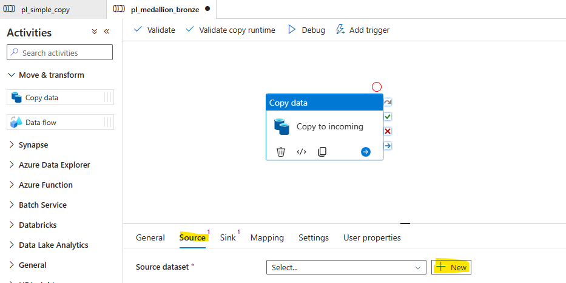 </kbd>

1. In the **New dataset** panel, find **Azure Data Lake Storage Gen 2** and click the **Continue** button.

1. Click the **Binary** option and click the **Continue** button.

1. Enter the properties and click the **OK** button. The **New dataset** pane will close.

    | Attribute  | Value |
    | --- | --- |
    | Name | `ds_vnmed_adls_binary` |
    | Linked Service | `ls_adls_irvnetmedium` |

1. Click the **Open** button from the **Source** tab of the **Copy data** activity properties to open the newly created dataset. 

    <kbd> 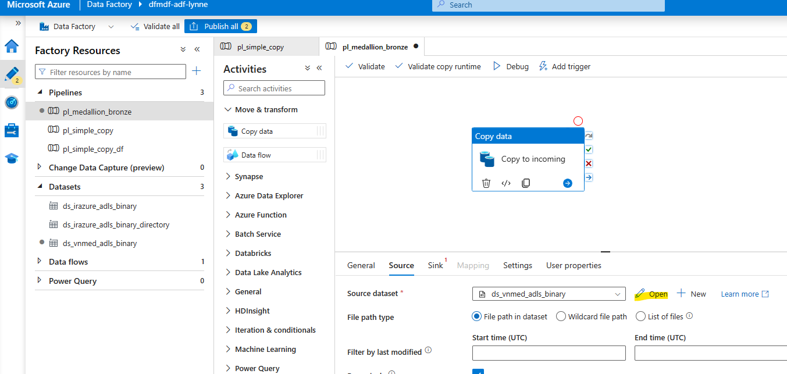 </kbd>

1. On the **Parameters** tab of the new dataset, click the **+ New** button and add the below parameters.

    | Name  | Type | Value |
    | --- | --- | --- |
    | `container` | `String` | leave blank |
    | `directory` | `String` | leave blank |
    | `filename` | `String` | leave blank |

    <kbd> 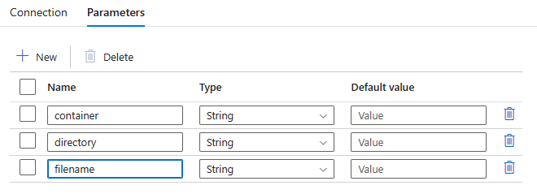 </kbd>

1. On the **Connection** tab of the new dataset, for all 3 attributes of the **File path**, roll over the attribute fields and click the **Add dynamic content** link that appears under each field. Then, add the parameters to the appropriate fields, the first field being for the `container` parameter, then `directory`, then `filename`. This dataset will take parameters inclusive of file name (as opposed to the directory level).

    <kbd> 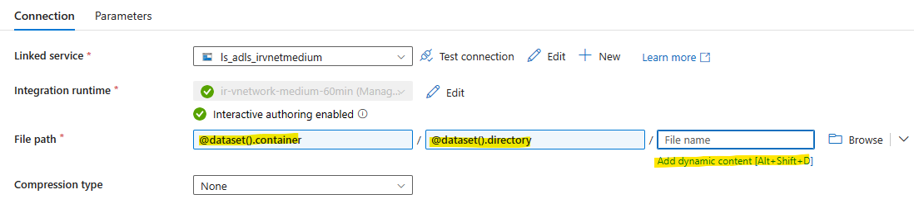 </kbd>
    <kbd> 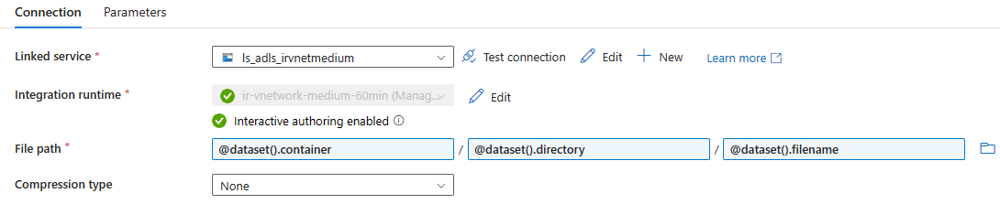 </kbd>

1. From the Factory Resources pane, click the `ds_vnmed_adls_binary` dataset elipsis menu item and select **Clone**.

    <kbd> 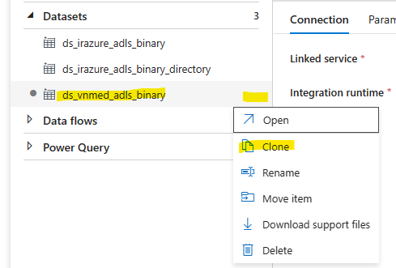 </kbd>

1. On the **Properties** pane of the cloned dataset, replace the text "copy1" in the **Name** with `directory`. The name of the dataset should now be `ds_vnmed_adls_binary_directory`.

1. Roll over the file name part of the **File path** and click the gargage bin icon. On the **Parameters** tab, check the filename parameter and click the **Delete** button.

    <kbd> 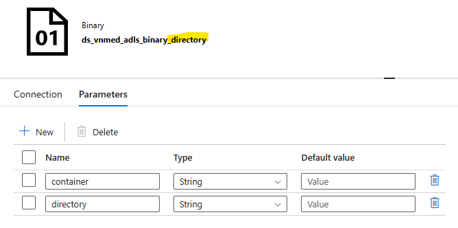 </kbd>

1. Now that the datasets are complete, open the `pl_medallion_bronze` pipeline in the canvas and make the following selections in the **Source** tab of the activity named `Copy to incoming`.

    | Attribute  | Value |
    | --- | --- |
    | Source dataset | `ds_vnmed_adls_binary` |
    | Dataset properties / container | `source` |
    | Dataset properties / directory | `employees` |
    | Dataset properties / filename | `*.xlsx*` |
    | File path type | `Wildcard file path` |
    | Wildcard paths / [directory] | `employees` |
    | Wildcard paths / [filename] | `*.xlsx*` |
    | Filter by last modified / Start time (UTC) | **Add dynamic content** expression: `@addDays(convertFromUtc(utcNow(),'Central Standard Time'),-3)` |
    | Filter by last modified / End time (UTC) | **Add dynamic content** expression: `@utcNow()` |

    Note that the **Delete files after completion** option is un-checked. Following industry accepted medallion architecture bronze layer patterns, you want to be able reload without having to re-query the source as much as possible. Leaving this option blank ensures that if you need to reload the silver layer, the most recent data is available.  

    <kbd> 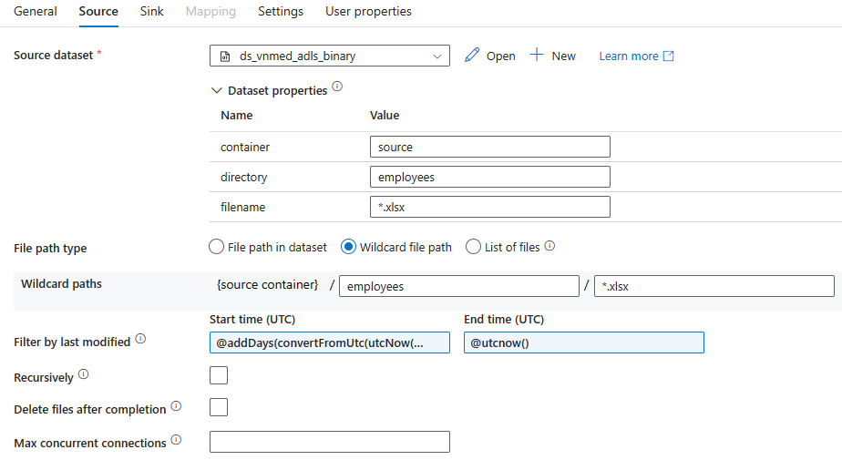 </kbd>

1. Make the following selections in the **Sink** tab of the activity `Copy to incoming`. 

    | Attribute  | Value |
    | --- | --- |
    | Sink dataset | `ds_vnmed_adls_binary_directory` |
    | Dataset properties / container | `inbound` |
    | Dataset properties / directory | **Add dynamic content** expression to sink files into a YYYY/YYYYMMDD directory: `@concat('employees_bronze/',formatDateTime(convertFromUtc(utcNow(),'Central Standard Time'),'yyyy'),'/',formatDateTime(convertFromUtc(utcNow(),'Central Standard Time'),'yyyyMMddHHmm'))` |

    <kbd> 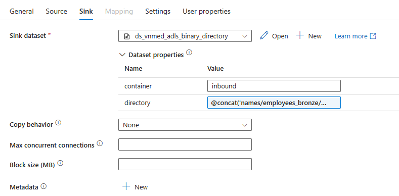 </kbd>

1. From the **Activities** panel, open the **General** accordian and drag the **Delete** activity onto the canvas. Click the *on success* condition (green check) for the `Copy to incoming` activity and connect it to the **Delete** activity. Complete the below attributes in the **Delete** activity: 

    | Tab | Attribute  | Value |
    | --- | --- | --- |
    | General | Name | `Inbound Data Retention Policy` |
    | General | Description | `Delete incoming folders older than 1 year.` |
    | General | Timeout | `0.00:30:00` (30 minutes)|
    | General | Retry | `1` |
    | Source | Dataset | `ds_vnmed_adls_bineary_directory` |
    | Source | Dataset properties / container | `inbound` |
    | Source | Dataset properties / directory | **Add dynamic content** expression: `@concat('employees_bronze/',formatDateTime(getPastTime(1,'Year'),'yyyy'))` |
    | Logging settings | Enable logging | *clear check box* |

    Note that this activity will only delete the previous year directory. If there are older directories, consider a one-time cleanup operation.

1. From the **Activities** panel, open the **General** accordian and drag the **Fail** activity onto the canvas. Click the *on fail* condition (red x) for the `Copy to incoming` activity and connect it to the **Fail** activity. Complete the below attributes in the **Fail** activity.

    | Tab | Attribute  | Value |
    | --- | --- | --- |
    | General | Name | `Fail` |
    | General | Description | `Set and throw first error code and message` |
    | Settings | Fail message | **Add dynamic content** expression: `@activity('Copy to incoming').output.errors[0].Message` |
    | Settings | Error code | **Add dynamic content** expression: `@activity('Copy to incoming').output.errors[0].Code` |

1. (Optional) In the Azure Storage Account lab resource named `dfmdf< Random string for your lab environment resources >adls` to open the storage account.
  
    Create a directory named *####*, where the number is one less than the current year, in the `inbound/employees_bronze` directory so that you can see the retention policy working. Then, create a directory for the current year.

    <kbd> 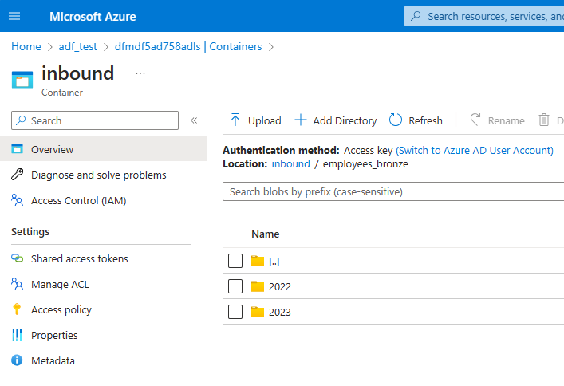 </kbd>

1. In the Azure Data Factory Studio, click the **Debug** button.

    <kbd> 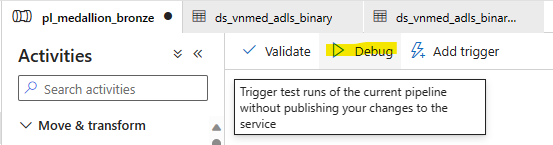 </kbd>

1. Ensure the debug succeeds.

    <kbd> 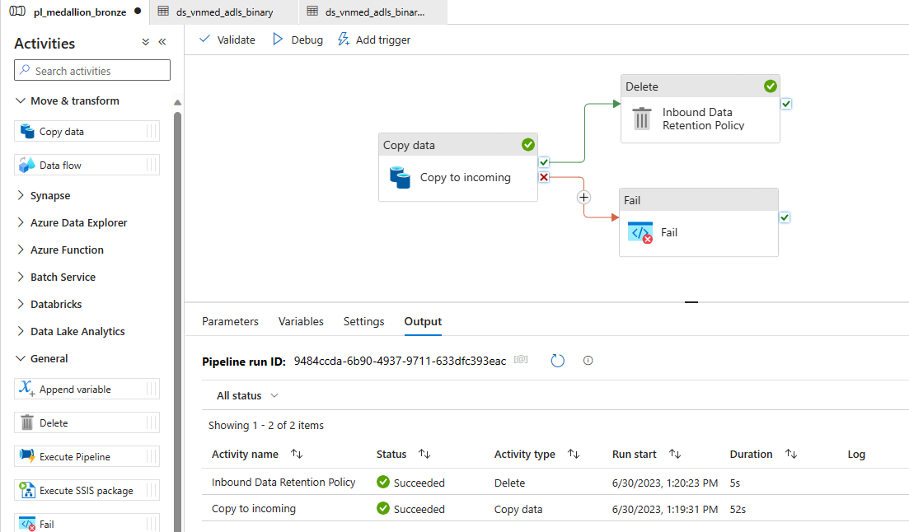 </kbd>

    When asked if you want to use the dataflow debug session, click **Use activity runtime**.

1. In the Azure Storage Account lab resource named `dfmdf< Random string for your lab environment resources >adls`, ensure the `inbound/employees_bronze/[####, current year]/[yyyymmddhhmm]` directory exists with 2 Excel files.

    <kbd> 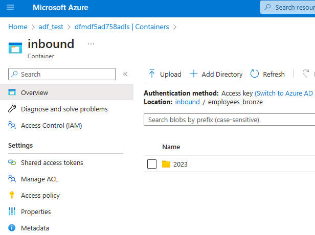 </kbd>
    <kbd> 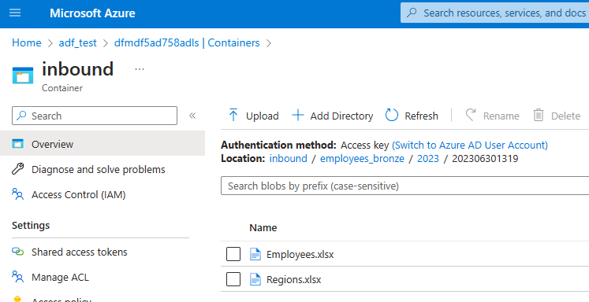 </kbd>

1. Click the **Publish all** button, then click the **Publish** button.

1. :important: Click **Debug** again to run the `pl_medallion_bronze` pipeline a second time. This is necessary to demonstate the de-duplicaton logic in the next module.

1. Close all open tabs.

<a href="#module-07---medallion-architecture-bronze-layer">↥ back to top</a>

## :tada: Summary

You have now completed this module. Your medallion architecture bronze layer pipeline is working as expected and you can continue to the silver layer.

[Continue >](../modules/module08.md)