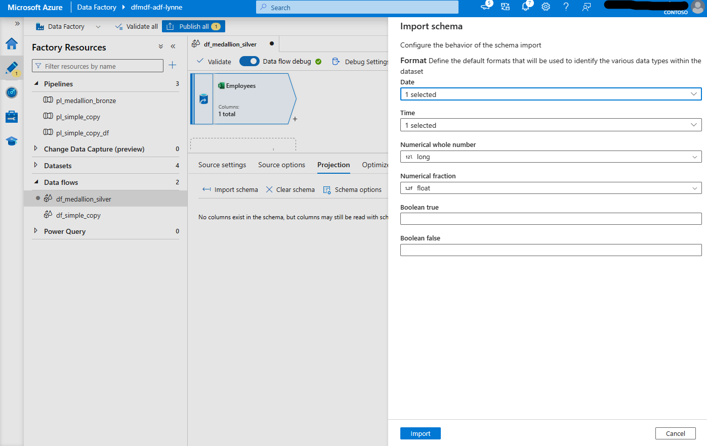
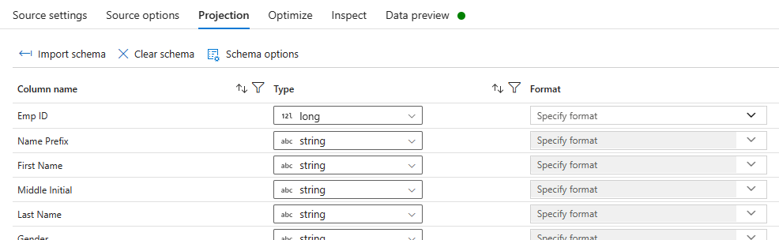
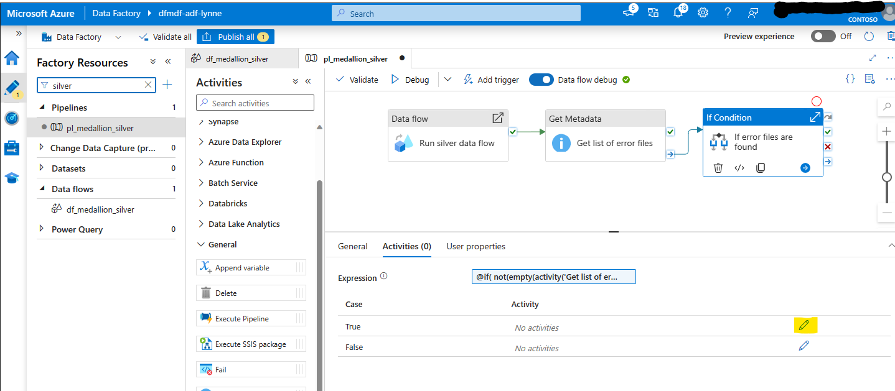

# Module 08 - Medallion Architecture: Silver Layer

[< Previous Module](../modules/module07.md) - **[Home](../README.md)** - [Next Module >](../modules/module09.md)

## Introduction
This module shows what a silver layer within the medallion pattern might look like implemented in Azure Data Factory. The silver layer typically involves the cleansing and/or preparation of data attributes provided by the source system in addition to adding any global attributes. In this example, that includes the following:
  - De-duplication
  - Data quality assertions
  - Cast data types
  - Joins
  - Reroute errors
  - Schema drift

Key capabilities of the silver layer are listed below:

- Represents a validated, enriched version of the data that is good enough for the enterprise to use.
- Distinction from the gold layer avoids consumption impact of currently writing data within transformation steps.
- May contain one or more layers per one or more dataset - data operations that require many Spark transformations perform better when intermediate files are used and a single gold dataset may require incoming multiple datasets.

<a href="#module-08---medallion-architecture-silver-layer">↥ back to top</a>

## :bookmark_tabs: Table of Contents

| #  | Section |
| --- | --- |
| 1 | [Create data flow part 1 (get latest employee records from all Employees files)](#1-create-data-flow-part-1-get-latest-employee-records-from-all-employees-files) |
| 2 | [Create data flow part 2 (get regions from the latest Region file)](#2-create-data-flow-part-2-get-regions-from-the-latest-region-file) |
| 3 | [Create data flow part 3 (pulling it all together)](#3-create-data-flow-part-3-pulling-it-all-together) |
| 4 | [Create pipeline](#4-create-pipeline) |

## 1. Create data flow part 1 (get latest employee records from all Employees files) 

1. In the factory resources pane, select on the plus icon to open the new resource menu. Select **Data flow** from the **Data flow** menu.

    <kbd>  </kbd>

1. If the **Data flow debug** slider is off, click it into the on position. In the Turn on data flow debug panel that appears, select the `ir-vnetwork-medium-60min` **Integration Runtime** and `4 hours` for the **Debug time to live**. Then, click **Ok**. Immediately proceed to the next step.

    <kbd>  </kbd>

1. In the **General** panel under **Properties**, add a **Name** and **Description**.

    | Attribute  | Value |
    | --- | --- |
    | Name | `df_medallion_silver` |
    | Description | `Transform and cleanse` |

1. Click on the **Add Source** down carrot (v) and select **Add Source**.

    <kbd>  </kbd>

1. In the **Source settings** tab of the newly added source, update the below attributes:

    | Attribute  | Value |
    | --- | --- |
    | Name | `Employees` |
    | Description | `Excel spreadsheet containing a complete list of employees.` |
    | Source type | `Inline` |
    | Inline dataset type | `Excel` |
    | Linked service | `ls_adls_irvnetmedium` |
    | Sampling | `Disable` |

    <kbd>  </kbd>

1. In the **Source options** tab of the source named `Employees`, update the below attributes:

    | Attribute  | Value |
    | --- | --- |
    | File mode | `Wildcard` |
    | File system | `inbound` |
    | Wildcard paths | **Add dynamic content** expression: `'employees_bronze/*/*/Employees.xlsx'` |
    | Sheet name | `90_name_records` |
    | Column to store file name | `__raw_filename` |

    <kbd>  </kbd>

1. In the **Projection** tab of the source named `Employees`, click the **Import schema** button. Note that if the data flow debug cluster is not ready, this button will be grey. 

    > The debug cluster being ready is indicated by a green check next to the slider.
    > <kbd>  </kbd>

    The **Import Schema** panel will appear. Enter the following attibutes and click **Import.**

    | Attribute  | Value |
    | --- | --- |
    | Date | `MM/dd/yyyy` |
    | Time | `MM/dd/yyyy hh:mm:ss a` |
    | Numerical whole number | `long` |
    | Numerical fraction | `float` |

    <kbd>  </kbd>

    The schema should look like the below when the import is finished.

    <kbd>  </kbd>

1. In the **Data preview** tab of the source named `Employees`, click the **Refresh** button.

    <kbd>  </kbd>

1. Add a select transformation by clicking the plus icon after the `Employees` source and selecting **Select** from the transformations menu.

    <kbd>  </kbd>

1. On the **Select settings** tab of the select tranformation, update the below attributes:

    | Attribute  | Value |
    | --- | --- |
    | Output stream name | `renameForSpark` |
    | Description | `Change to Spark friendly column names` |
    | Incoming stream | `Employees` |
    | Employee's column | Name as value: ***Remove any non alpha characters from all columns (e.g. no spaces, periods, special characters, etc.)*** |
    
    <kbd>  </kbd>

1. On the the **Data preview** tab of the select tranformation, click **Refresh**.

    <kbd>  </kbd>

1. Because the source options are set to read the entire employees_bronze directory, it is necessary to de-deplicate the records, ensuring that only the latest record is retained. This can be accomplished using a combination of the window and filter transformations.

   Click the plus icon and select **Window** from the transformations menu. Then, click the plus icon and select **Filter** from the transformations menu. Your canvas should look like the below.

    <kbd>  </kbd>

1. On the **Window settings** tab of the window tranformation, update the below attributes:

    | Attribute  | Value |
    | --- | --- |
    | Output stream name | `dedupStep1` |
    | Description | `Add rowNumberbyEmpId` |
    | 1. Over | selectRenameToSparkFriendly's column: `EmpId` |
    | 1. Over | Name as: `EmpID` |
    | 2. Sort | selectRenameToSparkFriendly's column: `__raw_filename` |
    | 2. Sort | Order: `Descending` |
    | 2. Sort | Nulls first: Unchecked |
    | 4. Window columns | Column: `rowNumberByEmpId` |
    | 4. Window columns | Expression: `rowNumber()` |

1. On the the **Data preview** tab of the window tranformation, click **Refresh**. Then, scroll to the right, ensuring that a rowNumberByEmpId column exists. 

    If you only executed the bronze pipeline once, all values will be 1 in this column.

    <kbd>  </kbd>

1. On the the **Filter settings** tab of the filter tranformation, update the below attributes:

    | Attribute  | Value |
    | --- | --- |
    | Output stream name | `dedupStep2` |
    | Description | `Filter to rowNumberbyEmpId of 1` |
    | Filter on | Open expression builder expression: `rowNumberByEmpId == 1` |

    <kbd>  </kbd>

1. On the the **Data preview** tab of the filter tranformation, click **Refresh**. Then, scroll to the right, ensuring that a rowNumberByEmpId values only show `1`.

    <kbd>  </kbd>

1. Click the plus icon and select **Cast** from the transformations menu. Then, update the below attributes:

    | Attribute  | Value |
    | --- | --- |
    | Output stream name | `castDates` |
    | Description | `Cast DateofBirth and DateofJoining` |
    | Columns | Column name: `DateofBirth` Type: `date` Format **(type this value)**: `M/d/yyyy` |
    | Columns | Column name: `DateofJoining` Type: `date` Format: **(type this value)**: `M/d/yyyy` |

1. On the the **Data preview** tab of the cast tranformation, click **Refresh**. Notice that EmpID 971640 has an error that results in a DateofJoining value being null. This error will be handled later in the module.
    <kbd>  </kbd>
    <kbd>  </kbd>

1. Click the plus icon and select **Aggregate** from the transformations menu. Then, update the below attributes:

    | Attribute  | Value |
    | --- | --- |
    | Output stream name | `aggregates` |
    | Description | `Add RateDateofBirthNull and CountAll` |
    | Group by | Columns: `__raw_filename` |
    | Aggregates | Column: `RateDateofBirthNull` Expression: `round(countIf(isNull(DateofBirth), EmpID)/countAll(EmpID), 2, 5)` |
    | Aggregates | Column: `CountAll` Expression: `countAll(EmpID)` |

1. On the the **Data preview** tab of the aggregate tranformation, click **Refresh**.

    <kbd>  </kbd>

1. It is not possible to publish data flow changes without a sink transformation. Lets do that now so we can publish. Click the plus icon and select **Sink** from the transformations menu. Then, select the **Cache** Sink type. 

    <kbd>  </kbd>

1. Click the **Publish all** button, then click the **Publish** button.

<a href="#module-08---medallion-architecture-silver-layer">↥ back to top</a>

## 2. Create data flow part 2 (get regions from the latest Region file)

1. Click on the **Add Source** down carrot (v) and select **Add Source**.

    <kbd>  </kbd>

1. In the **Source settings** tab of the newly added source, update the below attributes:

    | Attribute  | Value |
    | --- | --- |
    | Name | `Regions` |
    | Description | `Excel spreadsheet containing a complete list of valid Region values. Only the values in the latest file are valid.` |
    | Source type | `Inline` |
    | Inline dataset type | `Excel` |
    | Linked service | `ls_adls_irvnetmedium` |
    | Sampling | `Disable` |

    <kbd>  </kbd>

1. In the **Source options** tab of the source named `Regions`, update the below attributes:

    | Attribute  | Value |
    | --- | --- |
    | File mode | `Wildcard` |
    | File system | `inbound` |
    | Wildcard paths | **Add dynamic content** expression: `'employees_bronze/*/*/Regions.xlsx'` |
    | Sheet name | `Sheet1` |
    | Column to store file name | `__raw_filename` |

    <kbd>  </kbd>

1. In the **Projection** tab of the source named `Regions`, click the **Import schema** button. Note that if the data flow debug cluster is not ready, this button will be grey. 

    > The debug cluster being ready is indicated by a green check next to the slider.
    > <kbd>  </kbd>

    The **Import Schema** panel will appear. Leave all fields blank and click **Import**. The schema should look like the below when the import is finished.

    <kbd>  </kbd>

1. In the **Data preview** tab of the source named `Regions`, click the **Refresh** button.

1. Click the plus icon connected to the `Regions` source and select **Aggregate** from the transformations menu. Then, update the below attributes:

    | Attribute  | Value |
    | --- | --- |
    | Output stream name | `regionsAggregates` |
    | Description | `Get maxFilename` |
    | Group by | Columns: leave unselected |
    | Aggregates | Column: `__max_regions_filename` Expression: `max({__raw_filename})` |

1. On the the **Data preview** tab of the aggregate tranformation named `regionsAggregates`, click **Refresh**.

    <kbd>  </kbd>

1. Click the plus icon connected to the `regionsAggregates` aggregation and select **Join** from the transformations menu. 

    <kbd>  </kbd>

1. Update the below attributes on the newly added join transformation.

    | Attribute  | Value |
    | --- | --- |
    | Output stream name | `lastestRegionFileOnly` |
    | Description | `Filter Regions to only those in the latest file received` |
    | Left stream | `Regions` |
    | Right stream | `regionsAggregates` |
    | Join type | `Inner` |
    | Join conditions | Left: Region's column: `__raw_filename` Right: regionsAggrgate's column: `__max_regions_filename` |

    <kbd>  </kbd>

1. On the the **Data preview** tab of the join tranformation, click **Refresh**. There should only be 4 records returned.

    <kbd>  </kbd>

1. Click the **Publish all** button, then click the **Publish** button.

<a href="#module-08---medallion-architecture-silver-layer">↥ back to top</a>

## 3. Create data flow part 3 (pulling it all together)

1. In the last step of part 1, we added a sink to cache. Delete this by right-clicking in the sink transformation and selecting **Delete**.

    <kbd>  </kbd>

1. Click the plus icon connected to the `aggregates` aggregation and select **Join** from the transformations menu. Update the below attributes:

    | Attribute  | Value |
    | --- | --- |
    | Output stream name | `joinDobNullRate` |
    | Description | `The percent of total rows where the date of birth is NULL is joined back into the employee dataset` |
    | Left stream | `castDates` |
    | Right stream | `aggregates` |
    | Join type | `Custom (cross)` |
    | Condition | `1==1` |

    <kbd>  </kbd>

1. Click the plus icon connected to the `joinDobNullRate` transformation and select **Select** from the transformations menu. Update the below attributes:

    | Attribute  | Value |
    | --- | --- |
    | Output stream name | `dropDupFilename` |
    | Description | `Drop one of the __raw_filename attributes` |

    <kbd>  </kbd>

1. On the the **Data preview** tab of the join tranformation, click **Refresh**. The refresh should succeed.

1. Click the plus icon connected to the `dropDupFilename` transformation and select **Assert** from the transformations menu. Update the below attributes:

    | Attribute  | Value |
    | --- | --- |
    | Output stream name | `asserts` |
    | Additional streams | `lastestRegionFileOnly` |
    
    Add the following Asserts entries:
    | Assert type | Assert Id | Assert description | Filter | Expression | Igore nulls |
    | --- | --- | --- | --- | --- | --- |
    | `Expect true` | `assertGender` | `Gender + ' must be: M (Male), F (Female) or O (Other).'` |  | `not(isNull(Gender)) && in(['M','F','O'], Gender)` | cleared |
    | `Expect true` | `assertEmail` | `'Email is required and is Null'` | `` | `not(isNull(EMail))` | cleared |
    | `Expect unique` | `assertEmpId` | `toString({EmpID}) + ' is not unique'` | `` | `EmpId` | cleared |
    | `Expect true` | `assertYearJoining` | `toString({YearofJoining}) + ' must be realistic (within last 120 years)'` |  | `YearofJoining > minus(year(currentUTC()),120)` | checked |
    | `Expect true` | `assertHalfOfJoining` | `{HalfofJoining} + ' must be H1 or H2'` |  | `in(['H1','H2'], HalfofJoining)` | checked |
    | `Expect true` | `assertAggregateRateDateofBirthNull` | `'Source file has an unexpectedly large rate of null Date of Birth values: ' + toString(RateDateofBirthNull) + ' indicating a bad source file.'` |  | `RateDateofBirthNull < .2` | cleared |
    | `Expect true` | `assertAggregateCount` | `'Source file does not include > 20 records; indicating a bad file.'` |  | `CountAll > 20` | cleared |
    | `Expect exists` | `assertValidRegion` | `dropDupFilename@Region + ' does not exist in Regions list'` |  | Expression: `dropDupFilename@Region` == `Regions@Region` | cleared |

1. On the the **Data preview** tab of the assert tranformation, click **Refresh**. The refresh should succeed with 2 data errors.

    <kbd>  </kbd>

1. Click the plus icon connected to the `asserts` transformation and select **Conditional Split** from the transformations menu. Update the below attributes:

    | Attribute  | Value |
    | --- | --- |
    | Output stream name | `split` |
    | Description | `Split rows with errors from clean rows` |
    | Split condition | Stream name: `errors` Condition: `isError()` |
    | Split condition | Stream name: `cleansed` |

1. On the the **Data preview** tab of the conditional split tranformation stream named `errors`, click **Refresh**. The refresh should succeed with 2 data errors. Toggle between the two streams using the **Output stream** selection.

    <kbd>  </kbd>

1. Click the plus icon connected to the `errors` conditional split stream and select **Derived Column** from the transformations menu. Update the below attributes:

    | Attribute  | Value |
    | --- | --- |
    | Output stream name | `addErrorMessage` |
    | Description | `Add assertErrorMessage ` |
    | Columns | Column `assertErrorMessage` Expression: `assertErrorMessages()` |

1. On the the **Data preview** tab of the `addErrorMessage` tranformation, click **Refresh**. The refresh should succeed with 2 data errors. 

    Scroll to the right and an attribute named `assertErrorMessage` should exist with a **[...]** clickable cell. When clicked, the value will appear in an overlay window.

    <kbd>  </kbd>

1. Click the plus icon connected to the `addErrorMessage` transformation and select **Sink** from the transformations menu. Update the below attributes:

    | Attribute  | Value |
    | --- | --- |
    | Output stream name | `sinkErrors` |
    | Description | `Save error file ` |
    | Sink type | `Inline` |
    | Inline dataset type | `Delimited Text` |
    | Linked Service | `ls_adls_irvnetmedium` |

    <kbd>  </kbd>

1. On the `sinkErrors` transformation **Settings** tab, update the below attributes:

    | Attribute  | Value |
    | --- | --- |
    | Folder path | Container: `inbound` File path expression: `"employees_silver_errors/" + toString(currentDate('CST'),'yyyyMMdd')` |
    | First row as header | checked |
    | Quote All | checked |
    | Clear the folder | checked |
    | Unmask | Octal: `771` |

    <kbd>  </kbd>

1. On the the **Data preview** tab of the `sinkErrors` tranformation, select the **Partition option** `Single partition`. 

    <kbd>  </kbd>

1. On the the **Data preview** tab of the `sinkErrors` tranformation, click **Refresh**. The refresh should succeed with 2 records.

1. Click the plus icon connected to the `cleansed` transformation and select **Sink** from the transformations menu. Update the below attributes:

    | Attribute  | Value |
    | --- | --- |
    | Output stream name | `sink` |
    | Description | `Save cleansed file` |
    | Sink type | `Inline` |
    | Inline dataset type | `Delta` |
    | Linked Service | `ls_adls_irvnetmedium` |
    | Allow schema drift | checked |

    <kbd>  </kbd>

1. On the `sink` transformation **Settings** tab, update the below attributes. Note that this particular scenario would normally align with a **Table action** of `Overwrite` as it is a full load every time. However, for demonstration purposes, upserts were configured.

    | Attribute  | Value |
    | --- | --- |
    | Folder path | Container: `inbound` File path expression: `"employees_silver"` |
    | Vacuum | `30` |
    | Table action | `None` |
    | Update method | `Allow upsert` |
    | Key columns | `List of columns`, `EmpId` |
    | Unmask | Octal: `771` |

    > :boom: Notice the information banner advising you that an Alter Row transformation is required. Proceed to the next step to resolve.

    <kbd>  </kbd>

1. On the `sink` transformation **Settings** tab, click the **Add Alter Row** button. Then, update the below attributes.

    | Attribute  | Value |
    | --- | --- |
    | Output stream name | `sinkAlterConditions` |
    | Description | `Indicate in what conditions alters should occur` |
    | Alter row conditions | `Update if` Expression: `true()` |

1. On the the **Data preview** tab of the `sinkAlterConditions` tranformation, click **Refresh**. The refresh should succeed.

1. On the the **Data preview** tab of the `sink` tranformation, click **Refresh**. The refresh should succeed.

1. Click the **Publish all** button, then click the **Publish** button.

<a href="#module-08---medallion-architecture-silver-layer">↥ back to top</a>

## 4. Create pipeline
Once a data flow is developed, you can create the pipline that invokes it.

1. In the factory resources pane, select on the plus icon to open the new resource menu. Select **Pipeline**.

    <kbd>  </kbd>

1. In the **General** panel under **Properties**, add a **Name** and **Description**.

    | Attribute  | Value |
    | --- | --- |
    | Name | `pl_medallion_silver` |
    | Description | `Transform and cleanse data` |

1. From the **Activities** panel, open the **Move & transform** accordian and drag the **Data flow** activity onto the canvas. Complete the below attributes in the **General** tab: 

    | Attribute  | Value |
    | --- | --- |
    | Name | `Run silver data flow` |
    | Timeout | `0.00:30:00` |

1. On the activity named `Run silver data flow` **Settings** tab, update the below attributes: 

    | Attribute  | Value |
    | --- | --- |
    | Data flow | `df_medallion_silver` |
    | Run on (Azure IR) | `ir-vnetwork-medium-60min` |
    | Logging level | ` None ` |

1. From the **Activities** panel, open the **General** accordian and drag the **Get Metadata** activity onto the canvas. Click the *on success* condition (green check) for the `Run silver data flow` activity and connect it to the **Get Metadata** activity. Complete the below attributes:

    | Tab | Attribute  | Value |
    | --- | --- | --- |
    | General | Name | `Get list of error files` |
    | General | Description | `Gets the metadata for silver layer error directories starting with today's date` |
    | General | Timeout | `0.00:30:00` (30 minutes)|
    | General | Retry | `1` |
    | Settings | Dataset | `ds_vnmed_adls_binary_directory` |
    | Settings | Dataset properties / container | `inbound` |
    | Settings | Dataset properties / directory | **Add dynamic content** expression: `@concat('employees_silver_errors/', formatDateTime(convertFromUtc(utcNow(),'Central Standard Time'),'yyyyMMdd'))` |
    | Field list | Argument | `Child items` |

1. From the **Activities** panel, open the **Iteration & conditionals** accordian and drag the **If Condition** activity onto the canvas. Click the *on completion* condition (blue arrow) for the `Get list of error files` activity and connect it to the **If Condition** activity. Complete the below attributes:

    | Tab | Attribute  | Value |
    | --- | --- | --- |
    | General | Name | `If error files are found` |
    | General | Description | `Throws an error if error files are present` |
    | Activities | Expression | `@if(not(empty(activity('Get list of error files').output)),if(not( empty( activity('Get list of error files').output.childitems ) ) ,true,false),false)` |

1. Click the pencil icon in the **Activites** tab on the **True** case.

    <kbd>  </kbd>

1. From the **Activities** panel, open the **General** accordian and drag the **Fail** activity onto the canvas. Complete the below attributes in the **Fail** activity.

    | Tab | Attribute  | Value |
    | --- | --- | --- |
    | General | Name | `Fail` |
    | General | Description | `Set and throw custom error message that the silver layer has failed` |
    | Settings | Fail message | **Add dynamic content** expression: `@concat('Error files found: ',string(activity('Get list of error files').output.childItems))` |
    | Settings | Error code | **Add dynamic content** expression: `500` |

    Return to the main pipeline by clicking on the `pl_medallion_silver` breadcrumb as shown in the below image.

    <kbd>  </kbd>

1. In the Azure Data Factory Studio, click the **Debug** button.

    <kbd>  </kbd>

1. Review the debug outcomes. In this case, the data flow execution has succeeded; however, because there are error files written and the pipeline is configured to manually throw an error on finding these error files, the overall pipeline debug is failed.

    <kbd>  </kbd>

<a href="#module-08---medallion-architecture-silver-layer">↥ back to top</a>

## :link: References

- [Microsoft Learn: Data transformation expressions in mapping data flows](https://learn.microsoft.com/en-us/azure/data-factory/data-transformation-functions)
- [Microsoft Learn: Mapping data flow transformation overview](https://learn.microsoft.com/en-us/azure/data-factory/data-flow-transformation-overview) 
- [Microsoft Learn: Mapping data flow video tutorials](https://learn.microsoft.com/en-us/azure/data-factory/data-flow-tutorials)
- [Microsoft Learn: Schema drift in mapping data flow](https://learn.microsoft.com/en-us/azure/data-factory/concepts-data-flow-schema-drift)

<a href="#module-08---medallion-architecture-silver-layer">↥ back to top</a>

## :tada: Summary

Congradulations, you've completed the most complex layer in the medallion architecture pattern. Onward!

[Continue >](../modules/module09.md)