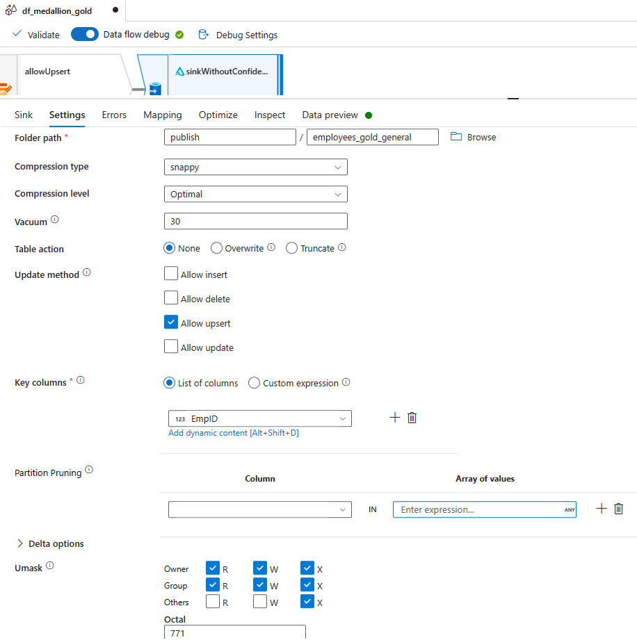

# Module 09 - Medallion Architecture: Gold Layer

[< Previous Module](../modules/module08.md) - **[Home](../README.md)** - [Next Module >](../modules/module10.md)

## Introduction
This module shows what a gold layer within the medallion pattern might look like implemented in Azure Data Factory. The gold layer is often highly refined and aggregated, containing data that powers anlaytics, machine learning, and production applications. In this lab, the gold layer includes the following:
  - Calculated value(s)
  - Given that the source includes both general and confidential attributes, the data is sinked twice, once for consumption of general data and once for consumption of confidential data. 
    - *Sink for general sensitivity*: selected attributes that are confirmed to be available for general use are included using explicit column.
    - *Sink for confidential sensitivity*: all attributes are passed through using schema drift and auto-mapping.

Key capabilities of the gold layer are listed below:

- Represents a highly refined and/or enriched version of the data
- Acts as re-usable asset for self-service and enterprise applications and data integrations
- Reduces data duplication across consumption teams and personas when combined with row level security
- Has lower latency query performance because ...
    - Most transformations are handled before data is written to the gold layer
    - Data is read-optimized
    - Multiple variations of a dataset may be published in the gold layer to support diverse query patterns

## :bookmark_tabs: Table of Contents

If there are multiple sections to this page, add a Table of Contents with jump links.

| #  | Section |
| --- | --- |
| 1 | [Create data flow](#1-create-data-flow) |
| 2 | [Create gold layer pipeline](#2-create-gold-layer-pipeline) |
| 3 | [BONUS: Create full medallion pipeline](#3-bonus-create-full-medallion-pipeline) |
| 4 | [References](#link-references) |

<a href="#module-09---medallion-architecture-gold-layer">↥ back to top</a>

## 1. Create data flow

1. In the factory resources pane, select on the plus icon to open the new resource menu. Select **Data flow** from the **Data flow** menu.

    <kbd>  </kbd>

1. If the **Data flow debug** slider is off, click it into the on position. In the Turn on data flow debug panel that appears, select the `ir-vnetwork-medium-60min` **Integration Runtime** and `4 hours` for the **Debug time to live**. Then, click **Ok**. Immediately proceed to the next step.

    <kbd>  </kbd>

1. In the **General** panel under **Properties**, add a **Name** and **Description**.

    | Attribute  | Value |
    | --- | --- |
    | Name | `df_medallion_gold` |
    | Description | `Final refinement and security application` |

1. Click on the **Add Source** down carrot (v) and select **Add Source**.

1. In the **Source settings** tab of the newly added source, update the below attributes:

    | Attribute  | Value |
    | --- | --- |
    | Name | `silver` |
    | Description | `Silver layer data (Delta format)` |
    | Source type | `Inline` |
    | Inline dataset type | `Delta` |
    | Linked service | `ls_adls_irvnetmedium` |
    | Sampling | `Disable` |

    <kbd>  </kbd>

1. In the **Source options** tab of the source named `silver`, update the below attributes:

    | Attribute  | Value |
    | --- | --- |
    | Folder path | File system: `inbound` Folder path: `employees_silver` |
    | Compression type | `snappy` |
    | Compression level | `Fastest` |
    | Time travel | `Disable` |

1. In the **Projection** tab of the source named `silver`, click the **Import schema** button. Note that if the data flow debug cluster is not ready, this button will be grey. 

    > The debug cluster being ready is indicated by a green check next to the slider.
    > <kbd>  </kbd>

    The **Import Schema** panel will appear. Leave all values blank and click **Import.**

1. In the **Data preview** tab of the source named `silver`, click the **Refresh** button.

    <kbd>  </kbd>

1. Click the plus icon connected to the `silver` source and select **Derived Column** from the transformations menu. Update the below attributes. :exclamation: Then, delete the default derived column expression.

    | Attribute  | Value |
    | --- | --- |
    | Output stream name | `addCalculatedAges` |
    | Description | `Add calculated columns for age and age in company to be used in new banded columns in next step.` |

    Click the **+ Add** button in the **Columns** options. Then, select **Add column pattern**. Update the following to add two derived columns, one based on the incoming `DateofBirth` and DateofJoining columns.

      | Column pattern attribute | value | 
      | --- | --- |
      | Matching condition | `startsWith(name, 'Dateof')` |
      | Column name expression | `$$ + 'CalculatedAge'` |
      | Value expression: | `floor(divide(monthsBetween(currentDate(),$$),12))` |

    <kbd>  </kbd>

1. On the **Inspect** tab of the `addCalculatedAges` transformation, ensure the **Schema** slider is set to `Output`. Then, scroll to the bottom of the column list and ensure two new columns appear named `DateofBirthAge` and `DateofJoiningAge`.

    <kbd>  </kbd>

1. In the **Data preview** tab of the `addCalculatedAges` transformation, click the **Refresh** button.

1. Click the plus icon connected to the `addCalculatedAges` transformation and select **Derived Column** from the transformations menu. Update the below attributes:

    | Attribute  | Value |
    | --- | --- |
    | Output stream name | `addCalculatedBandsAndMaskedEmail` |
    | Description | `Add banded and masked attributes.` |
    | Columns | Column `MaskedEMail` Expression: `rpad(left(toString(byName('EMail')),1),15,'*')` |

    Click the **+ Add** button in the **Columns** options. Then, select **Add column pattern**. Update the following to add two derived columns based on the previously added calculated age values. 

    | Column pattern attribute | value | 
    | --- | --- |
    | Matching condition | `endsWith(name, 'CalculatedAge')` |
    | Column name expression | `$$ + 'Band'` |
    | Value expression: | `case($$ < 5, 'Less than 5', case($$ < 10,'5-9',case($$ < 20,'10-19',case($$ < 30, '20-29', '30+'))))` |

    <kbd>  </kbd>

1. In the **Data preview** tab of the `addCalculatedBandsAndMaskedEmail` transformation, click the **Refresh** button. 

    <kbd>  </kbd>

1. Click the plus icon connected to the `addCalculatedBandsAndMaskedEmail` transformation and select **Alter Row** from the transformations menu. Update the below attributes. Then, on the **Data Preview** tab, click **Refresh**.

    | Attribute  | Value |
    | --- | --- |
    | Output stream name | `allowUpsert` |
    | Alter row conditions | `Upsert if` condition: `true()` |

1. Click the plus icon connected to the `allowUpsert` transformation and select **Sink** from the transformations menu. Update the below attributes:

    | Attribute  | Value |
    | --- | --- |
    | Output stream name | `sinkWithoutConfidential` |
    | Description | `Sink only the attributes that are available generally. Columns are explicitly mapped after they are confirmed to be generally available.` |
    | Sink type | `Inline` |
    | Inline dataset type | `Delta` |
    | Linked Service | `ls_adls_irvnetmedium` |
    | Options: Allow schema drift | checked |

    <kbd>  </kbd>

1. On the `sinkWithoutConfidential` transformation **Settings** tab, update the below attributes:

    | Attribute  | Value |
    | --- | --- |
    | Folder path | Container: `publish` File path: `employees_gold_general` |
    | Compression type | `snappy` |
    | Compression level | `Optimal` |
    | Vacuum | `30` |
    | Table action | `None` |
    | Update method | `Allow upsert` |
    | Key columns | `List of columns` Columns: `EmpId`|
    | Unmask | Octal: `771` |

    <kbd>  </kbd>

1. On the `sinkWithoutConfidential` transformation **Mapping** tab, clear the **Auto mapping** checkbox. Make the following changes.

    | Change description | Columns|
    | --- | --- |
    | Find the MaskedEMail input column and mouse over the left of the column selection checkbox. The mouse pointer will change to a hand. Left-click and drag this column to be just after EmpId. | MaskedEMail |
    | Remove the EMail column | Email |
    | Remove all name-related columns | NamePrefix, FirstName, MiddleInitial, LastName, FathersName, MothersName, MothersMaidenName |
    | Remove date related fields that are day or time grain | DateofBirth, Timeofbirth, DateofJoining, DayofJoining, DateofBirthCalculatedAge, DateofJoiningCalculatedAge |
    | Remove age related fields that are static as of the last source file curation. For this use case, calculated values are used based on the last run of the gold layer ETL.| AgeinYrs, AgeinCompanyYears |
    | Remove credential columns| UserName, Password |
    | Remove other protected information | SSN, PhoneNo, PlaceName, City |
    | Change the output columns name value for the __raw_filename column to `SourceFilename`. | __raw_filename |
    | Remove aggregate and/or system attributes that are not relevant for consumption | rowNumberByEmpId, RateDateofBirthNull, CountAll |

1. In the **Data preview** tab of the `sinkWithoutConfidential` sink, click the **Refresh** button. 

1. Click the plus icon connected to the `allowUpsert` transformation and select **Sink** from the transformations menu to add a second sink. 

    <kbd>  </kbd>

1. For the newly added sink, update the below attributes:

    | Attribute  | Value |
    | --- | --- |
    | Output stream name | `sinkWithConfidential` |
    | Description | `Sink all the attributes that are available for consumption, including protected attributes that are considered confidential.` |
    | Sink type | `Inline` |
    | Inline dataset type | `Delta` |
    | Linked Service | `ls_adls_irvnetmedium` |
    | Options: Allow schema drift | checked |

1. On the `sinkWithConfidential` sink **Settings** tab, update the below attributes. When modifying the **Delta options**, click okay to modify the options for all sinks.

    | Attribute  | Value |
    | --- | --- |
    | Folder path | Container: `publish` File path: `employees_gold_confidential` |
    | Compression type | `snappy` |
    | Compression level | `Optimal` |
    | Vacuum | `30` |
    | Table action | `None` |
    | Update method | `Allow upsert` |
    | Key columns | `List of columns` Columns: `EmpId`|
    | Delta options: Merge schema | checked |
    | Delta options: Auto compact | checked |
    | Delta options: Optimize write | checked |
    | Unmask | Octal: `771` |

    <kbd>  </kbd>

1. On the `sinkWithConfidential` sink **Mapping** tab, we want to generally allow all columns, passing through any newly added columns due to schema drift. However, there are some columns we want to exclude and 1 column we need to rename. 

    To accomplish this, clear the **Auto mapping** checkbox. Click the **+ Add mapping** button and select **Rule-based mapping**. Enter the following:

    - **Input columns**: `name!='rowNumberByEmpId' && name!='CountAll' && name!='RateDateofBirthNull'`
    - **Output columns**: `iif($$=='__raw_filename', 'SourceFilename', $$)`

    Note that the excluded fields no longer appear on the Inspect tab and the __raw_filename column is properly renamed to SourceFilename.

    <kbd>  </kbd>

1. In the **Data preview** tab of the `sinkWithConfidential` sink, click the **Refresh** button. 

1. Click the **Publish all** button, then click the **Publish** button.

<a href="#module-09---medallion-architecture-gold-layer">↥ back to top</a>

## 2. Create gold layer pipeline

Once a data flow is developed, you can create the pipline that invokes it.

1. In the factory resources pane, select on the plus icon to open the new resource menu. Select **Pipeline**.

    <kbd>  </kbd>

1. In the **General** panel under **Properties**, add a **Name** and **Description**.

    | Attribute  | Value |
    | --- | --- |
    | Name | `pl_medallion_gold` |
    | Description | `Final refinement and publication of data` |

1. From the **Activities** panel, open the **Move & transform** accordian and drag the **Data flow** activity onto the canvas. Complete the below attributes in the **General** tab: 

    | Attribute  | Value |
    | --- | --- |
    | Name | `Run gold data flow` |
    | Timeout | `0.00:30:00` |

1. On the activity named `Run gold data flow` **Settings** tab, update the below attributes: 

    | Attribute  | Value |
    | --- | --- |
    | Data flow | `df_medallion_gold` |
    | Run on (Azure IR) | `ir-vnetwork-medium-60min` |
    |Logging level | ` None ` |

1. In the Azure Data Factory Studio, click the **Debug** button.

1. Review the debug outcomes. 

    <kbd>  </kbd>

1. In the Azure Storage Account lab resource named `dfmdf< Random string for your lab environment resources >adls`, ensure the `publish/employees_gold_confidential` and `publish/employees_gold_general` directories have data files.

    <kbd>  </kbd>
    <kbd>  </kbd>

<a href="#module-09---medallion-architecture-gold-layer">↥ back to top</a>

## 3. BONUS: Create full medallion pipeline

1. In the factory resources pane, select on the plus icon to open the new resource menu. Select **Pipeline**.

    <kbd>  </kbd>

1. In the **General** panel under **Properties**, add a **Name** and **Description**.

    | Attribute  | Value |
    | --- | --- |
    | Name | `pl_medallion_load` |
    | Description | `ETL orchestration for medallion layers` |

1. From the **Activities** panel, open the **General** accordian and drag the **Execute Pipeline** activity onto the canvas 3 times. 
    
    Connect the 3 together with the *on success* condition. 
    
    Name the activities `bronze`, `silver`, and `gold`. 
    
    Then, on the **Settings** tab of each, select the appropriate dataflow for each layer.

    <kbd>  </kbd>

1. Create a trigger for the `pl_medallion_load` pipeline by selecting **New/Edit** from the **Add Trigger** menu. Then, in the **Add triggers** panel, select `New trigger` from the **Choose trigger** selection.

    <kbd>  </kbd>
    <kbd>  </kbd>

1. On the **New trigger** panel, update the following attributes and click **Ok** twice to complete the trigger creation.

    | Attribute  | Value |
    | --- | --- |
    | Name | `tr_medallion_load` |
    | Description | `Run the pl_medallion_load pipeline every day at 12:30 AM UTC.` |
    | Type | `Schedule` |
    | Time zone | `Coordinated Universal Time (UTC)` |
    | Execute at these times: Hours | `0` |
    | Execute at these times: Minutes | `30` |

1. Click the **Publish all** button, then click the **Publish** button.

<a href="#module-09---medallion-architecture-gold-layer">↥ back to top</a>

## :link: References

- [Microsoft Learn: Data transformation expressions in mapping data flows](https://learn.microsoft.com/en-us/azure/data-factory/data-transformation-functions)
- [Microsoft Learn: Using column patterns in mapping data flows](https://learn.microsoft.com/en-us/azure/data-factory/concepts-data-flow-column-pattern)
- [Microsoft Learn: Schema drift in mapping data flow](https://learn.microsoft.com/en-us/azure/data-factory/concepts-data-flow-schema-drift)
- [Microsoft Learn: Delta format in Azure Data Factory](https://learn.microsoft.com/en-us/azure/data-factory/format-delta)

<a href="#module-09---medallion-architecture-gold-layer">↥ back to top</a>

## :tada: Summary

You have successfully created a medallion architecture visual ETL pipeline!

[Continue >](../modules/module10.md)