# Module 10 - Medallion Architecture: Consumption Example

[< Previous Module](../modules/module09.md) - **[Home](../README.md)** - [Next Module >](../modules/module11.md)

## :loudspeaker: Introduction

While the gold layer is highly refined and usable for analytics, it might not be in the exact shape and scope needed for a specific use case. For this reason, it is generally accepted that use case specific variations of the data may be stored as needed. 

This lab demonstrates this concept by showing a new file being created that includes an additional aggregation on top of the gold data. However, this layer may reside within a transactional database used by the application, another analytical storage repository, or built as an API, or any other technology.

It is recommended to align your enterprise under the concept that consumption layers should all read from the same published gold data. This increases trust in the data and auditability.

<kbd> 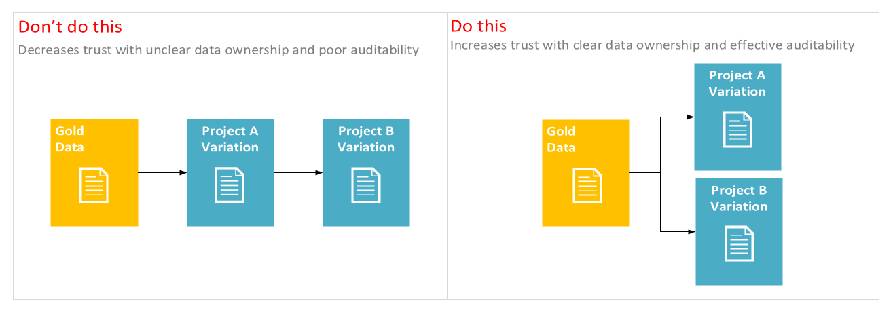 </kbd>

In this module, we create a new aggregate file of the employees gold data grouped by region.

## :bookmark_tabs: Table of Contents

| #  | Section |
| --- | --- |
| 1 | [Create the data flow](#1-create-the-data-flow) |
| 2 | [Create the pipeline](#2-create-the-pipeline) |

<a href="#module-10---medallion-architecture-consumption-example">↥ back to top</a>

## 1. Create the data flow

1. In the factory resources pane, select on the plus icon to open the new resource menu. Select **Data flow** from the **Data flow** menu.

    <kbd> 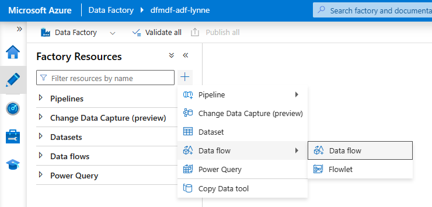 </kbd>

1. If the **Data flow debug** slider is off, click it into the on position. In the Turn on data flow debug panel that appears, select the `ir-vnetwork-medium-60min` **Integration Runtime** and `4 hours` for the **Debug time to live**. Then, click **Ok**. Immediately proceed to the next step.

    <kbd> 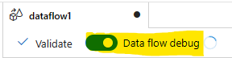 </kbd>

1. In the **General** panel under **Properties**, add a **Name** and **Description**.

    | Attribute  | Value |
    | --- | --- |
    | Name | `df_medallion_consumption` |
    | Description | `Create example consumption file` |

1. Click on the **Add Source** down carrot (v) and select **Add Source**.

1. In the **Source settings** tab of the newly added source, update the below attributes:

    | Attribute  | Value |
    | --- | --- |
    | Name | `gold` |
    | Description | `Gold layer data (Delta format)` |
    | Source type | `Inline` |
    | Inline dataset type | `Delta` |
    | Linked service | `ls_adls_irvnetmedium` |
    | Sampling | `Disable` |

    <kbd> 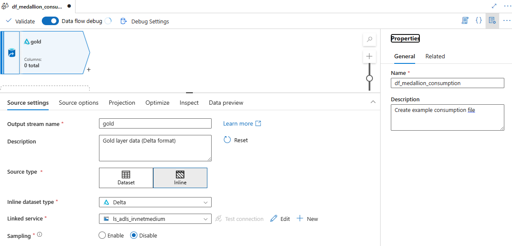 </kbd>

1. In the **Source options** tab of the source named `gold`, update the below attributes:

    | Attribute  | Value |
    | --- | --- |
    | Folder path | File system: `publish` Folder path: `employees_gold_general` |
    | Compression type | `snappy` |
    | Compression level | `Fastest` |
    | Time travel | `Disable` |

1. In the **Projection** tab of the source named `gold`, click the **Import schema** button. Note that if the data flow debug cluster is not ready, this button will be grey. 

    > The debug cluster being ready is indicated by a green check next to the slider.
    > <kbd> 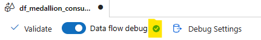 </kbd>

    The **Import Schema** panel will appear. Leave all values blank and click **Import.**

1. In the **Data preview** tab of the source named `gold`, click the **Refresh** button.

    <kbd> 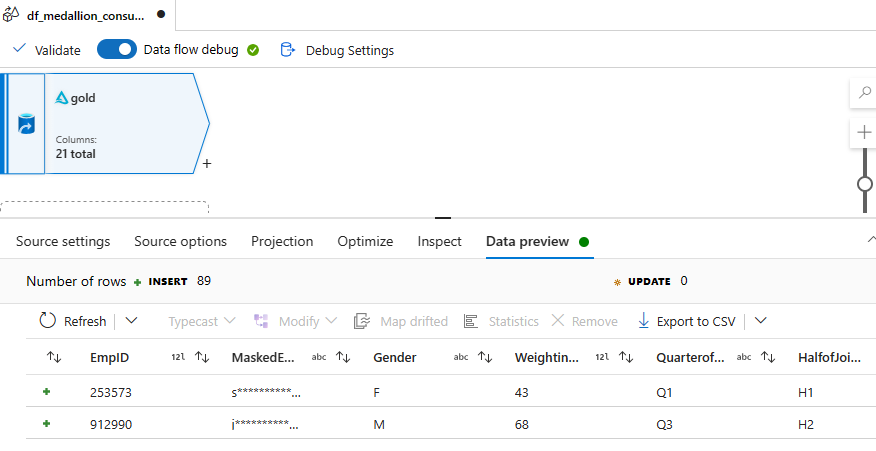 </kbd>

1. Click the plus icon connected to the `gold` source and select **Aggregate** from the transformations menu. Update the below attributes:

    | Attribute  | Value |
    | --- | --- |
    | Output stream name | `aggregateByRegion` |
    | Description | `Aggregating data by Region` |
    | Group by Columns| Columns: `Region` Name as `Region` |

    <kbd> 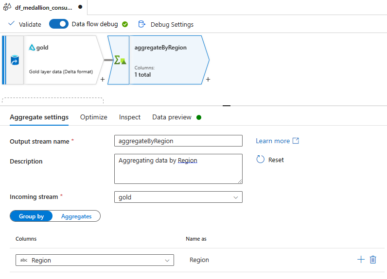 </kbd>

    Click the **Group by / Aggregates** slider to the right (Aggregates). Click the **Open expression builder** button.
    <kbd> 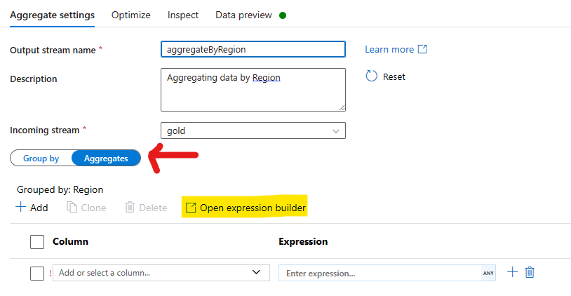 </kbd>

    Use the **Dataflow exression builder** to create the following columns.

    | Column name  | Expression |
    | --- | --- |
    | MaxLongetivity | `year(currentDate()) - min(YearofJoining)` |
    | MinLongetivity | `year(currentDate()) - max(YearofJoining)` |
    | MedianLongetivity | `avg((year(currentDate()) - (YearofJoining)))` |

    <kbd> 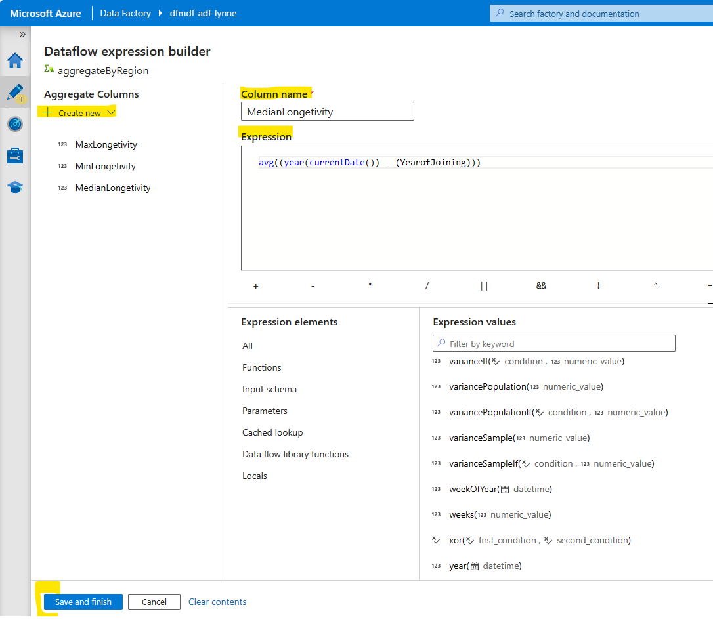 </kbd>

1. In the **Data preview** tab of the `aggregateByRegion` transformation`, click the **Refresh** button. Ensure the refresh succeeds.

1. Click the plus icon connected to the `aggregateByRegion` transformation and select **Sink** from the transformations menu. Update the below attributes:

    | Attribute  | Value |
    | --- | --- |
    | Output stream name | `sink` |
    | Description | `Sink employee aggregates by region CSV.` |
    | Sink type | `Inline` |
    | Inline dataset type | `Delimited Text` |
    | Linked Service | `ls_adls_irvnetmedium` |

    <kbd> 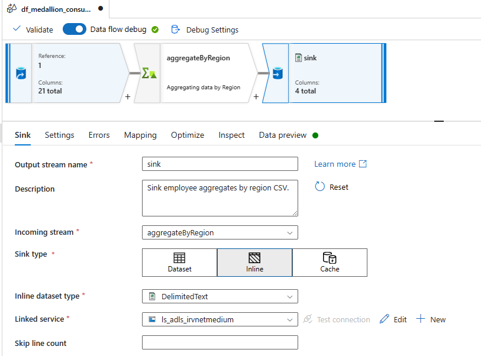 </kbd>

1. On the sink **Settings** tab, update the below attributes:

    | Attribute  | Value |
    | --- | --- |
    | Folder path | Container: `publish` File path: `employees_project_a` |
    | First row as header | checked |
    | Quote All | checked |
    | Clear the folder | checked |
    | Unmask | Octal: `771` |

    <kbd> 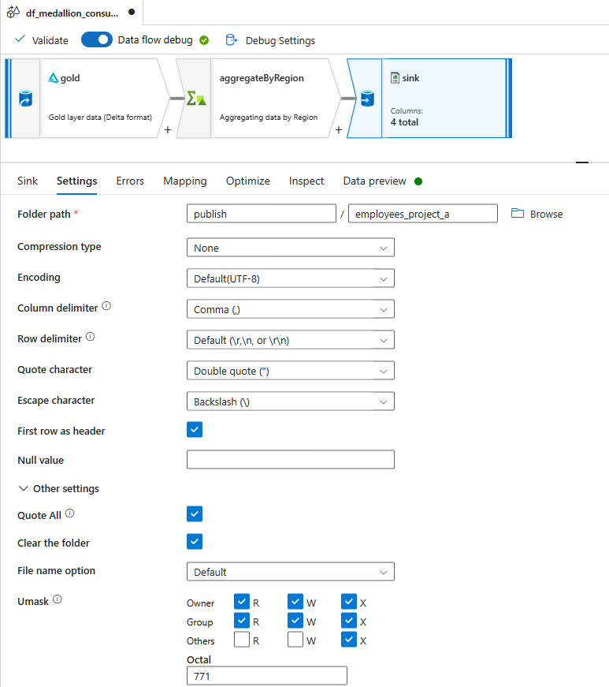 </kbd>

1. On the sink **Optimize** tab, to ensure you only get a single CSV file output, select **Single partition**. Without this selection, the data flow will create multiple CSVs as would be typical for Spark clusters with multiple workers. 

    <kbd> 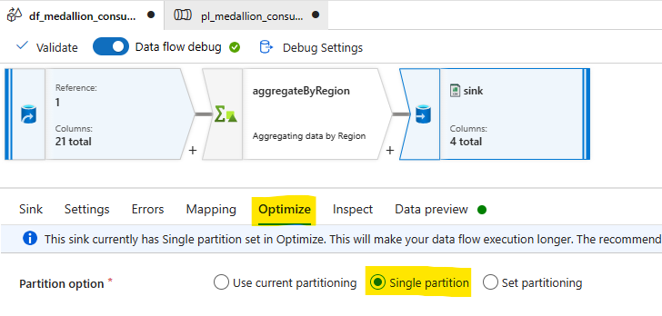 </kbd>

1. In the **Data preview** tab of the sink, click the **Refresh** button. Ensure the refresh succeeds.

1. Click the **Publish all** button, then click the **Publish** button.

<a href="#module-10---medallion-architecture-consumption-example">↥ back to top</a>

## 2. Create the pipeline

Once a data flow is developed, you can create the pipline that invokes it.

1. In the factory resources pane, select on the plus icon to open the new resource menu. Select **Pipeline**.

    <kbd> 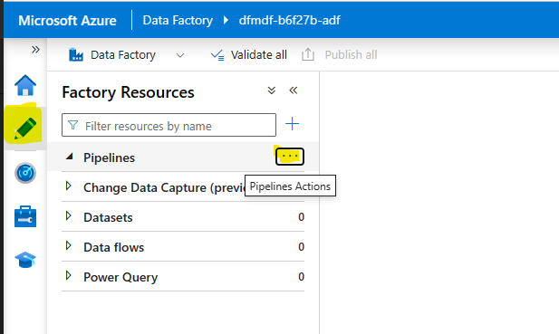 </kbd>

1. In the **General** panel under **Properties**, add a **Name** and **Description**.

    | Attribute  | Value |
    | --- | --- |
    | Name | `pl_medallion_consumption` |
    | Description | `Example consumption of gold data` |

1. From the **Activities** panel, open the **Move & transform** accordian and drag the **Data flow** activity onto the canvas. Complete the below attributes in the **General** tab: 

    | Attribute  | Value |
    | --- | --- |
    | Name | `Run consumption data flow` |
    | Timeout | `0.00:30:00` |

1. On the activity named `Run consumption data flow` **Settings** tab, update the below attributes: 

    | Attribute  | Value |
    | --- | --- |
    | Data flow | `df_medallion_consumption` |
    | Run on (Azure IR) | `ir-vnetwork-medium-60min` |
    |Logging level | ` None ` |

1. In the Azure Data Factory Studio, click the **Debug** button.

1. Review the debug outcomes. 

    <kbd> 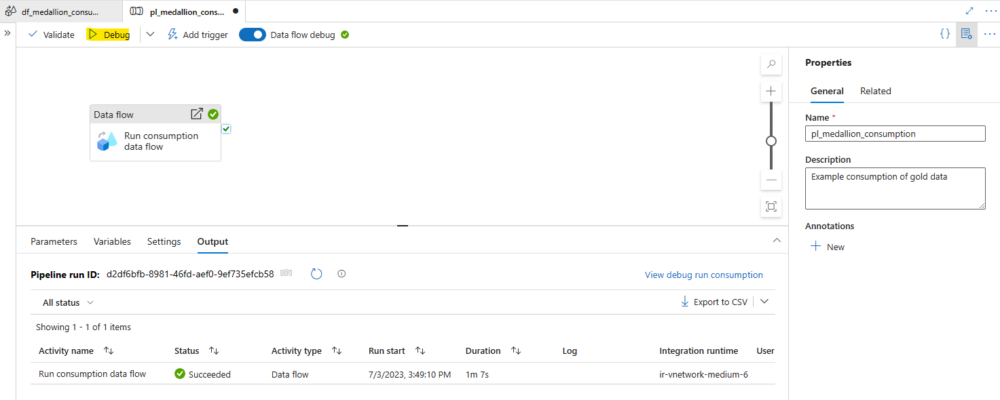 </kbd>

1. In the Azure Storage Account lab resource named `dfmdf< Random string for your lab environment resources >adls`, ensure the `publish/employees_gold_confidential` and `publish/employees_gold_general` directories have data files.

    <kbd> 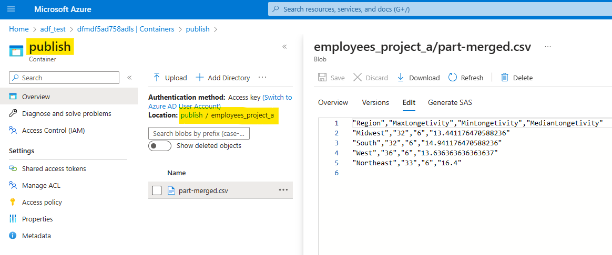 </kbd>

<a href="#module-10---medallion-architecture-consumption-example">↥ back to top</a>

## :tada: Summary

You have created an example of what the consumption pattern might be on top of the gold layer, where that consumption also requires a batch file output. 

Note that consumption of gold data assets can take many forms

[Continue >](../modules/module11.md)