# Module 11 - Troubleshooting

[< Previous Module](../modules/module10.md) - **[Home](../README.md)** - [Next Module >](../modules/module12.md)

## :loudspeaker: Introduction

As with any data processing solution, errors and issues can arise during the execution of mapping data flows, making troubleshooting an essential skill for any practitioner.

In this module, we will cover common mapping data flow issues and their respective solutions. You will learn how to use Azure Data Factory's built-in diagnostic tools, such as monitoring, logging, and data preview, to pinpoint and resolve these issues effectively.

## :bookmark_tabs: Table of Contents

| #  | Section |
| --- | --- |
| 1 | [Error Handling](#1-error-handling) |
| 1 | [Key steps and features to help you troubleshoot in Azure Data Factory](#1-key-steps-and-features-to-help-you-troubleshoot-in-azure-data-factory) |
| 2 | [Activity output](#2-capturing-activity-output) |
| 3 | [Activity logging](#3-activity-logging) |
| 4 | [End-to-end troubleshooting](#4-end-to-end-troubleshooting) |
| 5 | [Other troubleshooting tactics](#5-other-troubleshooting-tactics)

<a href="#module-11---troubleshooting">↥ back to top</a>

## 1. Error Handling

1. In the factory resources pane, select on the plus icon to open the new resource menu. Select **Pipeline**.

1. In the **General** panel under **Properties**, add a **Name** and **Description**.

    | Attribute  | Value |
    | --- | --- |
    | Name | `pl_troubleshooting` |
    | Description | `Explore troubleshooting` |

1. In the **Variables** tab of the pipeline, add a String variable called `testString`. 

    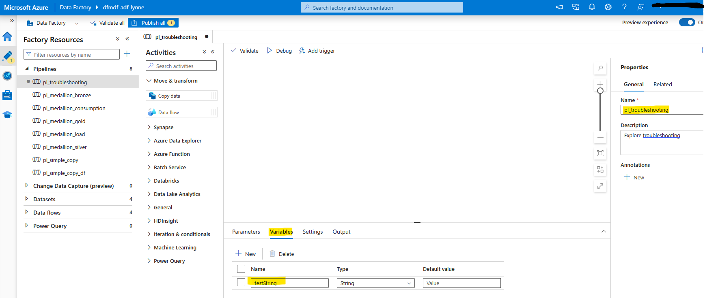

1. From the **Activities** panel, open the **General** accordian and drag the **Set variable** activity onto the canvas. Change the **Name** to `Simulate error` on the **General** tab. 

    Then, on the Settings tab, select the `testString` variable and then click the **Add dynamic content** link under the **Value** textbox to enter an expression.

    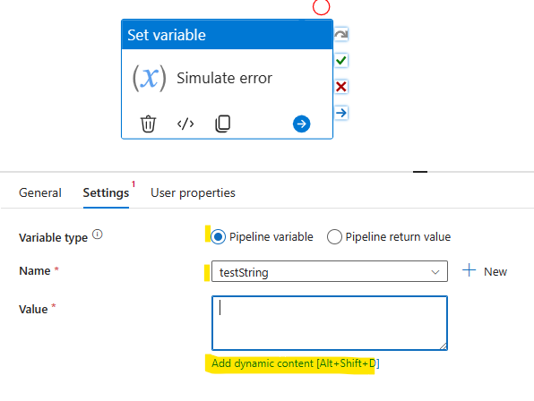

    Enter `@string(div(1,0))` into the expression builder. Then, click **OK** to close the **Pipeline expression builder** panel.

    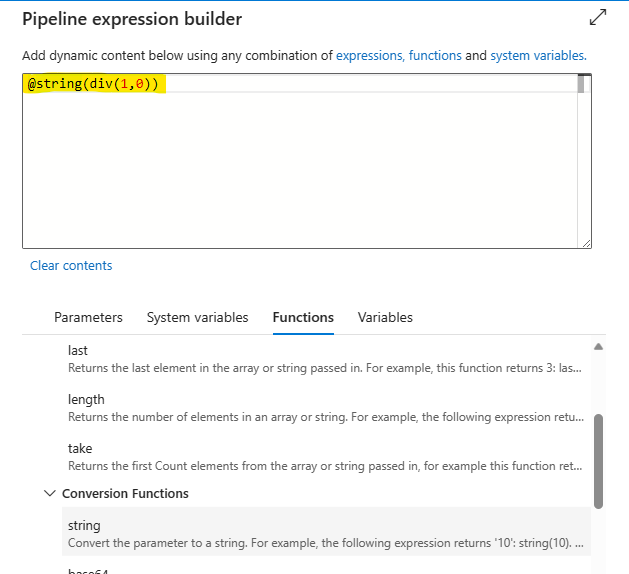

1. Click the **Debug** button to debug the pipeline. Then, on the pipeline **Output** tab, select the message icon over the `Failed` status for the activity. A popup window appears with the error message.

    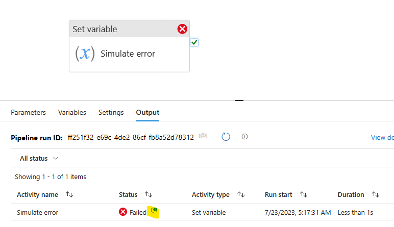

1. Next, drag a new **Set Varaible** activity onto the canvas. Change the **Name** on the **General** tab to `Upon fail`. On the **Settings** tab, select the `testString` variable and set the **Value** to `Fail`. 

    Hover over the right side of the `Simulate error` activity to select the upon success conditional path (red) and drag it to the new `Upon fail` activity connecting the two.

    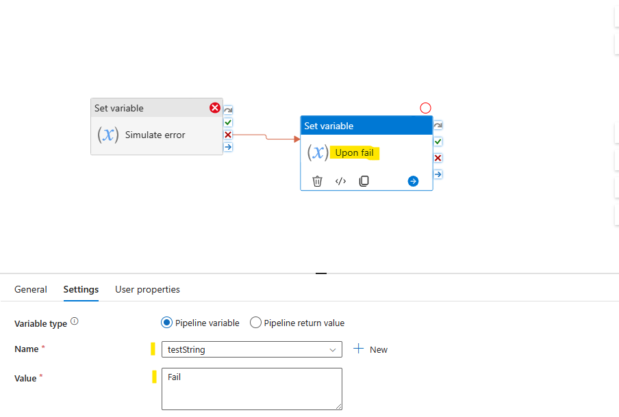

1. Click the **Debug** button to debug the pipeline. Then, on the pipeline **Output** tab, note the activities that were triggered and their status values. 

    On the **Factory Resources** pane, select the **Monitor** option from the elipsis menu of the `pl_troubleshooting` pipeline.

    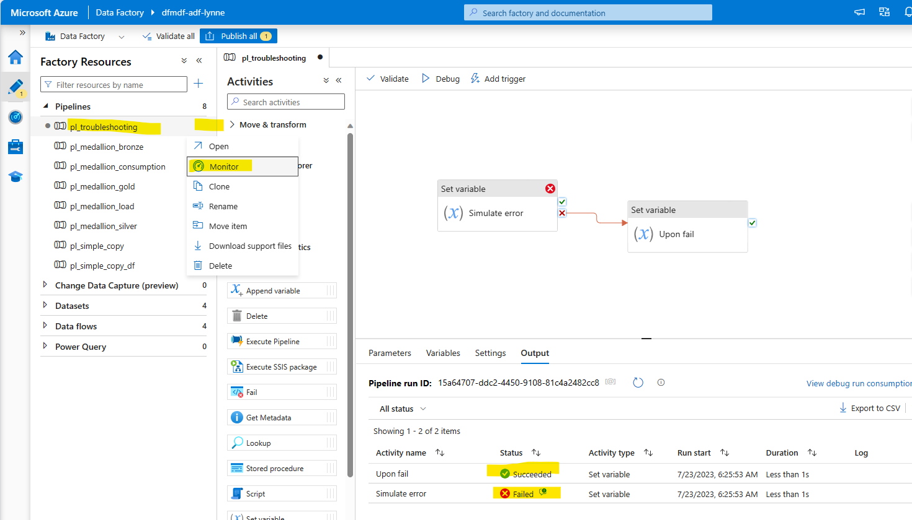

1. The **Pipeline runs** page opens in the Data Factory **Monitoring** tab. Note that the pipeline status is `Succeeded`. This is because all of the activities 

    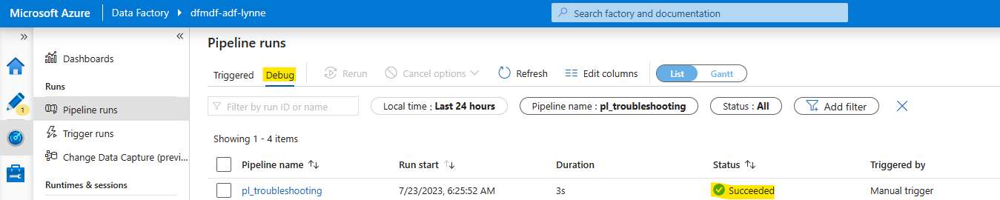

    | :exclamation: This behavior is by design. All activities on the success path either ran successfully or had their errors handled by the on failure conditional path.   |
    |-----------------------------------------|

1. Right-click over the `Upon Success` activity and select **Copy**.

    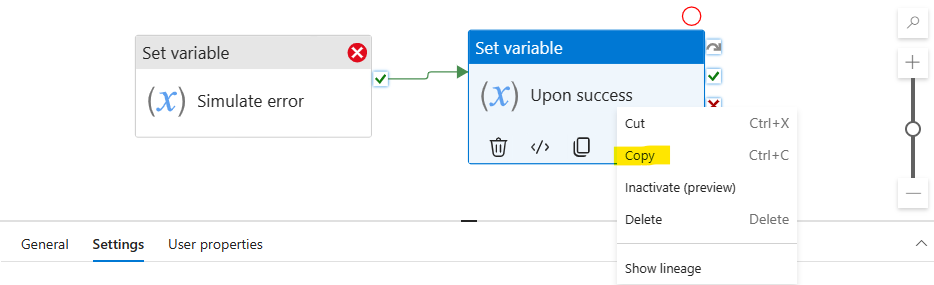

1. Left-click once in an empty canvas area. Then, right-click and select **Paste**.

    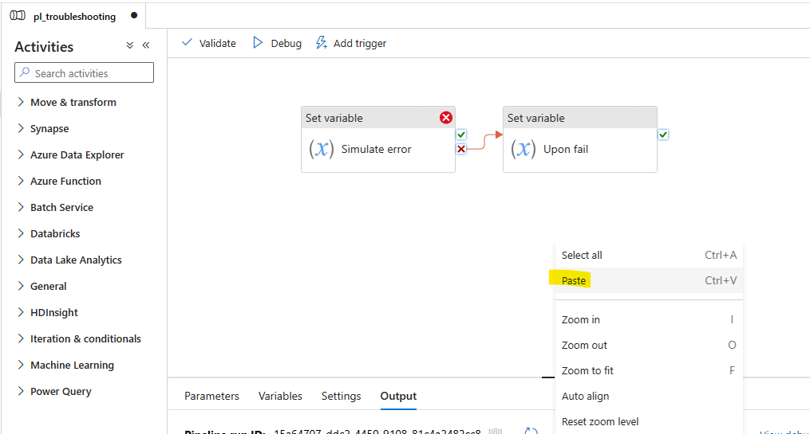

1. Rename the pasted activity to `Upon Failure` and change the **Settings** tab **Value** attribute to `Fail`.

    Hover over the right side of the `Simulate error` activity to select the upon failure conditional path (red) and drag it to the new `Upon failure` activity connecting the two.

    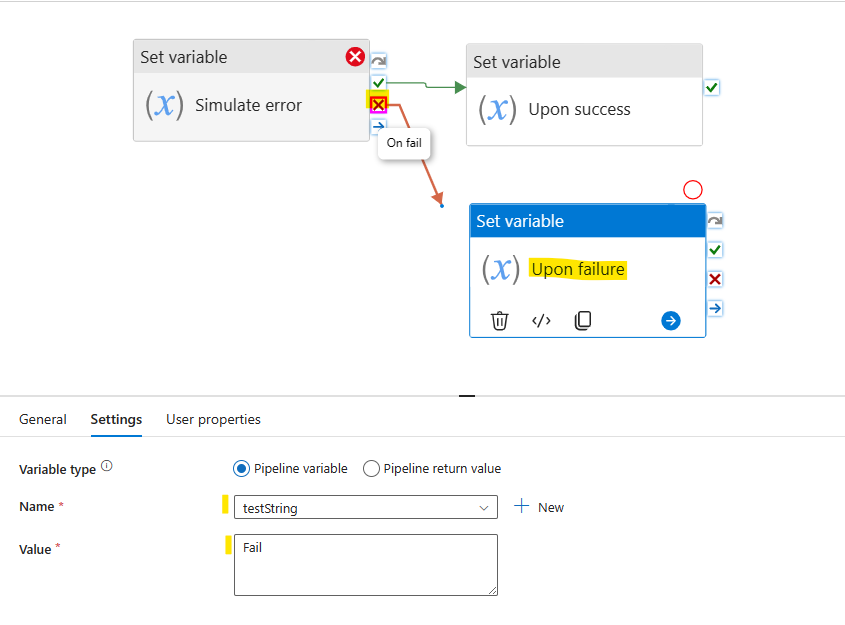

1. Click the **Debug** button to debug the pipeline. Then, on the pipeline **Output** tab, note the activities that were triggered. 

    On the **Factory Resources** pane, select the **Monitor** option from the elipsis menu of the `pl_troubleshooting` pipeline.

    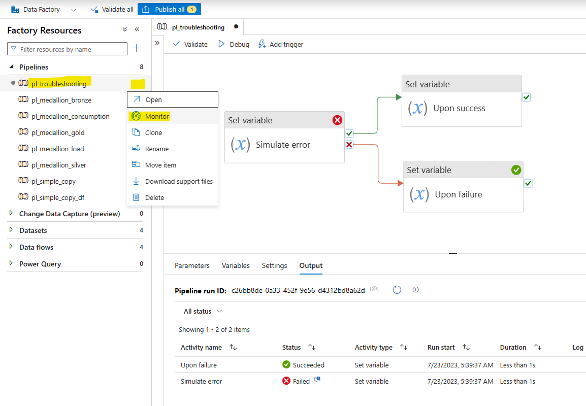

1. With the **Monitor** tab in Azure Data Factory open, on the Pipeline runs page, select Debug from the top bar. 

    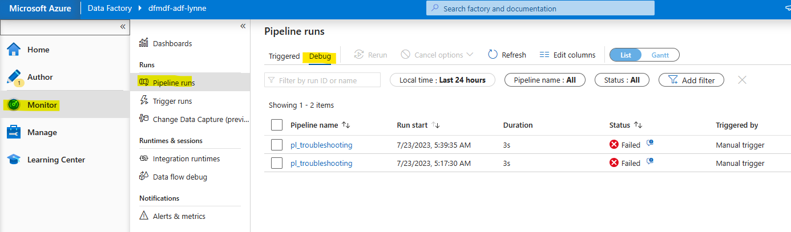

    Notice that the 2 debug runs appear with a **Status** of `Failed`. Explore available monitoring information by clicking the most recent run. Over over the activities just left of the **Status** indicator to see icons for input and output. 

    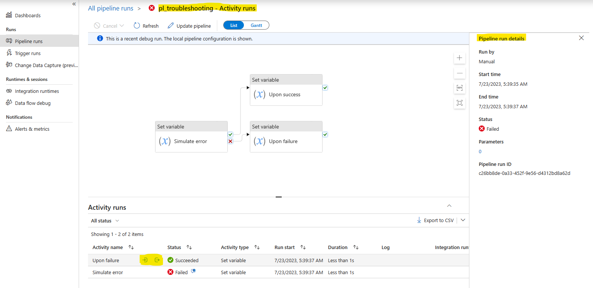

1. Click the **Update pipeline** button to return to the author tab for this pipeline.

    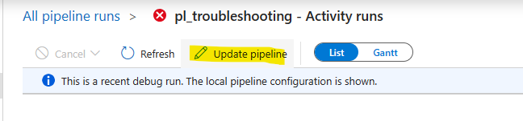

1. a

    | Attribute  | Value |
    | --- | --- |
    | Name | `Simulate error` |

## 1. Key steps and features to help you troubleshoot in Azure Data Factory

1. Pipeline Debugging
    - **Use the Debug feature**: In the Azure Data Factory user interface, click on the "Debug" button when editing a pipeline. This runs the pipeline in debug mode, allowing you to test and validate your pipeline before publishing.
    - **Add annotations and comments**: Annotate and comment on your activities, datasets, and linked services to provide context and improve readability for troubleshooting.
    - **Use output parameters and variables**: Utilize pipeline output parameters and variables to capture and log information about pipeline executions.
1. Monitoring and Logging
    - **Monitor activity runs**: Use the "Monitor" tab in the Azure Data Factory user interface to view the status of your pipeline and activity runs. You can filter and search for specific runs, view detailed information, and check error messages.
    - **Access log files**: Retrieve log files from the "Logs" tab in the activity run details window. These logs may contain valuable information for debugging purposes.
    - **Enable diagnostics**: Configure diagnostic settings to send monitoring data to Azure Monitor logs, Event Hubs, or Azure Storage for deeper analysis.
1. Mapping Data Flow Debugging
    - **Data flow debug mode**: Enable the Data Flow Debug mode in the Data Flow canvas to test and validate your data transformations in real-time.
    - **Data preview**: Use the "Data Preview" tab in the data flow transformation settings to view sample data at different transformation stages. This helps identify issues with data transformation logic.
    - **Row-level and column-level statistics**: Leverage row-level and column-level statistics available in the Data Flow Debug mode to analyze data transformations and identify potential issues.
1. Error Handling (See [Microsoft Learn: Errors and Conditional execution - Common Patterns](https://learn.microsoft.com/en-us/azure/data-factory/tutorial-pipeline-failure-error-handling#common-patterns))
    - **Determin error pattern based on how pipeline failures are determined**

    - **Consider common error handling patterns**
      - Try-Catch-Proceed
      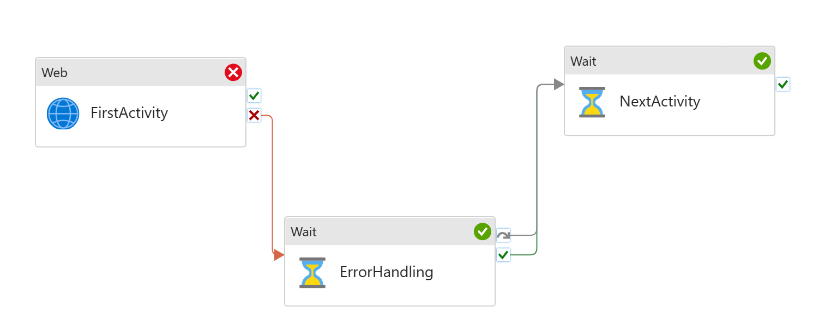
      - Generic Error Handling
      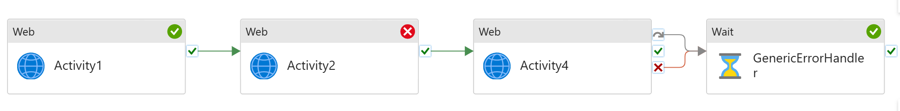
1. Alerts and Notifications:
    - **Set up alerts**: Configure alerts in Azure Data Factory to notify you when specific events or conditions occur, such as pipeline failures or delays. This helps ensure timely identification and resolution of issues.
    - **Integration Runtime Logs**
       - Self-hosted integration runtime logs: For self-hosted integration runtimes, you can enable logging to capture detailed information about data movement and data processing activities.

By using these tools and techniques, you can effectively debug and troubleshoot issues in Azure Data Factory, ensuring smooth and efficient data integration operations.

<a href="#module-11---troubleshooting">↥ back to top</a>

## 2. Capturing activity output

Section 2 content

## 3. Activity Logging

## 4. End-to-end troubleshooting

## 5. Other troubleshooting tactics

Section 2 content

## :tada: Summary

You have now completed this module. 

[Continue >](../modules/module12.md)