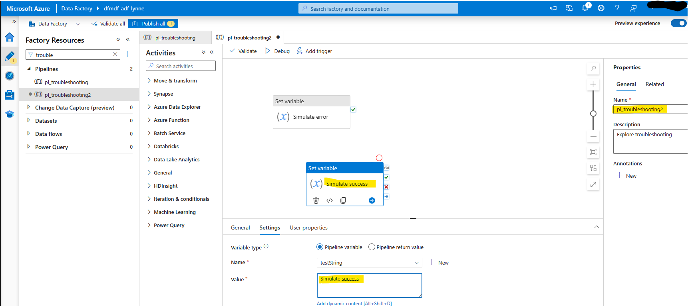
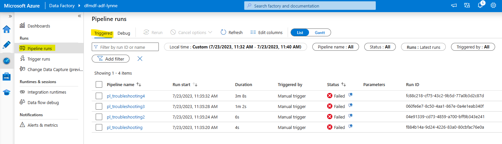

# Module 11 - Troubleshooting

[< Previous Module](../modules/module10.md) - **[Home](../README.md)** - [Next Module >](../modules/module12.md)

## :loudspeaker: Introduction

As with any data processing solution, errors and issues can arise during the execution of mapping data flows, making troubleshooting an essential skill for any practitioner.

In this module, we will cover common mapping data flow issues and their respective solutions. You will learn how to use Azure Data Factory's built-in diagnostic tools, such as monitoring, logging, and data preview, to pinpoint and resolve these issues effectively.

## :bookmark_tabs: Table of Contents

| #  | Section |
| --- | --- |
| 1 | [Handle control flow errors using conditional paths](#1-handle-control-flow-errors-using-conditional-paths) |
| 2 | [Capture activity error messages](#2-capture-activity-error-messages) |
| 3 | [Set up Data Factory pipeline failure alerts](#3-set-up-data-factory-pipeline-failure-alerts) |
| 4 | [End-to-end troubleshooting](#4-end-to-end-troubleshooting) |
| 5 | [Summary of key steps and features to help you troubleshoot in Azure Data Factory](#5-summary-of-key-steps-and-features-to-help-you-troubleshoot-in-azure-data-factory) |

<a href="#module-11---troubleshooting">↥ back to top</a>

## 1. Handle control flow errors using conditional paths

After this section, you will have learned the basics for conditional paths and how to build a standard try-catch block inside of Azure Data Factory pipelines - specifically for the control flow activities. Appropriately catching errors is the first step to building a robust pipeline and enabling troubleshooting.

1. In the factory resources pane, select on the plus icon to open the new resource menu. Select **Pipeline**.

1. In the **General** panel under **Properties**, add a **Name** and **Description**.

    | Attribute  | Value |
    | --- | --- |
    | Name | `pl_troubleshooting` |
    | Description | `Explore troubleshooting` |

1. In the **Variables** tab of the pipeline, add a String variable called `testString`. 

    

1. From the **Activities** panel, open the **General** accordian and drag the **Set variable** activity onto the canvas. Change the **Name** to `Simulate error` on the **General** tab. 

    Then, on the Settings tab, select the `testString` variable and then click the **Add dynamic content** link under the **Value** textbox to enter an expression.

    

    Enter `@string(div(1,0))` into the expression builder. Then, click **OK** to close the **Pipeline expression builder** panel.

    

1. Click the **Debug** button to debug the pipeline. Then, on the pipeline **Output** tab, select the message icon over the `Failed` status for the activity. A popup window appears with the error message.

    

1. Next, drag a new **Set Varaible** activity onto the canvas. Change the **Name** on the **General** tab to `Upon fail`. On the **Settings** tab, select the `testString` variable and set the **Value** to `Fail`. 

    Hover over the right side of the `Simulate error` activity to select the upon fail conditional path (red) and drag it to the new `Upon fail` activity connecting the two.

    

1. Click the **Debug** button to debug the pipeline. Then, on the pipeline **Output** tab, note the activities that were triggered and their status values. 

    On the **Factory Resources** pane, select the **Monitor** option from the elipsis menu of the `pl_troubleshooting` pipeline.

    

1. The **Pipeline runs** page opens in the Data Factory **Monitoring** tab. Note that the pipeline status is `Succeeded`. This is because all of the activities 

    

    |   :exclamation: IMPORTANT :exclamation: This behavior is by design. All activities on the success path either ran successfully or had their errors handled by the on failure conditional path.   |
    | --- |

1. Return to the Data Factory **Author** tab and navigate to the `pl_troubleshooting` pipeline. Right-click over the `Upon fail` activity and select **Copy**.

    

1. Left-click once in an empty canvas area. Then, right-click and select **Paste**.

    

1. Rename the pasted activity to `Upon success` and change the **Settings** tab **Value** attribute to `Success`.

    Hover over the right side of the `Simulate error` activity to select the upon success conditional path (green) and drag it to the new `Upon success` activity connecting the two.

    

1. Click the **Debug** button to debug the pipeline. Then, on the pipeline **Output** tab, note the activities that were triggered and the status of each.

    On the **Factory Resources** pane, select the **Monitor** option from the elipsis menu of the `pl_troubleshooting` pipeline.

    

1. With the **Monitor** tab in Azure Data Factory open, on the Pipeline runs page, select Debug from the top bar. 

    

    Notice that latest debug run has a **Status** of `Failed`. Explore available monitoring information by clicking the most recent run.

    |   :exclamation: IMPORTANT :exclamation: This behavior is by design. All activities on the success path did NOT run meeting the criteria of running successfully or having their errors handled by the on failure conditional path. The activity named `Upon success` was skipped. |
    | --- |

1. Return to the Data Factory **Author** tab and navigate to the `pl_troubleshooting` pipeline. 

1. Click the **Publish all** button, then click the **Publish** button.

1. From the Factory Resources pane, click the `pl_troubleshooting` pipeline elipsis menu item and select **Clone**.

    

1. Rename the cloned pipeline `pl_troubleshooting2` and copy the `Simulate error` activity. Rename the pasted actvity `Simulate success`. Then, change the Settings tab value to `Simulate success`.

    

1. Copy the `Simulate success` activity and paste it. Rename the pasted actvity to `Simulate success2`. Then, connect the two activities with an on success conditional path. 

    

1. Click and drag the **If Condition** activity from the **Activities** pane to the pipeline canvas. Connect the activity as follows: 
    - From `Simulate error`, drag the on completion path to the new if condition.
    - From `Simulate success2`, drag on skip path to the new if condition.
    - From `Simulate success2`, drag on completion path to the new if condition.

    

1. Update the attributes of the if condition activity to the below values.

    | Tab | Attribute  | Value |
    | --- | --- | --- |
    | General | Name | `Handling` |
    | General | Description | `If successful, set string variable value to Success. If not, set Fail activity and pipeline return value.` |
    | Activities | Expression | `@and(equals(activity('Simulate error').Status, 'Succeeded'),equals(activity('Simulate success2').Status, 'Succeeded'))` |

1. On the `Handling` activity's **Activities** tab, click the edit (pencil) icon for the **True** case.

    Click and drag a **Set variable** activity to the canvas. Name it `Return success`. On the **Settings** tab, select **Pipeline return value**. Then, add a new `myCustomAttribute` return value of **String** type with the value `Pipeline success`. 

    

1. Click the `pl_troubleshooting2` link portion of the breadcrumbs at the top left of the canvas to get back to the main pipeline canvas.

    

1. On the `Handling` activity's **Activities** tab, click the edit (pencil) icon for the **False** case.

   Click and drag a **Set variable** activity to the canvas. Name it `Return fail` On the **Settings** tab, select **Pipeline return value**. Then, add a new `myCustomAttribute` return value of **String** type with the value `Pipeline fail`. 

    

    Click and drag a **Fail** activity to the canvas. On the **Settings** tab, use the expression builder to set the **Fail message** to `Custom failure message`. Set the **Error code** to `30`.

    

    |   :exclamation: IMPORTANT :exclamation: If a Fail activity is used to handle an error, the pipeline will always fail if the preceeding activity fails. This is not the same as the  |
    | --- |

1. Click the `pl_troubleshooting2` link portion of the breadcrumbs at the top left of the canvas to get back to the main pipeline canvas.

    

1. Right-click in an empty area of the pipeline canvas and select the **Show nested activities by default** option.

    

1. Click the **Debug** button to debug the pipeline. Then, on the pipeline **Output** tab, note the activities that were triggered and the status of each.

    

    |   :exclamation: IMPORTANT :exclamation: This common error handling pattern demonstrates how a single catch block can be used for many activities. |
    | --- |

1. Click the **Publish all** button, then click the **Publish** button.

<a href="#module-11---troubleshooting">↥ back to top</a>

## 2. Capture activity error messages

In addition to being able to create conditional paths, some activites return a queryable error message in the JSON that returns from the activity execution. In this section, you will learn how to capture the error code and message returned from a failed **Copy data** actvity. 

An example of a Copy data error output is shown below. 

1. In the factory resources pane, select on the plus icon to open the new resource menu. Select **Pipeline**.

1. In the **General** panel under **Properties**, add a **Name** and **Description**.

    | Attribute  | Value |
    | --- | --- |
    | Name | `pl_troubleshooting3` |
    | Description | `Capture copy data effort message` |

1. From the **Activities** pane, under **Move & transform**, click and drag the **Copy data** activity into the pipeline area. Name it `Copy`. 

    On the **Source** tab of the activity properties, select the `ds_irazure_adls_binary_directory` dataset and enter `Bad` in both the container and directory parameters.

    

    On the **Sink** tab of the activity properties, select the `ds_irazure_adls_binary_directory` dataset and enter `Bad` in both the container and directory parameters.

    

1. From the **Activities** pane, under **General**, click and drag the **Fail** activity into the pipeline area. Name it `Fail message`. 

    On the **Settings** tab of the activity properties, use the **Pipeline expression builder** panel to add the values for the **Fail message** and **Error code** as shown below.

    | Attribute  | Value |
    | --- | --- |
    | Fail message | `@activity('Copy').output.errors[0].Message` |
    | Error code | `@activity('Copy').output.errors[0].Code` |

    

1. Click the **Debug** button to debug the pipeline. Then, on the pipeline **Output** tab, note the activities that were triggered and the status of each. Click the failure message for the `Fail message` activity and notice hat the **Error code** and **Details** fields appropriately reflect the Copy data activity error code and message.

    

1. Click the **Publish all** button, then click the **Publish** button.

<a href="#module-11---troubleshooting">↥ back to top</a>

## 3. Set up Data Factory Pipeline Failure Alerts

There are numerious architecture options for how a maintenance person or persons can be notified of a pipeline failure. Two of the most popular are to ...

1. Use Azure Monitoring Alerts to provide email and/or text message alerting.
2. Use the Azure Data Factory Web component to invoke a Logic Apps that handles the email.

This section walks through how to set up Monitor alerting. See [Microsoft Learn: Send an email with an Azure Data Factory or Azure Synapse pipeline](https://learn.microsoft.com/en-us/azure/data-factory/how-to-send-email) for more information about option 2.

1. Open the Azure Portal to the Azure Data Factory **Alerts** page. Then, click the **Create alert rule** button.

    

1. Select the **Signal name** `Failed pipeline runs metrics`. Ensure the **Check every** and **Lookback period** options are set to `5 minutes`. Then, click **Next: Actions**.

    

1. Click **+ Create action group**.

    

1. Enter an **Action group name** and a **Display name** and display name for the alert. 

    | Attribute  | Value |
    | --- | --- |
    | Action group name | `Alert Maintenance Crew` |
    | Display name | `adf_maint` |

    

1. Click **Next: Notifications**. Select the **Notification type** of `Email/SMS message/Push/Voice`. On the panel that appears, enter your email address, **Enable the common alert schema**, and click **Ok**. 

    

1. Enter a notification Name such as `EmailMaintCrewInbox`. Then, click **Review + create**. Click **Create**.

    

1. You are returned to the **Create an alert rule** wizard and the `Alert Maintenance Crew` action group now appears on the **Actions** tab. Click **Next: Details**.

1. Set the attributes below. 

    | Attribute  | Value |
    | --- | --- |
    | Severity | `1 - Error` |
    | Alert rule name | `adf_pipeline_errors_5` |
    | Alert rule description | `Checks for Data Factory pipeline errors every 5 minutes for the preceding 5 minutes and emails the adf maintenance inbox.` |

    

1. Click **Review + create** and then **Create**. There is now an active alert for this data factory.

1. If you have the Azure Data Factory Studio open, close and re-open it.

<a href="#module-11---troubleshooting">↥ back to top</a>

## 4. End-to-end troubleshooting

This section will demonstrate how published, triggered pipelines can be monitored. 

:point_up: For demonstration purposes, an additional pipeline needs to be created to demonstrate a Data flow failure. Follow the instructions in [Module 14 / Import a pipeline template](../modules/module14.md/#3-import-a-pipeline-template) to import `pl_troubleshooting4` before proceeding. Ensure all pl_troubleshooting* pipeline content is published.

1. To simulate that scheduled triggers have executed, open each of the pl_troubleshooting* pipelines. Then, for each, select **Trigger now** from the **Add trigger** menu.

1. In 5 minutes from when the failures from step 1, the email address that is confgured for the alert should receive an failure email notice. In the example below, only the first couple of errors were caught in the first 5 minute span of the alerts.

    
    

1. Once an email alert is received, click the link for the **Affected resource**. Then, open the Azure Data Factory Studio by clicking the **Launch studio** button. 

1. Navigate to the **Monitor** tab. On the **Pipeline runs** page, ensure that the **Triggered** filter is selected.

    

    To drill into the run history for a single run, click the pipeline name.

    For some activities, there is a glasses icon that allows you to drill further down. In the  pl_troubleshooting4 run, click this icon on the Data flow activity.

    
    

1. If the run was a non-manual triggered run, it would appear on the **Trigger runs** page as the below image depicts. Note that the trigger name appears on this page, rather than the pipeline name, because it is possible to trigger many pipelines in a single trigger.

    

    To drill into the run history for a single pipeline, click the number link in the **Pipelines** column and then the **Value** link on the popup.

    

<a href="#module-11---troubleshooting">↥ back to top</a>
 

## 5. Summary of key steps and features to help you troubleshoot in Azure Data Factory

The above sections provide an introduction into troubleshooting for Azure Data Factory. See the below for a summary of key steps and features for Azure Data Factory troubleshooting. For more information, see 

1. Pipeline Debugging
    - **Use the Debug feature**: In the Azure Data Factory user interface, click on the "Debug" button when editing a pipeline. This runs the pipeline in [debug mode](https://learn.microsoft.com/en-us/azure/data-factory/iterative-development-debugging?tabs=data-factory), allowing you to test and validate your pipeline before publishing.
    - **Add annotations and comments**: [Annotate and comment](https://learn.microsoft.com/en-us/azure/data-factory/concepts-annotations-user-properties) on your activities, datasets, and linked services to provide context and improve readability for troubleshooting.
    - **Use output parameters and variables**: Utilize pipeline output parameters and [pipeline return values](https://learn.microsoft.com/en-us/azure/data-factory/control-flow-set-variable-activity#setting-a-pipeline-return-value-with-ui) to capture and log information about pipeline executions.
1. Monitoring and Logging
    - **Monitor activity runs**: Use the ["Monitor" tab](https://learn.microsoft.com/en-us/azure/data-factory/monitor-visually) in the Azure Data Factory user interface to view the status of your pipeline and activity runs. You can filter and search for specific runs, view detailed information, and check error messages.
    - **Access log files**: Retrieve log files from the ["Logs" tab](https://learn.microsoft.com/en-us/azure/data-factory/copy-activity-log?tabs=data-factory) in the activity run details window. These logs may contain valuable information for debugging purposes.
    - **Enable diagnostics**: Configure [diagnostic settings](https://learn.microsoft.com/en-us/azure/data-factory/monitor-configure-diagnostics) to send monitoring data to Azure Monitor logs, Event Hubs, or Azure Storage for deeper analysis.
1. Mapping Data Flow Debugging
    - **Data flow debug mode**: Enable the [Data Flow Debug mode](https://learn.microsoft.com/en-us/azure/data-factory/concepts-data-flow-debug-mode?tabs=data-factory) in the Data Flow canvas to test and validate your data transformations in real-time.
    - **Data preview**: Use the "Data Preview" tab in the data flow transformation settings to view sample data at different transformation stages. This helps identify issues with data transformation logic.
    - **Row-level and column-level statistics**: Leverage row-level and column-level statistics available in the Data Flow Debug mode to analyze data transformations and identify potential issues.
1. Error Handling: There are many common patterns for error handling; [Microsoft Learn: Errors and Conditional execution - Common Patterns](https://learn.microsoft.com/en-us/azure/data-factory/tutorial-pipeline-failure-error-handling#common-patterns) to review which pattern works for your use case.
1. Alerts and Notifications:
    - **Set up alerts**: Configure [alerts](https://learn.microsoft.com/en-us/azure/data-factory/monitor-metrics-alerts) in Azure Data Factory to notify you when specific events or conditions occur, such as pipeline failures or delays. This helps ensure timely identification and resolution of issues.
    - **Integration Runtime Logs**
       - [Self-hosted integration runtime logs](https://learn.microsoft.com/en-us/azure/data-factory/how-to-configure-shir-for-log-analytics-collection): For self-hosted integration runtimes, you can enable logging to capture detailed information about data movement and data processing activities.

<a href="#module-11---troubleshooting">↥ back to top</a>

## :tada: Summary

By using these troubleshooting tools and techniques, you can effectively debug and troubleshoot issues in Azure Data Factory, ensuring smooth and efficient data integration operations.

[Continue >](../modules/module12.md)