# Module 13 - SAP CDC Connector

[< Previous Module](../modules/module11.md) - **[Home](../README.md)**

## Setup of ADF SAP-CDC Connector

This module will demonstrate the setup of the following tasks:

* Self-hosted Intergation Runtime 
* SAP CDC Linked Service
* Integration Dataset for SAP CDC
* Azure Synapse Analytics Linked Service
* Integration Dataset for for Azure Synapse Analytics
* Define Dataflow for Source, Transform and Sink 
* Create ADF Pipeline 
* Trigger data extraction

## Table of Contents

| #  | Section |
| --- | --- |
| 1 | [Overview of ETL process](#1-overview-of-implemented-etl-process) |
| 2 | [Prepare ADF for data extraction from SAP S/4HANA](2-prepare-adf-for-data-extraction-from-sap-s4hana) |
| 3 | [Data Extration trigger](#3-data-extraction-from-sap-s4hana-to-adf) |

<a href="#module-13---sap-cdc-connector">↥ back to top</a>

## 1. Overview of Implemented ETL Process 

The following environment was setup for this exercise

Source System:
* SAP S/4HANA 2022 (SAP Cloud Appliance Library) on Azure Tenant
* Extract data from SAP table Sales Order Headers using an ABAP CDS View and ADF SAP CDC Adapter
* Create linked service and data set using Azure Data Factory and Synapse  

<kbd>  </kbd>

## 2. Prepare ADF for data extraction from SAP S/4HANA

## 2.1 Download and install the self-hosted integration runtime

The self-hosted integration runtime is used to establish connectivity between Azure Data Factory and other non-public internet facing compute resources. These can be on-premises resources and those protected by virtual networks and firewalls.

2.1.1 On the SAP VM (in this particular test case, it was the Windows jumphost machine where SAP GUI was installed) 

2.1.2 Open Azure Data factory

2.1.3 Select the **Manage hub**, then choose **Integration runtimes** from beneath the Integration header. From the Integration runtimes screen, select + New from the toolbar menu.

<kbd>  </kbd>

2.1.4 On the Integration runtime setup blade, select the **Azure, Self-Hosted**. Select Continue.
<kbd>  </kbd>

2.1.5 Select **Self-Hosted** as the network environment. Select **Continue**
<kbd>  </kbd>

2.1.6 Enter **SAPVM-SHIR** in the Name field and select **Create**
<kbd>  </kbd>

2.1.7 Select the link below the **Option 1: Express setup header**. This will download an executable file.
<kbd>  </kbd>

2.1.8 Run the downloaded executable. The Express Setup will download, install, and register the self-hosted integration runtime. Select the Close button once all the steps have completed.
<kbd>  </kbd>
<kbd>  </kbd>

2.1.9 Close the Integration runtime setup blade.

2.1.10 The Integration runtimes list should now display SAPVM-SHIR in the list.
<kbd>  </kbd>

## 2.2 Create Linked Service to the Source System (SAP S/4HANA)
After creating the integration runtimes, the next step is to create linked services. 

2.2.1 In ADF, go to the Manage View, select **Linked Services** and click on **New** to create a new Linked Service of type **SAP CDC Connector**
<kbd>  </kbd>

2.2.2 Enter the Name for the linked service. 
Enter the connection details for the SAP System. 

Use the Integration Runtime which you installed in the previous steps

Use **Test Connection** to verify your settings to ensure that the details entered are correct.

Once the connection is successful, click on **Create**
<kbd>  </kbd>

## 2.3 Create an Integration Dataset for the Linked Service
2.3.1 Create an Integration DataSet for the Linked Service created in the previous step. This dataset will act as the source.

In ADF go to **Author** view, under **Datasets**, select **New dataset**

<kbd>  </kbd>

Use type **SAP CDC**

<kbd>  </kbd>

Provide a meaningful name for the Dataset.

For the linked service use the name created in the step before.

As in our case the ODP is a CDS View, we provide **ABAP CDS (ABAP Core Data Services)**.

The CDS view in our case is called **ZBD_ISALESDOC_E1$E** which is given as the input for the ODP name.

<kbd>  </kbd>

2.3.2 Once the Dataset is created, you can verify the connection using **Test connection**
<kbd>  </kbd>

2.3.3 Create a linked service to store the extracted data from Source System 
The data extracted from SAP S/4HANA will be stored in the Azure Data Lake Storage Gen2
<kbd>  </kbd>

## 2.4 Create a Linked Service to the Target System (Synapse SQL Pool)
2.4.1 For this exercise, we created a dedicated synapse SQL Pool.
<kbd>  </kbd>

2.4.2 Create SQL Table schema in synapse.
<kbd>  </kbd>

2.4.3 Grant ADF Useracess to synpase workspace.
<kbd>  </kbd>

2.4.4 In ADF, go to the Manage View, select **Linked Services** and click on **New** to create a new Linked Service of type **Azure Synapse Analytics** and click on **Continue**
<kbd>  </kbd>

2.4.5 Provide the details of the Synapse SQL Pool that will be used as the Target.
<kbd>  </kbd>

## 2.5 Create an Integration DataSet for the Synapse Sales Orders
2.5.1 In ADF go to Author view, under **Datasets**, select **New dataset**, to create a new Linked Service of type **Azure Synpase Analytics**
<kbd>  </kbd>

2.5.2 Provide the Linked Service and synpase table pool name
<kbd>  </kbd>

2.5.3 Use Test Connection to verify your settings to ensure that the details entered are correct.
<kbd>  </kbd>

## 2.6 Create the Data Pipeline
2.6.1 In ADF go to Author view, under **Pipelines**, select **New pipeline**
<kbd>  </kbd>

We named the pipeline **ExtractSalesOrderHeaders** 

2.6.2 Within created pipeline choose the **Dataflow** and drag in to the empty canvas
<kbd>  </kbd>

2.6.3 In the General tab change the **name** 
<kbd>  </kbd>

2.6.4 In the Settings tab, change the **Run on Azure IR** to **AutoResolveIntegrationRuntime**
**Enable Staging** and enter the path to the staging directory of your Azure Data Lake that was created earlier in this exercise

<kbd>  </kbd>

2.6.5 Create a new Dataflow
<kbd>  </kbd>

In the Dataflow, **Add Source**
<kbd>  </kbd>

Provide the following in the **Source Settings**

Change **Output stream name**. 

As Dataset, select the ODP dataset that was created earlier
<kbd>  </kbd>

Enable **Data flow debug**

<kbd>  </kbd>

2.6.6 In Source options:
Key Columns: SALESDOCUMENT (Use the Refresh button)

<kbd>  </kbd>

In **Projection**, select **Import projection**
<kbd>  </kbd>

## Add some simple transformations

<kbd>  </kbd>

2.6.7 In Derived column's settings
   
    | Attribute  | Value |
    | --- | --- |
    | OutputStream Name | `S4SSalesOrderHeadersUpd` |

Add Derived Columns with the following information:

    | CREATIONDATE| `toDate(CREATIONDATE, "yyyyMMdd")`|
    | PRICINGDATE| `toDate(PRICINGDATE, "yyyyMMdd")` |
    | BILLINGDOCUMENTDATE| `toDate(BILLINGDOCUMENTDATE, "yyyyMMdd")` |
    | LASTCHANGEDATE| `toDate(LASTCHANGEDATE, "yyyyMMdd")` |
    | CREATIONTIME| `toTimestamp(concatWS(" ", CREATIONDATE, CREATIONTIME), "yyyyMMdd HHmmss")` |

   <kbd>  </kbd>

Use the + button to be able to add a next step to the dataflow.

2.6.8 Select **Sink**
   <kbd>  </kbd>

In the **Sink** tab

Enter the **Outputstream**

Enter the Dataset linked to the Synapse Sales Order Headers

<kbd>  </kbd>

2.6.9 In the **Settings** tab
Ensure, **Allow insert, Allow delete, Allow upsert, Allow update** is checked
KeyColums : select **SalesDocument**, this is the key column of the SalesOrderHeader Table in Synapse.

<kbd>  </kbd>

2.6.10 In the Mapping tab, uncheck **Auto mapping**

<kbd>  </kbd>

## 3 Data Extraction from SAP S/4HANA to ADF 
## 3.1 Full Data Extraction

3.1.1 Publish all the changes and once the publish is successful, trigger the pipeline

<kbd>  </kbd>
<kbd>  </kbd>

3.1.2 Trigger data extraction
<kbd>  </kbd>

3.1.3 Check the result of each Dataflow in the Activity Run

**ExtractSalesOrderHeadersDF**  - results shows a

`Total # of rows calculated : 4592`

`Total # of rows copied : 4592`

<kbd>  </kbd>

**ExtractSalesOrderHeadersUp** - results shows a

`Total # of rows calculated : 4592`

`Total # of columns : 28`

`Total transformed columns: 4`

<kbd>  </kbd>

**SyncSalesOrderHeaders** - results shows a

`Total # of rows calculated : 4592`

`Total # of columns : 28`

<kbd>  </kbd>

3.1.4 Verify and monitor the extracted data on SAP system using `ODQMON - Monitor for Operational Delta Queue to monitor the ODP extractions`

<kbd>  </kbd>

<kbd>  </kbd>

3.1.5 Verify the extracted data in Synapse using SQL. In the **Develop** view create an SQL query.

<kbd>  </kbd>

## 3.2 Extract data - delta changes 

3.2.1 Verify the Purchaseorderbycustomer for the Sales Document # 50 before the change.
<kbd>  </kbd>

3.2.2 On SAP, change the **custref** number for this Sales Document # 50
<kbd>  </kbd>

3.2.3 Trigger the pipeline run on ADF
<kbd>  </kbd>

3.2.4 Check the result of each Dataflow in the Activity Run.

**ExtractSalesOrderHeadersDF**  - results shows a

`Total # of rows calculated : 1`

`Total # of rows copied : 1`

<kbd>  </kbd>

**ExtractSalesOrderHeadersUp** - results shows a

`Total # of rows calculated : 1`

<kbd>  </kbd>

**SyncSalesOrderHeaders** - results shows a

`Total # of rows calculated : 1`

<kbd>  </kbd>

3.2.5 Verify the extracted data in Synapse using SQL. In the **Develop** view create an SQL query.
<kbd>  </kbd>

3.2.6 Monitor the extraction using ODQMON. Note that it shows only 1 Row being updated and the Change Data field has the status **U** meaning update.

<kbd>  </kbd>

## 3. Ingest Sales order Header data from SAP to Azure Data Lake

The CDS view Sales order Header information residing in S/4HANA, is exposed with OData services. The self-hosted integration runtime installed on the SAP virtual machine enables connectivity between Azure Data Factory and S/4HANA, this will allow for local web calls to take place to the OData endpoints to retrieve sales data.

*** OLD CONTENT BELOW ***

The pipelines in this module use a 5 MB file named *NYCTripSmall.parquet*. This file needs to be in the Azure Storage Account created for this lab.

1. Download this file from [../data_to_be_staged/adls/inbound/nyx_taxi_sample/NYCTripSmall.parquet](../data_to_be_staged/adls/inbound/nyx_taxi_sample/NYCTripSmall.parquet).

2. From the Azure Resource Group overview page, find and click the Azure Storage Account lab resource named `dfmdf< Random string for your lab environment resources >adls` to open the storage account.

   <kbd>  </kbd>

3. Within the Azure Storage Account, open the **Containers** page from within the **Data storage** section of the left pane. Then, click the **+ Container** button and add an `inbound` container.

   <kbd>  </kbd>

4. Click the container name to open the container. Then, click **+ Add Directory**. Add a directory Name `nyx_taxi_sample' and click **Save** to create the directory.

   <kbd>  </kbd>

5. Click the directory name to open the directoy. Then, click the **Upload** button and drag and drop the `NYCTripSmall.parquet` file you downloaded in step 1 into the **Upload blob** drag and drop area. Finally, click **Upload**.

   <kbd>  </kbd>

6. Within the Azure Storage Account, open the **Containers** page from within the **Data storage** section of the left pane. Then, click the **+ Container** button and add an `publish` container.

   <kbd>  </kbd>

7. Click the `publish` container name to open the container. Then, click **+ Add Directory**. Add a directory named `nyx_taxi_sample_pipeline` and click **Save** and add a second directory named `nyx_taxi_sample_dataflow` and click **Save**.

   <kbd>  </kbd>

<a href="#module-13---sap-cdc-connector">↥ back to top</a>

## 2. Pipeline Copy

1. Within the Data Factory Studio, select the **Author** tab from the leftmost pane. Open the **Pipeline Actions** elipsis menu, and click the **New pipeline** menu item.

   <kbd>  </kbd>

2. In the **Properties** pane of the new pipeline, add a **Name** and **Description**.

    | Attribute  | Example Value |
    | --- | --- |
    | Name | `pl_simple_copy` |
    | Description | `Use the copy activity to copy data from one location to another.` |

2. From the **Activities** pane, under **Move & transform**, click and drag the **Copy data** activity into the pipeline area. Then, on the **Source** tab of the activity properties, click the **+ New** button.

   <kbd> 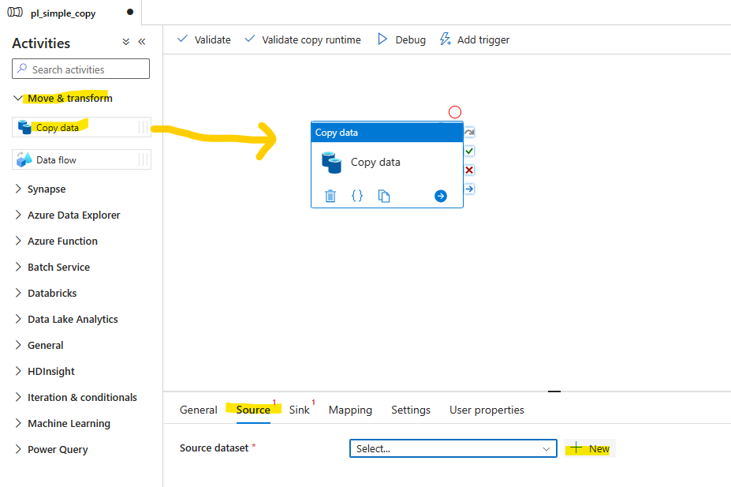 </kbd>

3. In the **New dataset** pane, find **Azure Data Lake Storage Gen 2** and click the **Continue** button.

4. Click the **Binary** option and click the **Continue** button.

5. Enter the properties and click the **OK** button.

    | Attribute  | Value |
    | --- | --- |
    | Name | `ds_irazure_adls_binary` |
    | Linked Service | `ls_adls_irazure` |

6. Click the **Open** button from the **Source** tab of the activity properties.

   <kbd>  </kbd>

7. On the **Parameters** tab of the new dataset, click the **+ New** button and add three parameters.

    | Name  | Type | Default value |
    | --- | --- | --- |
    | `container` | `String` | leave blank |
    | `directory` | `String` | leave blank |
    | `filename` | `String` | leave blank |

   <kbd>  </kbd>

8. On the **Connection** tab of the new dataset, for all 3 attributes of the **File path**, roll over the attribute fields and click the **Add dynamic content** link that appears under each field. Then, add the parameters to the appropriate fields, the first field being for the `container` parameter, then `directory`, then `filename`.

   <kbd>  </kbd>
   <kbd>  </kbd>

9. Click the `ds_ir_azure_adls_binary` dataset elipsis menu item and select **Clone**.

   <kbd> 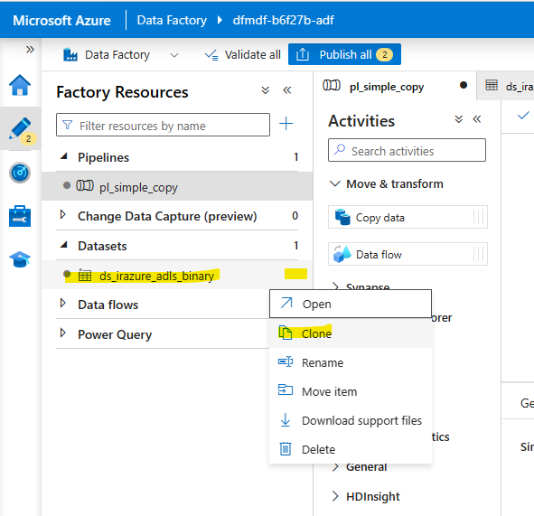 </kbd>

10. On the **Properties** pane of the cloned dataset, replace the text "copy1" in the **Name** with `directory`. Then, roll over the file name part of the **File path** and click the gargage bin icon. On the **Parameters** tab, check the filename parameter and click the **Delete** button. 

   <kbd>  </kbd>
   <kbd> 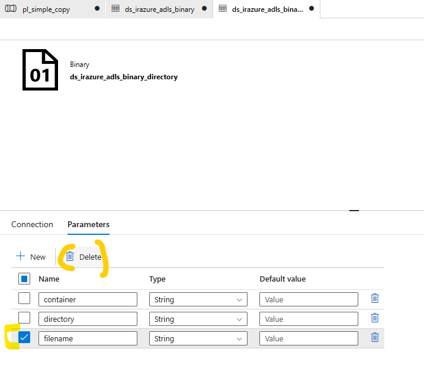 </kbd>

11. Click the `pl_simple_copy` pipeline from the list of Pipelines. On the **Source** tab of the **Copy data** activity, enter the following values. 

    | Attribute  | Value |
    | --- | --- |
    | Source dataset | `ds_irazure_adls_binary` |
    | Dataset properties / container | `inbound` |
    | Dataset properties / directory | `x` (This is a placeholder only; the value will be overwritten due to the **Wildcard file path** option selected in the **File path type** radio option.)|
    | Dataset properties / filename | `x` (This is a placeholder only; the value will be overwritten due to the **Wildcard file path** option selected in the **File path type** radio option.)|
    | File path type | `Wildcard file path` |
    | Wildcard paths / directory | `nyx_taxi_sample` |
    | Wildcard paths / filename | `*.parquet` |

   <kbd> 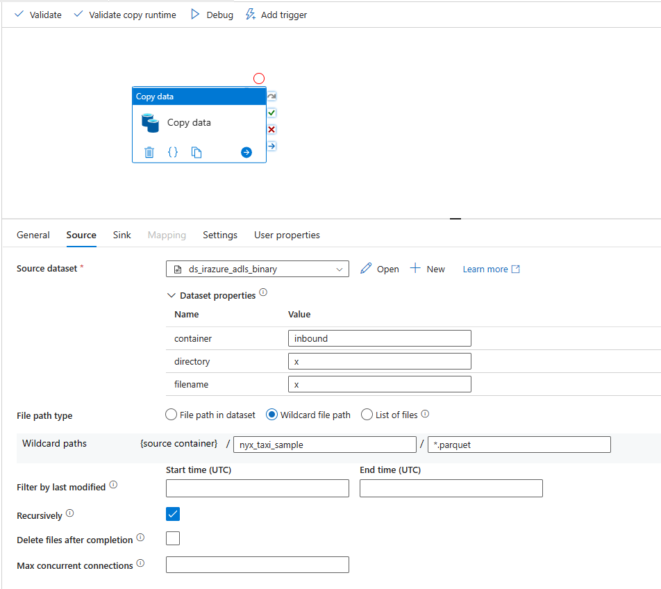 </kbd>

12. On the **Sink** tab of the **Copy data** activity, enter the following values. 

    | Attribute  | Value |
    | --- | --- |
    | Sink dataset | `ds_irazure_adls_binary_directory` |
    | Dataset properties / container | `publish` |
    | Dataset properties / directory | `nyx_taxi_sample_pipeline` |

   <kbd> 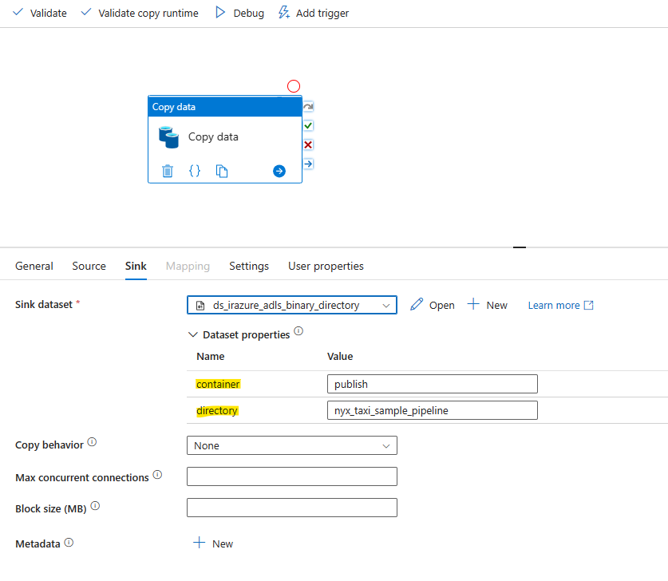 </kbd>

13. Click the **Debug** button and ensure your copy succeeds!

   <kbd>  </kbd>

14. Click the **Publish all** button, then click the **Publish** button.

   <kbd>  </kbd>

<a href="#module-13---sap-cdc-connector">↥ back to top</a>

## 3. Mapping Data Flows Copy

1. Within the Data Factory Studio, select the **Author** tab from the leftmost pane. Open the **Pipeline Actions** elipsis menu, and click the **New pipeline** menu item. In the **Properties** pane of the new pipeline, add a **Name** and **Description**.

    | Attribute  | Value |
    | --- | --- |
    | Name | `pl_simple_copy_df` |
    | Description | `Use the copy activity to copy data from one location to another using mapping data flows.` |

2. From the **Activities** pane, under **Move & transform**, click and drag the **Data flow** activity into the pipeline area. Then, on the **Settings** tab, click the **+ New** button.

   <kbd> 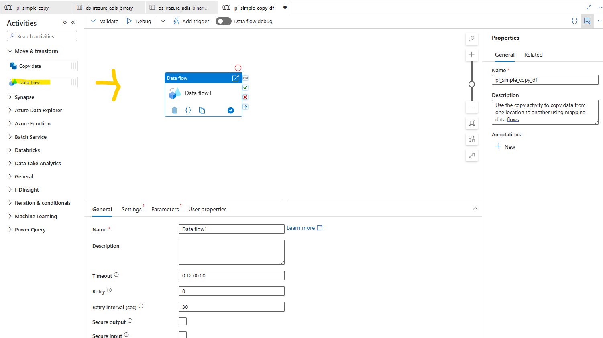 </kbd>
   <kbd>  </kbd>

3. On the Properties pane, enter the following values.

    | Attribute  | Value |
    | --- | --- |
    | Name | `df_simple_copy` |
    | Description | `Data flow that performs a simple copy.` |

4. Click the **Data flow debug** radio toggle from within the data flows working area. Select the **Integration runtime** `ir-vnetwork-medium-60min`. Select `4 hours` from the **Debug time to live** option so that your debug Apache cluster will be available during the next 4 hours of the lab. Click **OK**. 

   <kbd> 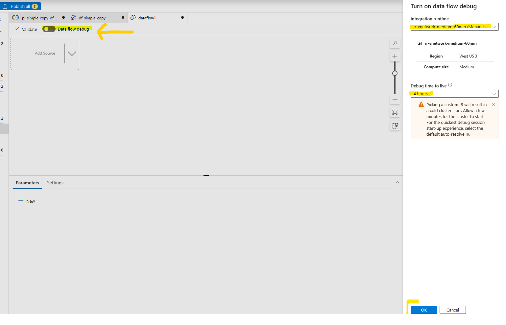 </kbd>

5. Click the **Add Source** option from the down caret menu as shown below.

   <kbd>  </kbd>

6. Complete the **Source settings**.

    | Attribute  | Value |
    | --- | --- |
    | Name | `source` |
    | Source type | `Inline` |
    | Inline dataset type | `Parquet` |
    | Linked service | `ls_adls_irvnetmedium` |
    | Sampling | `Enable` |

   <kbd>  </kbd>

7. On the **Source options** tab, click the `Wildcard` **File mode** option and click the **Browse** button. An error may appear indicating that interactive authoring is disabled. This is a debug condition, whereby the . Click the **Edit interactive authoring** link.

   <kbd>  </kbd>

8. On the **Edit integration runtime** pane, on the **Virtual network** tab, click **Enable** under **Interactive authoring**. Then, click **Apply**.

   <kbd>  </kbd>

9. When the runtime is edited to allow interactive authoring, the **Browse** pane will indicate `Interactive authoring enabled`. Click **Retry**.

   <kbd> 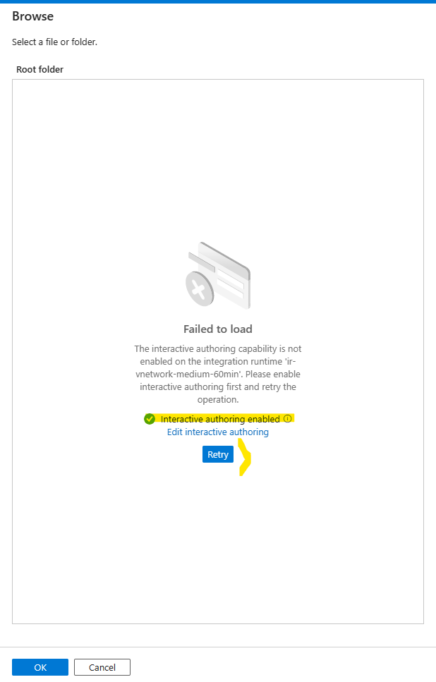 </kbd>

10. Use the **Browse** pane to navigate to `inbound` and click **OK**. The **File system** and **Wildcard paths** container values will show `inbound`.

   <kbd> 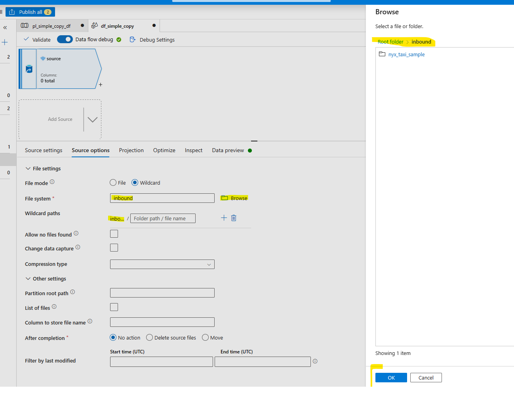 </kbd>

11. Enter `nyx_taxi_sample/*.parquet` in the **Wildcard paths** field as shown below.

   <kbd> 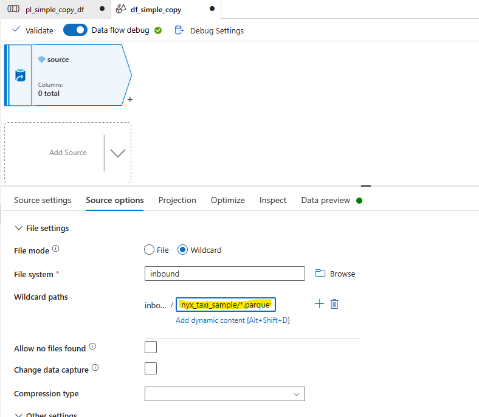 </kbd>

12. On the **Projection** tab, click **Import schema**.

   <kbd> 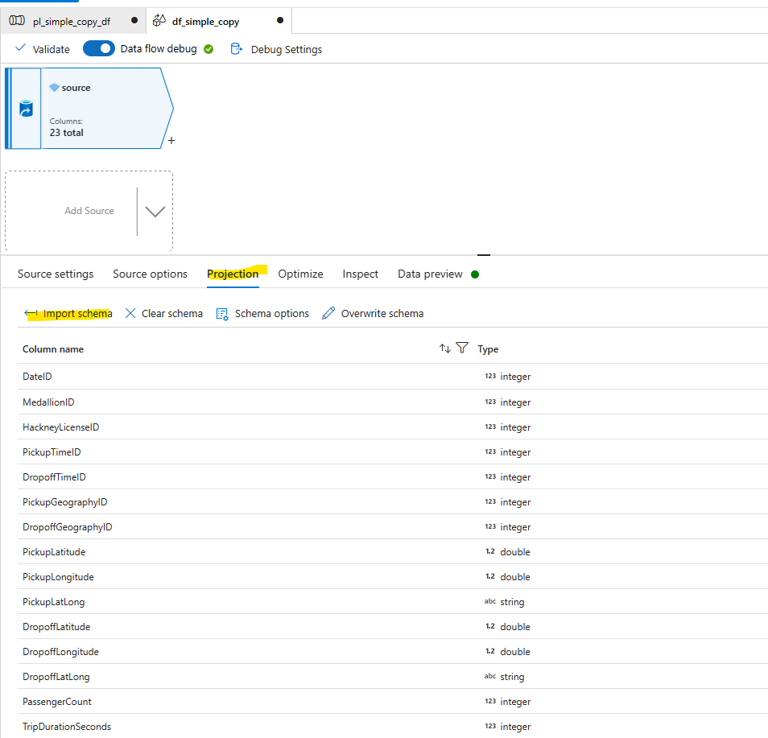 </kbd>

13. On the **Data preview** tab, click **Refresh** to see a preview of the data. Data flow activity data previews are used in conjunction with sampling of the source data to allow for ease of development and to ensure the Azure Data Factory user interface is able to pre-populate the data mid-transformation.

   <kbd>  </kbd>

14. Click the **+** button on the bottom right corner of the `source` activity and then select the **Sink** option.

   <kbd>  </kbd>

15. Enter the following values in the **Sink** tab.

    | Attribute  | Value |
    | --- | --- |
    | Name | `sink` |
    | Sink type | `Inline` |
    | Inline dataset type | `Parquet` |
    | Linked service | `ls_adls_irvnetmedium` |

16. On the **Settings** tab, click the **Browse** button, browse to `publish/nyx_taxi_sample_dataflow` and click **OK**.

   <kbd>  </kbd>

17. Set the unmask settings as shown below.

    | Attribute  | Value |
    | --- | --- |
    | Owner | `R` + ` W` + `X` |
    | Group | `R` + ` W` + `X` |
    | Others | `X` |

18. On the **Data preview** tab, click **Refresh** to see a preview of the data.

   <kbd>  </kbd>

19. Click the `pl_simple_copy_df` pipeline from the list of **Pipelines**.  Click the **Debug** button and ensure your copy succeeds!

   <kbd>  </kbd>

20. Click the **Publish all** button, then click the **Publish** button.

   <kbd> 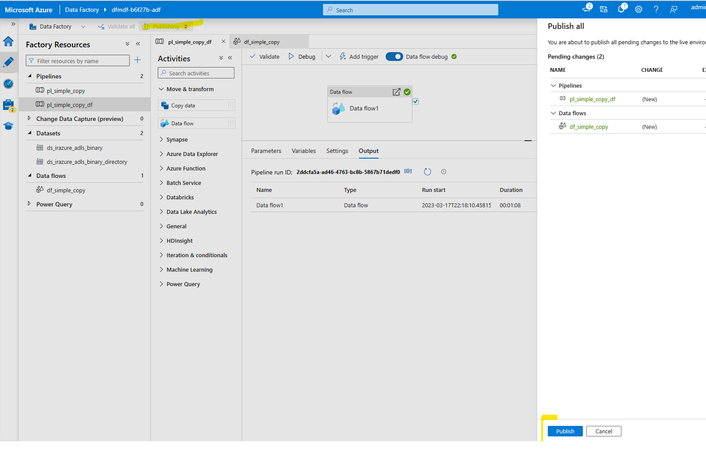 </kbd>

<a href="#module-13---sap-cdc-connector">↥ back to top</a>

## :tada: Summary

You have now completed this module. You have performed a simple copy using both the **Pipelines** and the **Data flows** features. The pipelines copy used the Azure IR compute that does not use spark while the data flows pipeline you created utilized an IR with managed virtual network enabled with a medium sized Apache spark cluster.

