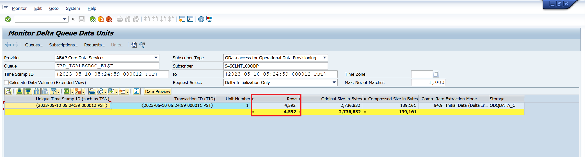

# Module 13 - SAP CDC Connector

[< Previous Module](../modules/module11.md) - **[Home](../README.md)**

## Setup of ADF SAP-CDC Connector

This module will demonstrate the setup of the following tasks:

* Self-hosted Intergation Runtime 
* SAP CDC Linked Service
* Integration Dataset for SAP CDC
* Azure Synapse Analytics Linked Service
* Integration Dataset for for Azure Synapse Analytics
* Define Dataflow for Source, Transform and Sink 
* Create ADF Pipeline 
* Trigger data extraction

## Table of Contents

| #  | Section |
| --- | --- |
| 1 | [Overview of ETL process](#1-overview-of-implemented-etl-process) |
| 2 | [Prepare ADF for data extraction from SAP S/4HANA](2-prepare-adf-for-data-extraction-from-sap-s4hana) |
| 3 | [Data Extration trigger](#3-data-extraction-from-sap-s4hana-to-adf) |

<a href="#module-13---sap-cdc-connector">↥ back to top</a>

## 1. Overview of Implemented ETL Process 

The following environment was setup for this exercise

Source System:
* SAP S/4HANA 2022 (SAP Cloud Appliance Library) on Azure Tenant
* Extract data from SAP table Sales Order Headers using an ABAP CDS View and ADF SAP CDC Adapter
* Create linked service and data set using Azure Data Factory and Synapse  

<kbd>  </kbd>

<a href="#module-13---sap-cdc-connector">↥ back to top</a>

## 2. Prepare ADF for data extraction from SAP S/4HANA

## 2.1 Download and install the self-hosted integration runtime

The self-hosted integration runtime is used to establish connectivity between Azure Data Factory and other non-public internet facing compute resources. These can be on-premises resources and those protected by virtual networks and firewalls.

2.1.1 On the SAP VM (in this particular test case, it was the Windows jumphost machine where SAP GUI was installed) 

2.1.2 Open Azure Data factory

2.1.3 Select the **Manage hub**, then choose **Integration runtimes** from beneath the Integration header. From the Integration runtimes screen, select + New from the toolbar menu.

<kbd>  </kbd>

2.1.4 On the Integration runtime setup blade, select the **Azure, Self-Hosted**. Select Continue.
<kbd>  </kbd>

2.1.5 Select **Self-Hosted** as the network environment. Select **Continue**
<kbd>  </kbd>

2.1.6 Enter **SAPVM-SHIR** in the Name field and select **Create**
<kbd>  </kbd>

2.1.7 Select the link below the **Option 1: Express setup header**. This will download an executable file.
<kbd>  </kbd>

2.1.8 Run the downloaded executable. The Express Setup will download, install, and register the self-hosted integration runtime. Select the Close button once all the steps have completed.
<kbd>  </kbd>
<kbd>  </kbd>

2.1.9 Close the Integration runtime setup blade.

2.1.10 The Integration runtimes list should now display SAPVM-SHIR in the list.
<kbd>  </kbd>

## 2.2 Create Linked Service to the Source System (SAP S/4HANA)
After creating the integration runtimes, the next step is to create linked services. 

2.2.1 In ADF, go to the Manage View, select **Linked Services** and click on **New** to create a new Linked Service of type **SAP CDC Connector**
<kbd>  </kbd>

2.2.2 Enter the Name for the linked service. 
Enter the connection details for the SAP System. 

Use the Integration Runtime which you installed in the previous steps

Use **Test Connection** to verify your settings to ensure that the details entered are correct.

Once the connection is successful, click on **Create**
<kbd>  </kbd>

## 2.3 Create an Integration Dataset for the Linked Service
2.3.1 Create an Integration DataSet for the Linked Service created in the previous step. This dataset will act as the source.

In ADF go to **Author** view, under **Datasets**, select **New dataset**

<kbd>  </kbd>

Use type **SAP CDC**

<kbd>  </kbd>

Provide a meaningful name for the Dataset.

For the linked service use the name created in the step before.

As in our case the ODP is a CDS View, we provide **ABAP CDS (ABAP Core Data Services)**.

The CDS view in our case is called **ZBD_ISALESDOC_E1$E** which is given as the input for the ODP name.

<kbd>  </kbd>

2.3.2 Once the Dataset is created, you can verify the connection using **Test connection**
<kbd>  </kbd>

2.3.3 Create a linked service to store the extracted data from Source System 
The data extracted from SAP S/4HANA will be stored in the Azure Data Lake Storage Gen2
<kbd>  </kbd>

## 2.4 Create a Linked Service to the Target System (Synapse SQL Pool)
2.4.1 For this exercise, we created a dedicated synapse SQL Pool.
<kbd>  </kbd>

2.4.2 Create SQL Table schema in synapse.
<kbd>  </kbd>

2.4.3 Grant ADF Useracess to synpase workspace.
<kbd>  </kbd>

2.4.4 In ADF, go to the Manage View, select **Linked Services** and click on **New** to create a new Linked Service of type **Azure Synapse Analytics** and click on **Continue**
<kbd>  </kbd>

2.4.5 Provide the details of the Synapse SQL Pool that will be used as the Target.
<kbd>  </kbd>

## 2.5 Create an Integration DataSet for the Synapse Sales Orders
2.5.1 In ADF go to Author view, under **Datasets**, select **New dataset**, to create a new Linked Service of type **Azure Synpase Analytics**
<kbd>  </kbd>

2.5.2 Provide the Linked Service and synpase table pool name
<kbd>  </kbd>

2.5.3 Use Test Connection to verify your settings to ensure that the details entered are correct.
<kbd>  </kbd>

## 2.6 Create the Data Pipeline
2.6.1 In ADF go to Author view, under **Pipelines**, select **New pipeline**
<kbd>  </kbd>

We named the pipeline **ExtractSalesOrderHeaders** 

2.6.2 Within created pipeline choose the **Dataflow** and drag in to the empty canvas
<kbd>  </kbd>

2.6.3 In the General tab change the **name** 
<kbd>  </kbd>

2.6.4 In the Settings tab, change the **Run on Azure IR** to **AutoResolveIntegrationRuntime**
**Enable Staging** and enter the path to the staging directory of your Azure Data Lake that was created earlier in this exercise

<kbd>  </kbd>

2.6.5 Create a new Dataflow
<kbd>  </kbd>

In the Dataflow, **Add Source**
<kbd>  </kbd>

Provide the following in the **Source Settings**

Change **Output stream name**. 

As Dataset, select the ODP dataset that was created earlier
<kbd>  </kbd>

Enable **Data flow debug**

<kbd>  </kbd>

2.6.6 In Source options:
Key Columns: SALESDOCUMENT (Use the Refresh button)

<kbd>  </kbd>

In **Projection**, select **Import projection**
<kbd>  </kbd>

## Add some simple transformations

<kbd>  </kbd>

2.6.7 In Derived column's settings
   
    | Attribute  | Value |
    | --- | --- |
    | OutputStream Name | `S4SSalesOrderHeadersUpd` |

Add Derived Columns with the following information:

    | CREATIONDATE| `toDate(CREATIONDATE, "yyyyMMdd")`|
    | PRICINGDATE| `toDate(PRICINGDATE, "yyyyMMdd")` |
    | BILLINGDOCUMENTDATE| `toDate(BILLINGDOCUMENTDATE, "yyyyMMdd")` |
    | LASTCHANGEDATE| `toDate(LASTCHANGEDATE, "yyyyMMdd")` |
    | CREATIONTIME| `toTimestamp(concatWS(" ", CREATIONDATE, CREATIONTIME), "yyyyMMdd HHmmss")` |

   <kbd>  </kbd>

Use the + button to be able to add a next step to the dataflow.

2.6.8 Select **Sink**
   <kbd>  </kbd>

In the **Sink** tab

Enter the **Outputstream**

Enter the Dataset linked to the Synapse Sales Order Headers

<kbd>  </kbd>

2.6.9 In the **Settings** tab
Ensure, **Allow insert, Allow delete, Allow upsert, Allow update** is checked
KeyColums : select **SalesDocument**, this is the key column of the SalesOrderHeader Table in Synapse.

<kbd>  </kbd>

2.6.10 In the Mapping tab, uncheck **Auto mapping**

<kbd>  </kbd>

<a href="#module-13---sap-cdc-connector">↥ back to top</a>

## 3 Data Extraction from SAP S/4HANA to ADF 
## 3.1 Full Data Extraction

3.1.1 Publish all the changes and once the publish is successful, trigger the pipeline

<kbd>  </kbd>
<kbd>  </kbd>

3.1.2 Trigger data extraction
<kbd>  </kbd>

3.1.3 Check the result of each Dataflow in the Activity Run

**ExtractSalesOrderHeadersDF**  - results shows a

`Total # of rows calculated : 4592`

`Total # of rows copied : 4592`

<kbd>  </kbd>

**ExtractSalesOrderHeadersUp** - results shows a

`Total # of rows calculated : 4592`

`Total # of columns : 28`

`Total transformed columns: 4`

<kbd>  </kbd>

**SyncSalesOrderHeaders** - results shows a

`Total # of rows calculated : 4592`

`Total # of columns : 28`

<kbd>  </kbd>

3.1.4 Verify and monitor the extracted data on SAP system using `ODQMON - Monitor for Operational Delta Queue to monitor the ODP extractions`

<kbd>  </kbd>

<kbd>  </kbd>

3.1.5 Verify the extracted data in Synapse using SQL. In the **Develop** view create an SQL query.

<kbd>  </kbd>

## 3.2 Extract data - delta changes 

3.2.1 Verify the Purchaseorderbycustomer for the Sales Document # 50 before the change.
<kbd>  </kbd>

3.2.2 On SAP, change the **custref** number for this Sales Document # 50
<kbd>  </kbd>

3.2.3 Trigger the pipeline run on ADF
<kbd>  </kbd>

3.2.4 Check the result of each Dataflow in the Activity Run.

**ExtractSalesOrderHeadersDF**  - results shows a

`Total # of rows calculated : 1`

`Total # of rows copied : 1`

<kbd>  </kbd>

**ExtractSalesOrderHeadersUp** - results shows a

`Total # of rows calculated : 1`

<kbd>  </kbd>

**SyncSalesOrderHeaders** - results shows a

`Total # of rows calculated : 1`

<kbd>  </kbd>

3.2.5 Verify the extracted data in Synapse using SQL. In the **Develop** view create an SQL query.
<kbd>  </kbd>

3.2.6 Monitor the extraction using ODQMON. Note that it shows only 1 Row being updated and the Change Data field has the status **U** meaning update.

<kbd>  </kbd>

<a href="#module-13---sap-cdc-connector">↥ back to top</a>

## 3. Ingest Sales order Header data from SAP to Azure Data Lake

The CDS view Sales order Header information residing in S/4HANA, is exposed with OData services. The self-hosted integration runtime installed on the SAP virtual machine enables connectivity between Azure Data Factory and S/4HANA, this will allow for local web calls to take place to the OData endpoints to retrieve sales data.

<a href="#module-13---sap-cdc-connector">↥ back to top</a>

## :tada: Summary

You have now completed this module. You have performed a simple copy using both the **Pipelines** and the **Data flows** features. The pipelines copy used the Azure IR compute that does not use spark while the data flows pipeline you created utilized an IR with managed virtual network enabled with a medium sized Apache spark cluster.

