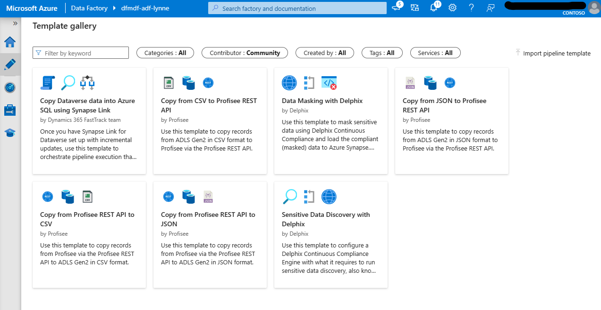

# Module 14 - Working with pipeline templates

[< Previous Module](../modules/module13.md) - **[Home](../README.md)**

## :loudspeaker: Introduction

The ability to create, share, and utilize shared work - to collaborate amongst Azure Data Factory engineers - can greatly reduce development and upskilling time. 

This module describes how to use templates and includes links to the template files for some of the pipelines included in this lab.

## :bookmark_tabs: Table of Contents

If there are multiple sections to this page, add a Table of Contents with jump links.

| #  | Section |
| --- | --- |
| 1 | [Templates for this lab](#1-templates-for-this-lab) |
| 2 | [Export a pipeline template](#2-export-a-pipeline-template) |
| 3 | [Import a pipeline template](#3-import-a-pipeline-template) |
| 4 | [My  Templates & Community templates](#4-my-templates--community-templates) |

<a href="#module-14---working-with-pipeline-templates">↥ back to top</a>

## 1. Templates for this lab

Pipeline templates associated with this lab are located in this repository's [pipeline_templates](../pipeline_templates) directory. 

To use a template, download the appropriate pipeline template file and import it into your Data Factory following the steps in section [3. Import a pipeline template](#3-import-a-pipeline-template).

<a href="#module-14---working-with-pipeline-templates">↥ back to top</a>

## 2. Export a pipeline template

To export a pipeline template file so it can be shared, in Azure Data Factory Studio, open the pipeline you want to export as a template. Then, click on the action elipsis and select **Export template** from the menu.

<kbd>  </kbd>

This will export a `.zip` file that represents the pipeline template. It will include any datasets, data flows, or pipelines related to the pipeline you are exporting. It will not include any integration runtimes or linked services.

<a href="#module-14---working-with-pipeline-templates">↥ back to top</a>

## 3. Import a pipeline template

1. In the **Factory Resources** pane, select on the plus icon to open the new resource menu. Open the **Pipeline** menu and select the **Import form pipeline template** menu item.

    <kbd>  </kbd>

1. Navigate to the template you want to import and click **Open**.

    <kbd>  </kbd>

1. The template does not include integration runtimes and linked services. Match linked servies from the Data Factory that you are importing into with the template. Then, click **Use this template** to complete the import.

    <kbd>  </kbd>

1. Publish imported resources. 

    <kbd>  </kbd>

<a href="#module-14---working-with-pipeline-templates">↥ back to top</a>

## 4. My Templates & Community templates

Note that if your Data Factory is linked to Git (in "Git mode"), you can save pipeline templates and even use submit these to the publically searchable **Template gallery**. 
    <kbd>  </kbd>

To access the community templates, in the **Factory Resources** pane, select on the plus icon to open the new resource menu. Open the **Pipeline** menu and select the **Template gallery** menu item.
    <kbd>  </kbd>

From within the **Template gallery**, community contributions are returned when you select `Community` from the **Contributor** filter.
    <kbd>  </kbd>

<a href="#module-14---working-with-pipeline-templates">↥ back to top</a>

## :link: References 

- [Microsoft Learn: Azure Data Factory Community Templates](https://learn.microsoft.com/en-us/azure/data-factory/solution-templates-introduction)

## :tada: Summary

You now know how to export and import pipeline templates. Use your new knowledge to improve productivity for data integration projects.

